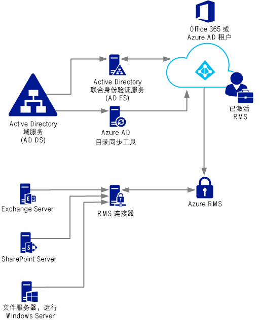
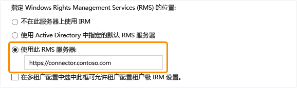

# 部署 Azure 权限管理连接器
使用以下信息可以了解 Microsoft 权限管理 (RMS) 连接器，以及如何使用该连接器提供信息保护，包括保护使用 Microsoft Exchange Server、Microsoft SharePoint Server 或文件服务器（运行 Windows Server 并使用文件服务器资源管理器的文件分类基础结构 (FCI) 功能）的现有本地部署。

> [!TIP]
> 有关带屏幕截图的高级示例方案，请参阅[什么是 Azure 权限管理？](../Topic/What_is_Azure_Rights_Management_.md)主题中的[自动在运行 Windows Server 和文件分类基础结构的文件服务器上保护文件](../Topic/What_is_Azure_Rights_Management_.md#BKMK_Example_FCI) 部分。

## <a name="OverviewConnector"></a>Microsoft 权限管理连接器概述
借助 Microsoft Rights Management (RMS) 连接器，你可以迅速让现有本地服务器将信息权限管理 (IRM) 功能用于基于云的 Microsoft Rights Management 服务 (Azure RMS)。 使用此功能，IT 部门和用户能够轻松地保护组织内部和外部的文档和图片，既无需安装其他基础结构，也无需建立与其他组织的信任关系。 你可以在混合方案中使用此连接器，即使你的一些用户连接到了在线服务。 例如，一些用户的邮箱使用 Exchange Online，一些用户的邮箱使用 Exchange Server。 安装 RMS 连接器后，所有用户都可以使用 Azure RMS 保护和使用电子邮件和附件，并且信息保护在两套部署配置中无缝合作。

RMS 连接器是一种小型化服务，你可将其安装在本地，包括安装在运行 Windows Server 2012 R2、Windows Server 2012 或 Windows Server 2008 R2 的服务器上。 除了在物理计算机上运行连接器之外，你也可以在虚拟机（包括 Azure IaaS VM）上运行它。 在你安装和配置连接器之后，它将充当本地服务器和云服务之间的通信接口（一种中继）。

如果你自行管理 Azure RMS 的租户密钥（自带密钥，即 BYOK 方案），RMS 连接器和使用该连接器的本地服务器不会访问包含你的租户密钥的硬件安全模块 (HSM)。 这是因为，使用租户密钥的所有加密操作都是在 Azure RMS 中并不是在本地执行的。



RMS 连接器支持以下本地服务器：Exchange Server、SharePoint Server 以及文件服务器，这些文件服务器运行 Windows Server 并使用文件分类基础结构来进行分类并将策略应用于文件夹内 Office 文档。 如果你想要通过文件分类保护所有文件类型，请勿使用 RMS 连接器，而是使用 [RMS 保护 cmdlet](https://msdn.microsoft.com/library/azure/mt433195.aspx)。

> [!NOTE]
> 有关这些本地服务器的受支持版本，请参阅 [支持 Azure RMS 的应用程序](../Topic/Requirements_for_Azure_Rights_Management.md#BKMK_SupportedApplications)主题[Azure 权限管理要求](../Topic/Requirements_for_Azure_Rights_Management.md)部分中的“支持 Azure RMS 的本地服务器”。

使用以下部分可帮助你计划、安装和配置 RMS 连接器。 你必须随后进行一些安装后配置，使得你的服务器能够使用连接器。

-   [RMS 连接器的必备组件](../Topic/Deploying_the_Azure_Rights_Management_Connector.md#BKMK_Prereqs)

-   **步骤 1：**  [安装 RMS 连接器](../Topic/Deploying_the_Azure_Rights_Management_Connector.md#BKMK_InstallingConnector)

-   **步骤 2：**  [输入凭据](../Topic/Deploying_the_Azure_Rights_Management_Connector.md#EnteringCredentials)

-   **步骤 3：**  [授权服务器使用 RMS 连接器](../Topic/Deploying_the_Azure_Rights_Management_Connector.md#AuthorizingServers)

-   **步骤 4：**  [配置负载平衡和高可用性](../Topic/Deploying_the_Azure_Rights_Management_Connector.md#ConfiguringConnector)

-   可选：[将 RMS 连接器配置为使用 HTTPS](../Topic/Deploying_the_Azure_Rights_Management_Connector.md#BKMK_ConfiguringHTTPS)

-   可选：[为 Web 代理服务器配置 RMS 连接器](../Topic/Deploying_the_Azure_Rights_Management_Connector.md#BKMK_ConfiguringWebProxy)

-   可选：[在管理计算机上安装 RMS 连接器管理工具](../Topic/Deploying_the_Azure_Rights_Management_Connector.md#BKMK_InstallingStandaloneTool)

-   **步骤 5：**  [将服务器配置为使用 RMS 连接器](../Topic/Deploying_the_Azure_Rights_Management_Connector.md#ConfiguringServers)

    -   [将 Exchange 服务器配置为使用连接器](../Topic/Deploying_the_Azure_Rights_Management_Connector.md#BKMK_ExchangeServer)

    -   [将 SharePoint 服务器配置为使用连接器](../Topic/Deploying_the_Azure_Rights_Management_Connector.md#BKMK_ConfiguringSharePoint)

    -   [将文件分类基础结构的文件服务器配置为使用连接器](../Topic/Deploying_the_Azure_Rights_Management_Connector.md#BKMK_FileServer)

-   [后续步骤](../Topic/Deploying_the_Azure_Rights_Management_Connector.md#BKMK_NextSteps)

## <a name="BKMK_Prereqs"></a>RMS 连接器的必备组件
在安装 RMS 连接器之前，请确保符合以下要求。

|要求|更多信息|
|------|--------|
|权限管理服务 (RMS) 已激活|[激活 Azure 权限管理](../Topic/Activating_Azure_Rights_Management.md)|
|Active Directory 林和 Azure Active Directory 之间的目录同步|RMS 激活之后，必须将 Azure Active Directory 配置为用于 Active Directory 数据库中的用户和组。 **Important:** 要使 RMS 连接器正常工作，你必须执行此目录同步步骤，即使对于测试网络，也是如此。 尽管你可以通过在 Azure Active Directory 中手动创建的帐户来使用 Office 365 和 Azure Active Directory，但此连接器要求 Azure Active Directory 中的帐户必须与 Active Directory 域服务同步；进行手动密码同步是不够的。<br />有关详细信息，请参阅下列资源：<br /><br />-   [有关配置 Azure AD 租户的说明](http://technet.microsoft.com/library/hh967611.aspx)<br />-   [有关使用 DirSync 实现与 AAD 的目录同步的说明](http://technet.microsoft.com/library/hh967642.aspx)|
|只是可选但也推荐的选项：<br /><br />-   启用本地 Active Directory 和 Azure Active Directory 之间的联合身份验证|你可以启用本地目录和 Azure Active Directory 之间的联合身份验证。 此配置使用 RMS 服务单一登录，实现更加无缝的用户体验。 而如果没有单一登录，用户在能够使用权限保护内容之前，会收到提供凭据的提示。<br /><br />有关使用 Active Directory 联合身份验证服务 (AD FS) 来配置 Active Directory 域服务和 Azure Active Directory 之间的联合身份验证的说明，请参阅 Windows Server 库中的[清单：使用 AD FS 实现和管理单一登录](http://technet.microsoft.com/library/jj205462.aspx)。|
|在最少两台成员计算机上安装 RMS 连接器：<br /><br /><ul><li>64 位物理或虚拟计算机，运行以下操作系统之一：<br /><br /><ul><li>Windows Server 2012 R2</li><li>Windows Server 2012</li><li>Windows Server 2008 R2</li></ul></li><li>至少 1 GB 的 RAM</li><li>至少 64 GB 的磁盘空间</li><li>至少一个网络接口</li><li>通过防火墙（或 Web 代理）访问 Internet，无需进行身份验证</li><li>必须位于某个林或域中，而该林或域信任组织内的其他林（包含要用于 RMS 连接器的 Exchange 或 SharePoint 服务器安装）</li></ul>|为了实现容错和高可用性，你必须在至少两台计算机上安装 RMS 连接器。 **Tip:** 如果你正在使用 Outlook Web Access 或装有 Exchange ActiveSync IRM 的移动设备，并且你必须保持对 Azure RMS 保护的电子邮件和附件的访问权限，则我们建议你部署一组负载平衡的连接器服务器，以确保高可用性。<br />你不需要专用服务器来运行连接器，但必须在将要使用连接器的服务器之外的一台独立计算机上安装连接器。 **Important:** 如果你希望在使用这些服务提供的功能时运行 Azure RMS，请不要将连接器安装在运行 Exchange Server、SharePoint Server 或文件服务器（已针对文件分类基础结构进行配置，前提是你希望将这些服务提供的功能用于  Azure RMS）的计算机上。 此外，请不要在域控制器上安装此连接器。|

## <a name="BKMK_InstallingConnector"></a>安装 RMS 连接器
在你确认满足前一部分中的先决条件之后，请根据以下说明来安装 RMS 连接器：

1.  确定将要运行 RMS 连接器的计算机（最少两台）。 它们必须达到前一部分所列的最低规格。

    > [!NOTE]
    > 你将为每个租户（Office 365 租户或 Azure AD 租户）安装单个 RMS 连接器（包含多个服务器以实现高可用性）。 与 Active Directory RMS 不同，你无需在每个林中安装 RMS 连接器。

2.  从 [Microsoft 下载中心](http://go.microsoft.com/fwlink/?LinkId=314106)下载 RMS 连接器的源文件。

    若要安装 RMS 连接器，请下载 RMSConnectorSetup.exe。

    此外：

    -   如果你以后要从 32 位计算机配置连接器，请下载 RMSConnectorAdminToolSetup_x86.exe。

    -   如果你要使用 RMS 连接器的服务器配置工具，自动执行本地服务器上的注册表设置的配置，也请下载 GenConnectorConfig.ps1。

3.  在你要安装 RMS 连接器的计算机上，以管理员权限运行 **RMSConnectorSetup.exe**。

4.  在“Microsoft Rights Management 连接器设置”页面的欢迎页上，选择“在计算机上安装 Microsoft Rights Management 连接器”，然后单击“下一步”。

5.  阅读并同意 RMS 连接器许可条款，然后单击“下一步”。

若要继续，请输入帐号和密码以配置 RMS 连接器。

## <a name="EnteringCredentials"></a>输入凭据
在能够配置 RMS 连接器之前，你必须输入具有足够 RMS 连接器配置权限的帐户的凭据。

此外，如果你实现了[内置控件](https://technet.microsoft.com/library/jj658941.aspx)，请确保你指定的帐户能够保护内容。例如，如果你将保护内容的功能限制给“IT 部门”组，则在此指定的帐户必须是该组成员。如果不是，你将看到以下错误消息：“发现管理服务和组织位置的尝试失败。”“请确保为你的组织启用了 Microsoft Rights Management 服务。”

你可以使用具有以下某一种权限的帐户：

-   **Office 365 租户管理员**：Office 365 租户的全局管理员帐户。

-   **Azure Rights Management 全局管理员**：具有 Azure RMS 租户管理员权限的帐户。

-   **Microsoft RMS 连接器管理员**：Azure Active Directory 中的一个帐户，已被授予为你的组织安装和管理 RMS 连接器的权限。

    > [!NOTE]
    > 如果你希望使用 Microsoft RMS 连接器管理员帐户，则必须先执行以下操作以分配 RMS 连接器管理员角色：
    > 
    > 1.  在同一台计算机上，下载和安装适用于权限管理的 Windows PowerShell。 有关详细信息，请参阅[安装适用于 Azure 权限管理的 Windows PowerShell](../Topic/Installing_Windows_PowerShell_for_Azure_Rights_Management.md)。
    > 
    >     使用**“以管理员身份运行”**命令启动 Windows PowerShell，并使用 [Connect-AadrmService](https://msdn.microsoft.com/library/azure/dn629415.aspx) 命令连接到 Azure RMS 服务：
    > 
    >     ```
    >     Connect-AadrmService                   //provide Office 365 tenant administrator or Azure RMS global administrator credentials
    >     ```
    > 2.  然后运行 [Add-AadrmRoleBasedAdministrator](https://msdn.microsoft.com/library/azure/dn629417.aspx) 命令，仅使用以下参数之一：
    > 
    >     ```
    >     Add-AadrmRoleBasedAdministrator -EmailAddress <email address> -Role "ConnectorAdministrator"
    >     ```
    > 
    >     ```
    >     Add-AadrmRoleBasedAdministrator -ObjectId <object id> -Role "ConnectorAdministrator"
    >     ```
    > 
    >     ```
    >     Add-AadrmRoleBasedAdministrator -SecurityGroupDisplayName <group Name> -Role "ConnectorAdministrator"
    >     ```
    >     例如，键入：**Add-AadrmRoleBasedAdministrator -EmailAddress melisa@contoso.com -Role " ConnectorAdministrator "**
    > 
    >     尽管这些命令使用 ConnectorAdministrator 角色，但你也可以在此处使用 GlobalAdministrator 角色。

在 RMS 连接器安装过程中，将会验证和安装所有必备软件。如果还没有 Internet Information Services (IIS)，则会安装该服务。另外还要安装和配置连接器软件。 此外，还会创建以下各项，做好配置 Azure RMS 的准备：

-   一个空表，用于列出被授权使用连接器与 Azure RMS 通信的服务器。 你以后可将服务器添加至此表。

-   一组连接器安全令牌，授权对 Azure RMS 所进行的操作。 可从 Azure RMS 下载这些令牌，并安装在注册表中的本地计算机上。 它们通过使用数据保护应用程序编程接口 (DPAPI) 和本地系统帐户凭据得到保护。

在向导的最后一页上执行以下操作，然后单击“完成”：

-   如果这是你安装的第一个连接器，此时请不要选择“启动连接器管理员控制台对服务器授权”。 在安装第二个（或最后一个）RMS 连接器之后，再选择此选项。 请在至少一台其他计算机上再次运行向导。 你必须安装至少两个连接器。

-   如果你已安装第二个（或最后一个）连接器，请选择“启动连接器管理员控制台对服务器授权”。

> [!TIP]
> 现在，你可以执行一项验证测试，以测试 RMS 连接器的 Web 服务是否可以运行：
> 
> -   从 Web 浏览器连接至 **http://&lt;connectoraddress&gt;/_wmcs/certification/servercertification.asmx**，将 *&lt;connectoraddress&gt;* 替换为安装 RMS 连接器的服务器地址或名称。 如果成功连接，则将显示 **ServerCertificationWebService** 页。

如果你需要卸载 RMS 连接器，请再次运行向导并选择卸载选项。

## <a name="AuthorizingServers"></a>授权服务器使用 RMS 连接器
在至少两台计算机上安装 RMS 连接器之后，即可为你希望其使用 RMS 连接器的服务器和服务授权。 例如运行 Exchange Server 2013 或 SharePoint Server 2013 的服务器。

若要定义这些服务器，请运行 RMS 连接器管理工具，然后向允许服务器列表添加条目。 如果你在 Microsoft Rights Management 连接器设置向导结束时选择了“启动连接器管理员控制台对服务器授权”，则可运行此工具，也可从向导单独运行此工具。

当你向这些服务器授权时，请注意以下事项：

-   你添加的服务器将被授予特殊权限。 你在连接器中为 Exchange Server 角色指定的所有帐户将在 Azure RMS 中授予[超级用户角色](https://technet.microsoft.com/library/mt147272.aspx)，这将给予他们访问所有此 RMS 租户的所有内容的权限。 如有必要，超级用户功能将在此时自动启用。 为了避免权限提升带来的安全风险，请注意仅指定你的组织的 Exchange 服务器使用的帐户。 配置为 SharePoint 服务器的所有服务器或使用 FCI 的文件服务器将被授予常规用户权限。

-   你可以通过指定 Active Directory 安全或分发组，或由多台服务器使用的服务帐户，添加多个服务器作为单个条目。 当你使用此配置时，服务器组将共享相同的 RMS 证书，并且会被视为其中任何一个服务器保护的内容的所有者。 为了最大程度地减少管理开销，我们建议你使用这种单组配置，而不是使用单独服务器的配置，为组织的 Exchange 服务器或 SharePoint 服务器场授权。

在“被允许使用连接器的服务器”页上，单击“添加”。

### <a name="BKMK_AddServer"></a>将服务器添加到允许服务器列表。
在“允许服务器使用连接器”页上，输入对象的名称，或进行浏览以确定要授权的对象。

必须为正确的对象授权，这一点非常重要。 若要让服务器使用连接器，必须选择运行本地服务（例如 Exchange 或 SharePoint）的帐户来进行授权。 例如，如果服务作为配置的服务帐户运行，请将该服务帐户的名称添加到列表。 如果服务作为本地系统运行，请添加该计算机对象的名称（例如 SERVERNAME$）。 最佳做法是创建一个包含这些帐户的组并指定该组，而不是指定单独的服务器名称。

有关不同服务器角色的详细信息：

-   对于运行 Exchange 的服务器：必须指定一个安全组，并可使用 Exchange 自动创建和维护的包含林中所有 Exchange 服务器的默认组（“Exchange 服务器”）。

-   对于运行 SharePoint 的服务器：

    -   如果 SharePoint 2010 服务器配置为作为本地系统（它不使用服务帐户）运行，请在 Active Directory 域服务中手动创建安全组，并将此配置中的服务器的计算机名称对象添加到此组。

    -   如果 SharePoint 服务器配置为使用服务帐户（SharePoint 2010 的建议做法，并且是 SharePoint 2013 的唯一选项），请执行以下操作：

        1.  添加运行 SharePoint 管理中心服务的服务帐户，以便从管理员控制台配置 SharePoint。

        2.  添加为 SharePoint 应用池配置的帐户。

        > [!TIP]
        > 如果上述两个帐户是不同的，可考虑创建包含这两个帐户的单个组，以最大程度地降低管理开销。

-   对于使用文件分类基础结构的文件服务器，相关服务作为本地系统帐户运行，因此你必须为文件服务器（例如 SERVERNAME$）的计算机帐户或包含这些计算机帐户的组授权。

在将服务器添加至列表之后，请单击“关闭”。

如果尚未配置负载平衡，则现在必须为安装了 RMS 连接器的服务器配置负载平衡，并考虑是否使用 HTTPS 在这些服务器和你刚才授权的服务器之间进行连接。

## <a name="ConfiguringConnector"></a>配置负载平衡和高可用性
在你安装第二个或最后一个 RMS 连接器实例之后，请定义连接器 URL 服务器名称并配置负载平衡系统。

连接器 URL 服务器名称可以是你控制的命名空间中的任何名称。 例如，你可在 DNS 系统中为 **rmsconnector.contoso.com** 创建一个条目，并将此条目配置为使用负载平衡系统中的 IP 地址。 此名称没有任何特殊要求，也无需在连接器服务器本身上进行配置。 除非你的 Exchange 和 SharePoint 服务器要通过 Internet 与连接器通信，否则此名称无需在 Internet 上解析。

> [!IMPORTANT]
> 在将 Exchange 或 SharePoint 服务器配置为使用连接器之后，我们建议你不要更改该名称，因为你随后必须清除这些服务器的所有 IRM 配置，然后重新进行配置。

在 DNS 中创建名称并配置 IP 地址之后，请配置该地址的负载平衡，将流量定向到连接器服务器。 你可以使用任何基于 IP 的负载平衡器来达到此目的，该负载平衡器应包括 Windows Server 中的网络负载平衡 (NLB) 功能。 有关详细信息，请参阅[负载平衡部署指南](http://technet.microsoft.com/library/cc754833%28v=WS.10%29.aspx)。

使用以下设置来配置 NLB 群集：

-   端口：80（对于 HTTP）或 443（对于 HTTPS）

    有关如何使用 HTTP 或 HTTPS 的详细信息，请参阅下一部分。

-   地缘组：无

-   分发方法：等于

为负载平衡的系统（为运行 RMS 连接器服务的服务器）定义的此名称是你稍后将本地服务器配置为使用 Azure RMS 时要使用的组织 RMS 连接器名称。

## <a name="BKMK_ConfiguringHTTPS"></a>将 RMS 连接器配置为使用 HTTPS
> [!NOTE]
> 此配置步骤是可选的，但建议执行此步骤以提高安全性。

虽然使用 TLS 或 SSL 对于 RMS 连接器是可选的，但我们建议将其用于任何基于 HTTP 的安全敏感服务。 在此配置中，运行连接器的服务器向使用连接器的 Exchange 和 SharePoint 服务器进行身份验证。 此外，从这些服务器向连接器发送的所有数据都进行了加密。

若要让 RMS 连接器能够使用 TLS，请在运行 RMS 连接器的每个服务器上安装服务器身份验证证书，其中包含你将用于连接器的名称。 例如，如果你在 DNS 中定义的 RMS 连接器名称为 **rmsconnector.contoso.com**，请部署一个服务器身份验证证书，其中的证书使用者包含 **rmsconnector.contoso.com** 作为通用名称。 也可以在证书备选名称中指定 **rmsconnector.contoso.com** 作为 DNS 值。 证书不一定必须包括服务器的名称。 然后在 IIS 中，将此证书绑定到默认网站。

如果你使用 HTTPS 选项，请确保运行连接器的所有服务器都具有有效的服务器身份验证证书，该证书链接到 Exchange 和 SharePoint 服务器信任的根 CA。 此外，如果为连接器服务器颁发证书的证书颁发机构 (CA) 发布了证书吊销列表 (CRL)，则 Exchange 和 SharePoint 服务器必须能够下载此 CRL。

> [!TIP]
> 你可以使用以下信息和资源，帮助请求和安装服务器身份验证证书，并将此证书绑定到 IIS 中的默认网站：
> 
> -   如果使用 Active Directory 证书服务 (AD CS) 和企业证书颁发机构 (CA) 来部署这些服务器身份验证证书，则你可以复制和使用 Web 服务器证书模板。 此证书模板使用“在请求中提供”作为证书使用者名称，这意味着在你请求证书时，可以提供 RMS 连接器名称的 FQDN 作为证书使用者名称或使用者备选名称。
> -   如果你使用独立 CA 或从其他公司购买此证书，请参阅 TechNet 上 [Web Server (IIS)](http://technet.microsoft.com/library/cc753433%28v=ws.10%29.aspx) 文档库中的[配置 Internet 服务器证书 (IIS 7)](http://technet.microsoft.com/library/cc731977%28v=ws.10%29.aspx)。
> -   若要将 IIS 配置为使用证书，请参阅 TechNet 上 [Web Server (IIS)](http://technet.microsoft.com/library/cc753433%28v=ws.10%29.aspx) 文档库中的[添加网站绑定 (IIS 7)](http://technet.microsoft.com/library/cc731692.aspx)。

## <a name="BKMK_ConfiguringWebProxy"></a>为 Web 代理服务器配置 RMS 连接器
如果你的连接器服务器安装在没有直接 Internet 连接的网络中，需要手动配置出站 Internet 访问的 Web 代理服务器，则必须在 RMS 连接器的这些服务器上配置注册表。

#### 将 RMS 连接器配置为使用 Web 代理服务器

1.  在运行 RMS 连接器的每台服务器上，打开注册表编辑器，例如 Regedit。

2.  导航至 **HKEY_LOCAL_MACHINE\SOFTWARE\Microsoft\AADRM\Connector**

3.  添加 **ProxyAddress** 的字符串值，然后将此值的数据设置为 **http://&lt;MyProxyDomainOrIPaddress&gt;:&lt;MyProxyPort&gt;**

    例如：**http://proxyserver.contoso.com:8080**

4.  关闭注册表编辑器，然后重新启动服务器，或者执行 IISReset 命令以重新启动 IIS。

## <a name="BKMK_InstallingStandaloneTool"></a>在管理计算机上安装 RMS 连接器管理工具
可以在未安装 RMS 连接器的计算机上运行 RMS 连接器管理工具，前提是该计算机符合以下要求：

-   运行 Windows Server 2012 或 Windows Server 2012 R2（所有版本）、Windows Server 2008 R2 或 Windows Server 2008 R2 Service Pack 1（所有版本）、Windows 8.1、Windows 8 或 Windows 7 的物理或虚拟计算机。

-   至少 1 GB 的 RAM。

-   至少 64 GB 的磁盘空间。

-   至少一个网络接口。

-   通过防火墙（或 Web 代理）访问 Internet。

若要安装 RMS 连接器管理工具，请运行以下文件：

-   对于 32 位计算机：RMSConnectorAdminToolSetup_x86.exe

-   对于 64 位计算机：RMSConnectorSetup.exe

如果你尚未下载这些文件，可从 [Microsoft 下载中心](http://go.microsoft.com/fwlink/?LinkId=314106)下载。

## <a name="ConfiguringServers"></a>将服务器配置为使用 RMS 连接器
安装并配置 RMS 连接器之后，即可将本地服务器配置为使用权限管理并通过连接器连接到 Azure RMS。 这意味着需要配置以下服务器：

-   对于 Exchange 2013：客户端访问服务器和邮箱服务器

-   对于 Exchange 2010：客户端访问服务器和中心传输服务器

-   对于 SharePoint：前端 SharePoint Web 服务器，包括托管中心管理服务器的 Web 服务器

-   对于文件分类基础结构：装有文件资源管理器的 Windows Server 计算机

这种配置需要注册表设置。 执行此操作时，你有两个选项：

|配置选项|优点|缺点|
|--------|------|------|
|使用适用于 Microsoft RMS 连接器的服务器配置工具来自动配置|不直接编辑注册表。 可以使用脚本进行自动编辑。<br /><br />无需运行 Windows PowerShell cmdlet 来获取你的 Microsoft RMS URL。<br /><br />如果你本地运行工具，则自动为你检查必备组件（但不自动进行补救）。|当你运行工具时，必须连接到已在运行 RMS 连接器的服务器。|
|通过编辑注册表进行手动配置|不需要连接到运行 RMS 连接器的服务器。|更多管理开销，容易发生错误。<br /><br />你必须获取 Microsoft RMS URL，这需要你运行 Windows PowerShell 命令。<br /><br />你必须始终自行进行所有必备组件检查。|
> [!IMPORTANT]
> 对于这两种情况，都必须手动安装所有必备组件，并将 Exchange、SharePoint 和文件分类基础结构配置为使用权限管理。

对于大多数组织，使用适用于 Microsoft RMS 连接器的服务器配置工具进行自动配置是更好的选择，因为它提供优于手动配置的效率和可靠性。

在这些服务器上进行配置更改之后，如果这些服务器正在运行 Exchange 或 SharePoint 并且以前配置为使用 AD RMS，则你必须重新启动它们。 在首次将它们配置为使用权限管理时，无需重新启动它们。 进行这些配置更改后，始终必须重新启动配置为使用文件分类基础结构的文件服务器。

#### 如何使用适用于 Microsoft RMS 连接器的服务器配置工具

1.  如果你尚未下载适用于 Microsoft RMS 连接器的服务器配置工具的脚本 (GenConnectorConfig.ps1)，请从 [Microsoft 下载中心](http://go.microsoft.com/fwlink/?LinkId=314106)下载。

2.  将 GenConnectorConfig.ps1 文件保存在你要运行工具的计算机上。 如果要在本地运行该工具，则此计算机必须是你想要配置为与 RMS 连接器通信的服务器。 否则，你可将文件保存在任何计算机上。

3.  确定如何运行工具：

    -   **本地**：可以从要将配置为与 RMS 连接器通信的服务器以交互方式运行该工具。 这对于一次性配置（例如测试环境）非常有用。

    -   **软件部署**：你可以运行工具以生成注册表文件，然后使用支持软件部署的系统管理应用程序（例如 System Center Configuration Manager），将这些注册表文件部署到一个或多个相关服务器。

    -   **组策略设置**：你可以运行工具以生成脚本，然后将脚本提供给管理员，管理员可为要配置的服务器创建组策略对象。 此脚本为要配置的每个服务器类型创建一个组策略对象，然后管理员能够将此对象分配给相关服务器。

    > [!NOTE]
    > 此工具可以配置将与 RMS 连接器通信并已在本部分开头列出的服务器。 不要在运行 RMS 连接器的服务器上运行此工具。

4.  使用“以管理员身份运行”选项启动 Windows PowerShell，然后使用 Get-help 命令阅读有关如何将工具用于你选择的配置方法的说明：

    ```
    Get-help .\GenConnectorConfig.ps1 -detailed
    ```

若要运行脚本，你必须输入组织的 RMS 连接器的 URL。 输入协议前缀（HTTP:// 或 HTTPS://），以及你在 DNS 中为连接器的负载平衡地址定义的连接器名称， 例如 https://connector.contoso.com。 然后，此工具会使用该 URL 来联系运行 RMS 连接器的服务器，并获取用于创建所需配置的其他参数。

> [!IMPORTANT]
> 当你运行此工具时，请确保指定组织的负载平衡 RMS 连接器的名称，而不要指定运行 RMS 连接器服务的单个服务器的名称。

使用以下部分获取每个服务类型的特定信息：

-   [将 Exchange 服务器配置为使用连接器](../Topic/Deploying_the_Azure_Rights_Management_Connector.md#BKMK_ExchangeServer)

-   [将 SharePoint 服务器配置为使用连接器](../Topic/Deploying_the_Azure_Rights_Management_Connector.md#BKMK_ConfiguringSharePoint)

-   [将文件分类基础结构的文件服务器配置为使用连接器](../Topic/Deploying_the_Azure_Rights_Management_Connector.md#BKMK_FileServer)

> [!NOTE]
> 在将这些服务器配置为使用连接器之后，本地安装在这些服务器上的客户端应用程序可能无法使用 RMS。 发生这种情况的原因是应用程序试图使用连接器而不是直接使用 RMS，但这种方式不受支持。
> 
> 此外，如果 Office 2010 本地安装在 Exchange 服务器上，则在将服务器配置为使用连接器之后，客户端应用的 IRM 功能可能从该计算机运行，但这种方式不受支持。
> 
> 在上述两种情况下，你必须在没有配置为使用连接器的单独计算机上安装客户端应用程序。 然后它们即可正确地直接使用 RMS。

### <a name="BKMK_ExchangeServer"></a>将 Exchange 服务器配置为使用连接器
以下 Exchange 角色将与 RMS 连接器通信：

-   对于 Exchange 2013：客户端访问服务器和邮箱服务器

-   对于 Exchange 2010：客户端访问服务器和中心传输服务器

若要使用 RMS 连接器，这些运行 Exchange 的服务器必须运行以下软件版本之一：

-   Exchange Server 2013，附带 Exchange 2013 累积更新 3

-   Exchange Server 2010，附带 Exchange 2010 Service Pack 3 汇总更新 6

你还需要在服务器上安装能够支持 RMS 加密模式 2 的 RMS 客户端版本。 Windows Server 2008 支持的最低版本包括在修补程序中，你可从[在 Windows Server 2008 R2 和 Windows Server 2008 中，AD RMS 的 RSA 密钥长度增加到 2048 位](http://support.microsoft.com/kb/2627272)下载该修补程序。 适用于 Windows Server 2008 R2 的最低版本可从[在 Windows 7 或 Windows Server 2008 R2 中，AD RMS 的 RSA 密钥长度增加到 2048 位](http://support.microsoft.com/kb/2627273)下载。 Windows Server 2012 和 Windows Server 2012 R2 以本机方式支持加密模式 2。

> [!IMPORTANT]
> 如果没有安装这些版本或更高版本的 Exchange 和 RMS 客户端，你就无法将 Exchange 配置为使用连接器。 继续之前，请确认已安装这些版本。

##### 将 Exchange 服务器配置为使用连接器

1.  在与 RMS 连接器通信的 Exchange 服务器角色上执行以下任一操作：

    -   运行适用于 Microsoft RMS 连接器的服务器配置工具。 有关详细信息，请参阅本主题中的[如何使用适用于 Microsoft RMS 连接器的服务器配置工具](../Topic/Deploying_the_Azure_Rights_Management_Connector.md#BKMK_HowToRunTheTool)。

        例如，若要在本地运行该工具以配置运行 Exchange 2013 的服务器，请执行以下操作：

        ```
        .\GenConnectorConfig.ps1 -ConnectorUri https://rmsconnector.contoso.com -SetExchange2013
        ```

    -   使用以下部分的表格，在服务器上手动添加注册表设置，进行手动注册表编辑。

2.  在 Exchange 中启用 IRM 功能。 有关详细信息，请参阅 Exchange 库中的[信息权限管理过程](https://technet.microsoft.com/library/dd351212%28v=exchg.150%29.aspx)。

只有当你需要在服务器上手动添加或检查将这些服务器配置为使用 RMS 连接器的注册表设置时，才使用以下部分的表格。 有关何时使用这些表格的说明：

-   *MicrosoftRMSURL* 是你组织的 Microsoft RMS 服务 URL。 查找此值：

    1.  对 Azure RMS 运行 [Get-AadrmConfiguration](http://msdn.microsoft.com/library/windowsazure/dn629410.aspx) cmdlet。 如果你尚未安装适用于 Azure RMS 的 Windows PowerShell 模块，请参阅[安装适用于 Azure 权限管理的 Windows PowerShell](../Topic/Installing_Windows_PowerShell_for_Azure_Rights_Management.md)。

    2.  在输出中找到 **LicensingIntranetDistributionPointUrl** 值。

        例如：**LicensingIntranetDistributionPointUrl   : https://5c6bb73b-1038-4eec-863d-49bded473437.rms.na.aadrm.com/_wmcs/licensing**

    3.  该值中，将 **/_wmcs/licensing** 从此字符串删除。 剩余字符串就是你的 Microsoft RMS URL。 在我们的示例中，Microsoft RMS URL 应为以下值：

        **https://5c6bb73b-1038-4eec-863d-49bded473437.rms.na.aadrm.com**

-   *ConnectorFQDN* 是你在 DNS 中为连接器定义的负载平衡名称。 例如 **rmsconnector.contoso.com**。

-   如果你已将连接器配置为使用 HTTPS 与本地服务器通信，请使用 HTTPS 前缀作为连接器 URL。 有关详细信息，请参阅本主题中的[将 RMS 连接器配置为使用 HTTPS](../Topic/Deploying_the_Azure_Rights_Management_Connector.md#BKMK_ConfiguringHTTPS)部分。 Microsoft RMS URL 始终使用 HTTPS。

#### Exchange 2013 注册表设置表

|注册表路径|类型|值|数据|
|---------|------|-----|------|
|HKEY_LOCAL_MACHINE\Software\Microsoft\MSDRM\ServiceLocation\Activation|Reg_SZ|默认|https://*MicrosoftRMSURL/_wmcs/certification*|
|HKEY_LOCAL_MACHINE\Software\Microsoft\MSDRM\ServiceLocation\EnterprisePublishing|Reg_SZ|默认|https://MicrosoftRMSURL/_wmcs/Licensing|
|HKEY_LOCAL_MACHINE\SOFTWARE\Microsoft\ExchangeServer\v15\IRM\CertificationServerRedirection|Reg_SZ|https://*MicrosoftRMSURL*|以下前缀之一，具体取决于 Exchange 服务器与 RMS 连接器之间的连接是使用 HTTP 还是 HTTPS：<br /><br />-   http://*ConnectorFQDN*<br />-   https://*ConnectorFQDN*|
|HKEY_LOCAL_MACHINE\SOFTWARE\Microsoft\ExchangeServer\v15\IRM\LicenseServerRedirection|Reg_SZ|https://*MicrosoftRMSURL*|以下前缀之一，具体取决于 Exchange 服务器与 RMS 连接器之间的连接是使用 HTTP 还是 HTTPS：<br /><br />-   http://*ConnectorFQDN*<br />-   https://*ConnectorFQDN*|

#### Exchange 2010 注册表设置表

|注册表路径|类型|值|数据|
|---------|------|-----|------|
|HKEY_LOCAL_MACHINE\Software\Microsoft\MSDRM\ServiceLocation\Activation|Reg_SZ|默认|https://*MicrosoftRMSURL*/_wmcs/certification|
|HKEY_LOCAL_MACHINE\Software\Microsoft\MSDRM\ServiceLocation\EnterprisePublishing|Reg_SZ|默认|https://*MicrosoftRMSURL*/_wmcs/Licensing|
|HKEY_LOCAL_MACHINE\SOFTWARE\Microsoft\ExchangeServer\v14\IRM\CertificationServerRedirection|Reg_SZ|https://*MicrosoftRMSURL*|以下前缀之一，具体取决于 Exchange 服务器与 RMS 连接器之间的连接是使用 HTTP 还是 HTTPS：<br /><br />-   http://*ConnectorFQDN*<br />-   https://*ConnectorFQDN*|
|HKEY_LOCAL_MACHINE\SOFTWARE\Microsoft\ExchangeServer\v14\IRM\LicenseServerRedirection|Reg_SZ|https://*MicrosoftRMSURL*|以下前缀之一，具体取决于 Exchange 服务器与 RMS 连接器之间的连接是使用 HTTP 还是 HTTPS：<br /><br />-   http://*ConnectorFQDN*<br />-   https://*ConnectorFQDN*|

### <a name="BKMK_ConfiguringSharePoint"></a>将 SharePoint 服务器配置为使用连接器
以下 SharePoint 角色将与 RMS 连接器通信：

-   前端 SharePoint Web 服务器，包括托管中心管理服务器的 Web 服务器

若要使用 RMS 连接器，这些运行 SharePoint 的服务器必须运行以下软件版本之一：

-   SharePoint Server 2013

-   SharePoint Server 2010

SharePoint 2013 服务器也必须运行版本从 1.0.622.34 到 1.0.10907.0 的 MSIPC 客户端 2.1。

> [!WARNING]
> 有多个版本的 MSIPC 2.1 客户端，因此请务必安装本文提及的版本。
> 
> 你可以通过检查位于 **\Program Files\Active Directory Rights Management Services Client 2.1** 中的 MSIPC.dll 的版本号来验证客户端版本。 属性对话框将显示 MSIPC 2.1 客户端的版本号。

这些运行 SharePoint 2010 的服务器必须安装了能够支持 RMS 加密模式 2 的 MSDRM 客户端版本。 Windows Server 2008 支持的最低版本包括在修补程序中，你可从[在 Windows Server 2008 R2 和 Windows Server 2008 中，AD RMS 的 RSA 密钥长度增加到 2048 位](http://support.microsoft.com/kb/2627272)下载该修补程序。适用于 Windows Server 2008 R2 的最低版本可从[在 Windows 7 或 Windows Server 2008 R2 中，AD RMS 的 RSA 密钥长度增加到 2048 位](http://support.microsoft.com/kb/2627273)下载。 Windows Server 2012 和 Windows Server 2012 R2 以本机方式支持加密模式 2。

##### 将 SharePoint 服务器配置为使用连接器

1.  在与 RMS 连接器通信的 SharePoint 服务器上执行以下任一操作：

    -   运行适用于 Microsoft RMS 连接器的服务器配置工具。 有关详细信息，请参阅本主题中的[如何使用适用于 Microsoft RMS 连接器的服务器配置工具](../Topic/Deploying_the_Azure_Rights_Management_Connector.md#BKMK_HowToRunTheTool)。

        例如，若要在本地运行该工具以配置运行 SharePoint 2013 的服务器，请执行以下操作：

        ```
        .\GenConnectorConfig.ps1 -ConnectorUri https://rmsconnector.contoso.com -SetSharePoint2013
        ```

    -   如果你使用 SharePoint 2013，请使用以下部分的表格，在服务器上手动添加注册表设置，进行手动注册表编辑。

2.  在 SharePoint 中启用 IRM。 有关详细信息，请参阅 SharePoint 库中的[配置信息权限管理 (SharePoint Server 2010)](https://technet.microsoft.com/library/hh545607%28v=office.14%29.aspx)。

    当你按照这些说明操作时，必须通过指定**“使用此 RMS 服务器”**，将 SharePoint 配置为使用连接器，然后输入你配置的负载平衡连接器 URL。 输入协议前缀（HTTP:// 或 HTTPS://），以及你在 DNS 中为连接器的负载平衡地址定义的连接器名称， 例如，如果你的连接器名称为 https://connector.contoso.com，则配置将如下图所示：

    

    在 SharePoint 场上启用 IRM 之后，你可以使用每个库的**“库设置”**页上的**“信息权限管理”**选项，在各个库上启用 IRM。

    > [!IMPORTANT]
    > 要让 SharePoint 使用连接器访问 RMS，你必须在 RMS 连接器管理工具中向相应的帐户授权。 如果你尚未执行此操作，请参阅本主题中的[授权服务器使用 RMS 连接器](../Topic/Deploying_the_Azure_Rights_Management_Connector.md#AuthorizingServers)。

只有当你需要在运行 SharePoint 2013 的服务器上手动添加或检查注册表设置时，才使用以下部分的表格。

#### SharePoint 2013 注册表设置表
有关何时使用此表格的说明：

-   *MicrosoftRMSURL* 是你组织的 Microsoft RMS 服务 URL。 查找此值：

    1.  对 Azure RMS 运行 [Get-AadrmConfiguration](http://msdn.microsoft.com/library/windowsazure/dn629410.aspx) cmdlet。 如果你尚未安装适用于 Azure RMS 的 Windows PowerShell 模块，请参阅[安装适用于 Azure 权限管理的 Windows PowerShell](../Topic/Installing_Windows_PowerShell_for_Azure_Rights_Management.md)。

    2.  在输出中找到 **LicensingIntranetDistributionPointUrl** 值。

        例如：**LicensingIntranetDistributionPointUrl   : https://5c6bb73b-1038-4eec-863d-49bded473437.rms.na.aadrm.com/_wmcs/licensing**

    3.  该值中，将 **/_wmcs/licensing** 从此字符串删除。 剩余字符串就是你的 Microsoft RMS URL。 在我们的示例中，Microsoft RMS URL 应为以下值：

        **https://5c6bb73b-1038-4eec-863d-49bded473437.rms.na.aadrm.com**

-   *ConnectorFQDN* 是你在 DNS 中为连接器定义的负载平衡名称。 例如 **rmsconnector.contoso.com**。

-   如果你已将连接器配置为使用 HTTPS 与本地服务器通信，请使用 HTTPS 前缀作为连接器 URL。 有关详细信息，请参阅本主题中的[将 RMS 连接器配置为使用 HTTPS](../Topic/Deploying_the_Azure_Rights_Management_Connector.md#BKMK_ConfiguringHTTPS)部分。 Microsoft RMS URL 始终使用 HTTPS。

|注册表路径|类型|值|数据|
|---------|------|-----|------|
|HKEY_LOCAL_MACHINE\SOFTWARE\Microsoft\MSIPC\ServiceLocation\LicensingRedirection|Reg_SZ|https://*MicrosoftRMSURL*/_wmcs/licensing|以下前缀之一，具体取决于 SharePoint 服务器与 RMS 连接器之间的连接是使用 HTTP 还是 HTTPS：<br /><br />-   http://*ConnectorFQDN*/_wmcs/licensing<br />-   https://*ConnectorFQDN*/_wmcs/licensing|
|HKEY_LOCAL_MACHINE\SOFTWARE\Microsoft\MSIPC\ServiceLocation\EnterpriseCertification|Reg_SZ|默认|以下前缀之一，具体取决于 SharePoint 服务器与 RMS 连接器之间的连接是使用 HTTP 还是 HTTPS：<br /><br />-   http://*ConnectorFQDN*/_wmcs/certification<br />-   https://*ConnectorFQDN*/_wmcs/certification|
|HKEY_LOCAL_MACHINE\SOFTWARE\Microsoft\MSIPC\ServiceLocation\EnterprisePublishing|Reg_SZ|默认|以下前缀之一，具体取决于 SharePoint 服务器与 RMS 连接器之间的连接是使用 HTTP 还是 HTTPS：<br /><br />-   http://*ConnectorFQDN*/_wmcs/licensing<br />-   https://*ConnectorFQDN*/_wmcs/licensing|

### <a name="BKMK_FileServer"></a>将文件分类基础结构的文件服务器配置为使用连接器
若要使用 RMS 连接器和文件分类基础结构来保护 Office 文档，文件服务器必须运行以下操作系统之一：

-   Windows Server 2012 R2

-   Windows Server 2012

##### 将文件服务器配置为使用连接器

1.  在为文件分类基础结构配置的、将与 RMS 连接器通信的文件服务器上执行以下任一操作：

    -   运行适用于 Microsoft RMS 连接器的服务器配置工具。 有关详细信息，请参阅本主题中的[如何使用适用于 Microsoft RMS 连接器的服务器配置工具](../Topic/Deploying_the_Azure_Rights_Management_Connector.md#BKMK_HowToRunTheTool)。

        例如，若要在本地运行该工具以配置运行 FCI 的文件服务器，请执行以下操作：

        ```
        .\GenConnectorConfig.ps1 -ConnectorUri https://rmsconnector.contoso.com -SetFCI2012
        ```

    -   使用以下部分的表格，在服务器上手动添加注册表设置，进行手动注册表编辑。

2.  创建分类规则和文件管理任务，才能使用 RMS 加密保护文档，然后指定一个用于自动将 RMS 策略的应用的 RMS 模板。 有关详细信息，请参阅 Windows Server 文档库中的[文件服务器资源管理器概述](http://technet.microsoft.com/library/hh831701.aspx)。

只有当你需要在使用文件分类基础结构来保护文档的文件服务器上手动添加或检查注册表设置时，才使用以下部分的表格。

#### 文件服务器和文件分类基础结构注册表设置表
有关何时使用此表格的说明：

-   *ConnectorFQDN* 是你在 DNS 中为连接器定义的负载平衡名称。 例如 **rmsconnector.contoso.com**。

-   如果你已将连接器配置为使用 HTTPS 与本地服务器通信，请使用 HTTPS 前缀作为连接器 URL。 有关详细信息，请参阅本主题中的[将 RMS 连接器配置为使用 HTTPS](../Topic/Deploying_the_Azure_Rights_Management_Connector.md#BKMK_ConfiguringHTTPS)部分。 Microsoft RMS URL 始终使用 HTTPS。

|注册表路径|类型|值|数据|
|---------|------|-----|------|
|HKEY_LOCAL_MACHINE\SOFTWARE\Microsoft\MSDRM\ServiceLocation\EnterprisePublishing|Reg_SZ|默认|http://*ConnectorFQDN*/_wmcs/licensing|
|HKEY_LOCAL_MACHINE\SOFTWARE\Microsoft\MSDRM\ServiceLocation\Activation|Reg_SZ|默认|http://*ConnectorFQDN*/_wmcs/certification|

## <a name="BKMK_NextSteps"></a>后续步骤
现已安装并配置 RMS 连接器，并且你的服务器已配置为使用该连接器，IT 管理员和用户可以使用 Azure RMS 保护和使用电子邮件与文档了。 若要让用户轻松使用此功能，请部署 RMS 共享应用程序，它会安装 Office 的外接程序并在文件资源管理器中添加新的右键单击选项。 有关详细信息，请参阅[Rights Management 共享应用程序管理员指南](http://technet.microsoft.com/library/%20dn339003%28v=ws.10%29.aspx)。

此外，你可以考虑使用以下方法，帮助你监控 RMS 连接器以及组织使用 Azure RMS 的情况：

-   内置 **Microsoft Rights Management 连接器**性能计数器。

-   [RMS 分析器工具](https://www.microsoft.com/en-us/download/details.aspx?id=46437)，使用 RMS 连接器选项来帮助你监视连接器的运行状况并确定配置问题。

-   [记录和分析 Azure 权限管理使用情况](../Topic/Logging_and_Analyzing_Azure_Rights_Management_Usage.md)

向用户和管理员推出 [Azure 权限管理部署路线图](../Topic/Azure_Rights_Management_Deployment_Roadmap.md) 之前，你可以使用 [!INCLUDE[aad_rightsmanagement_1](../Token/aad_rightsmanagement_1_md.md)]来检查是否还需要执行其他配置步骤。 如果不需要执行其他配置步骤，请参阅[使用 Azure 权限管理](../Topic/Using_Azure_Rights_Management.md) 以获取操作指导，帮助你的组织成功完成部署。

## 请参阅
[配置 Azure 权限管理](../Topic/Configuring_Azure_Rights_Management.md)

