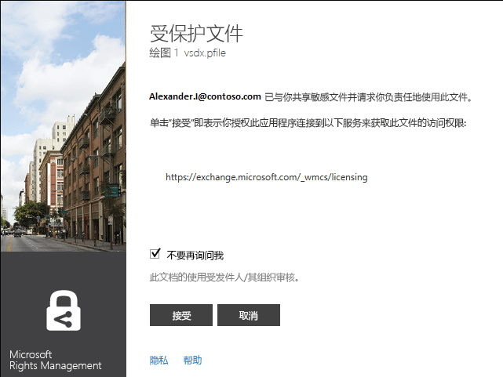
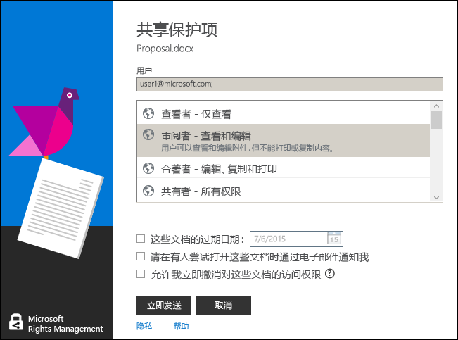

# Microsoft Rights Management 共享应用程序用户指南 - 原始出版物
适用于 Windows 的 Microsoft 权限管理共享应用程序的本用户指南包括以下部分：

-   [Evaluating and Installing Microsoft Rights Management sharing application](../Topic/Microsoft_Rights_Management_sharing_application_user_guide_-_original_publication.md#BKMK_Eval)

-   [Using Microsoft Rights Management sharing application](../Topic/Microsoft_Rights_Management_sharing_application_user_guide_-_original_publication.md#BKMK_UsingMSRMSApp)

-   [Using User-Authored Permissions and Sharing Protected Content](../Topic/Microsoft_Rights_Management_sharing_application_user_guide_-_original_publication.md#BKMK_Custom)

-   [Using the Office Toolbar Add-in](../Topic/Microsoft_Rights_Management_sharing_application_user_guide_-_original_publication.md#BKMK_OfficeToolbar)

-   [Administrator’s guidance for Microsoft Rights Management sharing application](../Topic/Microsoft_Rights_Management_sharing_application_user_guide_-_original_publication.md#BKMK_AdminGuide)

有关常见问题和故障排除信息，请参阅[适用于 Windows 的 Microsoft 权限管理共享应用程序的常见问题](http://go.microsoft.com/fwlink/?LinkId=303971)。

## <a name="BKMK_Eval"></a>评估和安装 Microsoft 权限管理共享应用程序
本部分介绍 Microsoft 权限管理共享应用程序及其安装方式：

-   [What is the Microsoft Rights Management sharing application?](../Topic/Microsoft_Rights_Management_sharing_application_user_guide_-_original_publication.md#BKMK_WhatIs)

-   [Requirements for Microsoft Rights Management sharing application](../Topic/Microsoft_Rights_Management_sharing_application_user_guide_-_original_publication.md#BKMK_Reqs)

-   [Installing the Microsoft Rights Management sharing application](../Topic/Microsoft_Rights_Management_sharing_application_user_guide_-_original_publication.md#BKMK_Install)

### <a name="BKMK_WhatIs"></a>Microsoft 权限管理共享应用程序是什么？
Microsoft 权限管理共享应用程序是一个可选且可下载的适用于 Microsoft Windows 的应用程序，它提供以下功能：

-   增强文件资源管理器（在 Windows 7 及更低版本中也称为 Windows 资源管理器），以便能够保护单个文件，或者批量保护多个文件以及选定文件夹中的所有文件。

-   支持对任意类型文件的保护，并提供一个内置的查看器用于查看常用文本文件和图像文件类型。

-   在 Word、PowerPoint 和 Excel 的 Microsoft Office 工具栏中添加了新按钮。

### <a name="BKMK_Reqs"></a>Microsoft 权限管理共享应用程序的要求
若要使用 Microsoft 权限管理共享应用程序，你的计算机必须运行 Windows 8.1、Windows 8 或 Windows 7。

Microsoft 权限管理共享应用程序需要安装包中随附的 AD RMS 客户端 2.1。Microsoft 权限管理共享应用程序只能配合此版本的 AD RMS 客户端工作。

### <a name="BKMK_Install"></a>安装 Microsoft 权限管理共享应用程序
若要安装 Microsoft 权限管理共享应用程序，请执行以下操作：

1.  转到 Microsoft 网站上的 [Microsoft 权限管理](http://go.microsoft.com/fwlink/?LinkId=303970)页。

2.  在“计算机”部分中，单击“适用于 Windows 的 RMS 应用程序”图标，并在计算机上保存 Microsoft 权限管理共享应用程序安装包。

3.  双击已下载的压缩文件，然后双击 **setup.exe**。如果系统提示你是否继续，请单击“是”。

4.  在“安装 Microsoft RMS”页上，单击“下一步”，然后等待安装完成。

5.  在安装完成后，单击“重新启动”，以重新启动计算机并完成安装。或者单击“关闭”，在稍后重新启动计算机以完成安装。

## <a name="BKMK_UsingMSRMSApp"></a>使用 Microsoft 权限管理共享应用程序
本部分介绍 Microsoft 权限管理共享应用程序的不同使用方式：

-   [Creating a protected text (.ptxt) file](../Topic/Microsoft_Rights_Management_sharing_application_user_guide_-_original_publication.md#BKMK_CreatePTXT)

-   [Viewing a protected text (.ptxt) or a protected image file](../Topic/Microsoft_Rights_Management_sharing_application_user_guide_-_original_publication.md#BKMK_ViewPTXT)

-   [Creating a generic protected (.pfile) file](../Topic/Microsoft_Rights_Management_sharing_application_user_guide_-_original_publication.md#BKMK_CreatePFILE)

-   [Viewing a generic protected (.pfile) file](../Topic/Microsoft_Rights_Management_sharing_application_user_guide_-_original_publication.md#BKMK_ViewPFILE)

-   [Removing protection from a file](../Topic/Microsoft_Rights_Management_sharing_application_user_guide_-_original_publication.md#BKMK_Unprotect)

### <a name="BKMK_CreatePTXT"></a>创建受保护的文本 (.ptxt) 文件
可以使用 Microsoft 权限管理共享应用程序将常规文本 (.txt) 文件转换为受保护的 (.ptxt) 文件。

##### 创建受保护的文本 (.ptxt) 文件

1.  在文件资源管理器中，右键单击某个文件夹，指向“新建”，然后单击“文本文档”。

2.  重命名文件（例如 Sample.txt）。

3.  双击该文件，在记事本中将其打开。

4.  在记事本中，将类似于下面的几行内容添加到该文件，然后保存该文件：

    ```
    This is a sample text file.
    This is a sample text file.
    This is a sample text file.
    This is a sample text file. 
    This is a sample text file.
    This is a sample text file.
    ```

5.  右键单击该文件，指向“就地保护”，然后从列表中选择一个模板。（请注意，如果这是你第一次使用该工具，则你需要选择“公司保护”，以开始为你的组织下载模板。）

6.  在“Microsoft 权限管理共享应用程序”屏幕上，确认你要应用的策略，单击“应用”，并且该文件受到保护后单击“关闭”。

### <a name="BKMK_ViewPTXT"></a>查看受保护的文本 (.ptxt) 文件或受保护的图像文件
若要查看受保护的文本 (.ptxt) 文件，请在文件资源管理器中双击该文件（例如 Sample.ptxt）。系统可能会提示你授权应用程序获取权限。保护策略将显示在文件的顶部。

可以类似的方式打开和查看受保护的图像。

### <a name="BKMK_CreatePFILE"></a>创建常规受保护 (.pfile) 文件
可以使用常规保护 (.pfile) 文件格式，针对 Microsoft 权限管理共享应用程序或提供内置 RMS 类型保护的其他应用程序不直接支持的文件类型提供一般保护级别。

例如，常规保护文件格式可以保护使用 Microsoft Visio（目前不支持内置保护）生成的 .vsd 文件。

> [!NOTE]
> 使用常规保护的文件只会出于身份验证目的而受到保护。有权使用受保护文件 (.pfile) 的用户将会经过身份验证，该用户的权限将会显示，但是，一旦以文件的原始格式打开文件（例如，一旦在 Visio 中打开 .vsd 文件），则无法强制实施这些权限。未获授权或者无法进行身份验证的用户将无法打开受保护文件。

##### 从 Visio 绘图 (.vsd) 文件创建常规受保护文件 (.pfile)

1.  在文件资源管理器中，右键单击某个文件夹，指向“新建”，然后单击“新建 Visio 文档”。

2.  重命名文件（例如 Sample.vsd）。

3.  双击该文件，在 Visio 中将其打开。

4.  在 Visio 中，将元素添加到绘图，然后保存并关闭该文件。

5.  右键单击该文件，指向“就地保护”，然后从列表中选择一个策略模板。（请注意，如果这是你第一次使用该工具，则你需要选择“公司保护”，以开始为你的组织下载模板。）

6.  在“Microsoft 权限管理共享应用程序”屏幕上，选择你要应用的策略，然后单击“应用”。

7.  此时将显示一条消息，指出受保护文件已保存为 Sample.vsd.pfile（原始文件已删除）。

### <a name="BKMK_ViewPFILE"></a>查看常规受保护 (.pfile) 文件
若要查看某个常规受保护 (.pfile) 文件，请在文件资源管理器中，双击该常规受保护 (.pfile) 文件（例如 Sample.vsd.pfile），然后单击“打开”。

### <a name="BKMK_Unprotect"></a>移除对文件的保护
Microsoft 权限管理共享应用程序提供了相应的选项，让你移除对以前受保护的文件的保护。

若要移除对以前受保护文件的保护（即取消保护），请应用“移除保护”选项，如下所述：

1.  右键单击 **Sample.ptxt**，指向“就地保护”，然后单击“移除保护”。系统可能会提示你授权应用程序获取权限。

2.  Sample.ptxt 将被删除并替换为 Sample.txt。

## <a name="BKMK_Custom"></a>使用用户创作的权限和共享受保护内容
本部分介绍如何保护和使用带有用户创作权限的文件，如何共享受保护内容，以及如何保护多个文件：

-   [Protecting a file with user-authored permissions](../Topic/Microsoft_Rights_Management_sharing_application_user_guide_-_original_publication.md#BKMK_ProtectCustom)

-   [Consuming files that have user-authored protection](../Topic/Microsoft_Rights_Management_sharing_application_user_guide_-_original_publication.md#BKMK_UserDefined)

-   [Sharing protected content](../Topic/Microsoft_Rights_Management_sharing_application_user_guide_-_original_publication.md#BKMK_ShareProtected)

-   [Using keyboard shortcuts](../Topic/Microsoft_Rights_Management_sharing_application_user_guide_-_original_publication.md#BKMK_AccessKeys)

-   [Applying protection to multiple files and folders](../Topic/Microsoft_Rights_Management_sharing_application_user_guide_-_original_publication.md#BKMK_Multiple)

### <a name="BKMK_ProtectCustom"></a>保护具有用户创作权限的文件
可以使用用户创作的保护来实现以下目的：

-   将访问权限限制给按各用户电子邮件地址标识的特定用户列表。

-   将文件的用法限制为执行特定的权限，例如，只能对某个文档执行只读权限。

若要保护具有用户创作权限的文件，请右键单击该文件，单击“就地保护”，然后单击“自定义权限”。将启动以下屏幕：


键入列表中各用户的电子邮件地址，使用滑块选择文件的权限，然后单击“应用”。

### <a name="BKMK_UserDefined"></a>使用具有用户创作的保护的文件
由 Microsoft 权限管理共享应用程序处理的大多数受保护文件将会通过应用基于模板的保护级别进行保护。但是，Microsoft 权限管理共享应用程序可能还支持指定了用户创作保护级别的文件。

可以使用用户创作的保护来实现对文件的以下类型的保护：

-   将访问权限限制给按各用户电子邮件地址标识的具体用户列表。

-   将文件的用法限制为执行单个特定的权限，例如，对文档执行仅打印权限。

对于文本和图像文件格式，这种级别的保护要求任何用于编辑、保存或限制文本或图像文件的应用程序在设计上支持 RMS 保护，并可实施 AD RMS SDK 中提供的保护 API。

在查看应用了用户保护的受保护文本文件时，你将会注意到，针对该文件显示的权限存在细微的差异，如以下示例中所示。

对于使用常规保护 (.pfile) 文件格式进行保护的文件，用户指定的特定权限将显示在确认屏幕中，而不是显示在用于保护该文件的模板的名称中，如下图中所示。



### <a name="BKMK_ShareProtected"></a>共享受保护内容
若要保护和共享内容，请右键单击该文件，然后单击“共享受保护内容”。将启动以下屏幕：


键入列表中各用户的电子邮件地址，使用滑块选择文件的权限，然后单击“发送”。应用程序将启动 Outlook，其中包含一封附有受保护文件的预置电子邮件。原始文件将不会受到保护。

若要让用户在非 Windows 设备上查看受保护文件，请单击“允许在所有设备上使用”。用户需要为其设备[下载 Microsoft 权限管理共享应用程序](http://go.microsoft.com/fwlink/?LinkId=303970)。

### <a name="BKMK_AccessKeys"></a>使用键盘快捷键
按 **Alt** 键可以查看可用的访问键。按 **Alt** + 访问键可以选择一个选项。例如，在“共享保护内容”对话框中，按 **Alt** 可查看访问键，按 **Alt + u** 可选择“用户每次打开此文件都必须登录”。



### <a name="BKMK_Multiple"></a>向多个文件和文件夹应用保护
还可以使用 Microsoft 权限管理共享应用程序向多个文件应用保护，例如，通过在文件资源管理器中选择多个文件或者选择包含未受保护文件的文件夹，来应用这种保护。

##### 保护选定文件夹中的多个文件或所有文件

1.  在文件资源管理器中，选择多个文件，或者选择包含要保护的多个文件的文件夹。

2.  右键单击选定的文件夹或文件，指向“就地保护”，然后从列表中选择一个模板。（请注意，如果这是你第一次使用该工具，则你需要选择“公司保护”，以开始为你的组织下载模板。）

3.  在“Microsoft 权限管理共享应用程序”屏幕上，确认文件已受到保护。

如果遇到错误，请参阅[适用于 Windows 的 Microsoft 权限管理共享应用程序的常见问题](http://go.microsoft.com/fwlink/?LinkId=303971)。

## <a name="BKMK_OfficeToolbar"></a>使用 Office 工具栏加载项
你可以直接从 Microsoft Office 的内部，使用 Microsoft 权限管理共享应用程序的 Office 功能区加载项保护和共享 Word、PowerPoint 和 Excel 文件。在功能区上单击“共享保护内容”启动 Microsoft 权限管理共享应用程序。


## <a name="BKMK_AdminGuide"></a>Microsoft 权限管理共享应用程序管理员指南
Microsoft 权限管理共享应用程序管理员指南包括以下部分：

-   [Microsoft Rights Management sharing application Technical Overview](../Topic/Microsoft_Rights_Management_sharing_application_user_guide_-_original_publication.md#BKMK_AdminOverview)

-   [Supported File Types](../Topic/Microsoft_Rights_Management_sharing_application_user_guide_-_original_publication.md#BKMK_SupportFileTypes)

-   [Automatic deployment for the Microsoft Rights Management sharing application](../Topic/Microsoft_Rights_Management_sharing_application_user_guide_-_original_publication.md#BKMK_ScriptedInstall)

### <a name="BKMK_AdminOverview"></a>Microsoft 权限管理共享应用程序技术概述
Microsoft 权限管理共享应用程序是一个可选且可下载的适用于 Microsoft Windows 和其他平台的应用程序，它提供以下功能：

-   单个文件保护、多个文件的批量保护以及对某个选定文件夹内所有文件的保护。

-   完全支持对任意类型文件的保护，并提供一个内置的查看器用于查看常用文本文件和图像文件类型。

-   对不支持 RMS 保护的文件的常规保护。

-   与使用 Office 信息权限管理 (IRM) 保护的文件的完全互操作性

-   与使用 SharePoint、FCI 和支持的 PDF 创作工具保护的 PDF 文件的完全互操作性

Microsoft 权限管理共享应用程序使用新的 [AD RMS 客户端 2.1 运行时](http://www.microsoft.com/download/details.aspx?id=38396)。该应用程序可让用户使用预定义的或用户定义的模板（你可以根据组织的情况自定义和部署这些模板）来保护内容。通过使用 AD RMS 2.1 的功能，Microsoft 权限管理共享应用程序为最终用户提供了简单的保护和使用体验。

借助 2013 年 10 月版的 Microsoft Azure AD RMS，你可以使用 Office 2010 本机保护文档，还可以将这些文档发送给其他公司的用户，这样他们便可以通过 Microsoft Azure AD RMS 使用这些文档。此外，在此版本中，如果你在加密模式 2 中使用 AD RMS，则可以使用面向个人的 RMS，并可以使用其他公司中使用 Microsoft Azure AD RMS 的用户提供的内容。有关加密模式 2 的详细信息，请参阅 [AD RMS 加密模式](http://technet.microsoft.com/library/hh867439%28v=ws.10%29.aspx)。

若要下载 Microsoft 权限管理共享应用程序，请执行以下操作：

1.  使用你的 Microsoft 帐户（以前称为 Live ID）登录到 [Microsoft Connect](http://connect.microsoft.com/)。

2.  在“主页”上，搜索“权限管理服务”并加入该组。

3.  单击“下载”，然后单击“Microsoft 权限管理共享应用程序”。

4.  在“下载详细信息”页上，选择“Microsoft Rights Management sharing application.zip”，然后单击“下载”。

5.  如果需要，请安装 Microsoft 文件传输管理器，并完成下载 Microsoft 权限管理共享应用程序的步骤。

#### Microsoft 权限管理共享应用程序支持的保护级别
Microsoft 权限管理共享应用程序支持两个不同级别的保护，如下表中所述。

||||
|-|-|-|
|保护类型|本机|泛型|
|描述|对于文本、图像、Microsoft Office（Word、Excel、PowerPoint）文件、.pdf 文件和其他支持 AD RMS 的应用程序文件类型，本机保护提供了同时包括权限的加密和强制执行的强保护级别。|对于其他所有应用程序和文件类型，常规保护提供了一种保护级别，该保护级别既包括使用 .pfile 文件类型的文件封装，又包括用于验证用户是否有权打开该文件的身份验证。|
|保护|对文件进行完全加密，并采用以下方式强制执行保护：<br /><br />-   必须在通过电子邮件接收文件的用户或通过文件被授予访问权限或共享权限的用户成功通过身份验证之后，才能呈现受保护的内容。<br />-   此外，无论是使用 IP 查看器（适用于受保护的文本和图像文件）还是关联的应用程序（适用于其他所有受支持的文件类型）呈现内容，都会完全执行内容所有者在文件处于受保护状态时所设置的使用权限和策略。|通过以下方式强制执行文件保护：<br /><br />-   必须在经授权可打开文件的用户或被授予访问权限的用户成功通过身份验证之后，才能呈现受保护的内容。如果授权失败，则文件不会打开。<br />-   将显示由内容所有者设置的使用权限和策略，以向授权用户通知预期使用策略。<br />-   将出现授权用户打开和访问文件的审核日志记录，但是，不支持的应用程序不强制执行任何使用权限。|
|文件类型默认值|这是以下文件类型的默认保护级别：<br /><br />-   文本和图像文件<br />-   Microsoft Office（Word、Excel、PowerPoint）文件<br />-   可移植文档格式 (.pdf)<br /><br />有关详细信息，请参阅“支持的文件类型”。|这是针对不受完整保护支持的其他所有文件类型（例如 .vsdx、.rtf 等）的默认保护。|

### <a name="BKMK_SupportFileTypes"></a>支持的文件类型
下表列出了 Microsoft 权限管理共享应用程序支持的文件类型。

|文件扩展名|描述|原始文件扩展名|
|---------|------|-----------|
|.ptxt|受保护的文本文件|.txt|
|.pxml|受保护的 XML 文件|.xml|
|.pjpg|受保护的 JPG 图像文件|.jpg|
|.pjpeg|受保护的 JPEG 图像文件|.jpeg|
|.ppng|受保护的 PNG 图像文件|.png|
|.ptiff|受保护的 TIFF 图像文件|.tiff|
|.pbmp|受保护的 Windows 位图文件|.bmp|
|.pgif|受保护的 GIF 图像文件|.gif|
|.pgiff|受保护的 GIFF 图像文件|.giff|
|.pjpe|受保护的 JPE 图像文件|.jpe|
|.pjfif|受保护的 JFIF 图像文件|.jfif|
|.pjif|受保护的 JIF 图像文件|.jif|
下表列出了 Microsoft Office 2013、Office 2010 和 Office 2007 支持的文件类型。有两种保护程序类型：MsoIrmProtector 和 OpcIrmProtector。有关这些保护程序类型的详细信息，请参阅 [Microsoft Office 文件格式保护程序](http://archive.msdn.microsoft.com/OfficeProtectors)。

|||
|-|-|
|MsoIrmProtector 支持以下文件类型：<br /><br />-   doc<br />-   dot<br />-   xla<br />-   xls<br />-   xlt<br />-   pps<br />-   ppt|OpcIrmProtector 支持以下文件类型：<br /><br />-   docm<br />-   docx<br />-   dotm<br />-   dotx<br />-   xlam<br />-   xlsb<br />-   xlsm<br />-   xlsx<br />-   xltm<br />-   xltx<br />-   xps<br />-   potm<br />-   potx<br />-   ppsx<br />-   ppsm<br />-   pptm<br />-   pptx<br />-   thmx|

### <a name="BKMK_ScriptedInstall"></a>自动部署 Microsoft 权限管理共享应用程序
Windows 版本的 RMS 共享应用程序支持脚本化安装，这使其适用于企业部署。

##### 下载要自动部署的 RMS 共享应用程序

1.  转到 Microsoft 下载中心内的[适用于 Windows 的 Microsoft Rights Management 共享应用程序](http://www.microsoft.com/download/details.aspx?id=40857)页，然后单击“下载”。

2.  选择并下载所需文件。有两个客户端安装包：一个适用于 64 位 Windows (Microsoft Rights Management sharing application x64.zip)，另一个适用于 32 位 Windows (Microsoft Rights Management sharing application x86.zip)。

3.  从压缩的安装包中提取文件，例如双击它们。然后，将提取的文件复制到客户端计算机可以访问的网络位置。

RMS 共享应用程序的安装包支持不同的部署方案，包括以下方案：

|描述|部署方案|
|------|--------|
|Microsoft Online 登录助手|对于以下方案是必需的：<br /><br />-   Office 2010 和 Microsoft Azure RMS|
|Office 修补程序 (KB 2596501)|对于以下方案是必需的：<br /><br />-   Office 2010 和 Microsoft Azure RMS|
|加密模式 2 修补程序 (KB 2627273)|对于以下方案是必需的：<br /><br />-   Office 2010 和 Microsoft Azure RMS|
|AD RMS 客户端和 RMS 共享应用程序|对于以下方案是必需的：<br /><br />-   Office 2013 和 Microsoft Azure RMS<br />-   Office 2010 和 Microsoft Azure RMS<br />-   Office 2013 和 Active Directory RMS<br />-   Office 2010 和 Active Directory RMS<br />-   RMS 共享应用程序升级|
|功能区的 Office 加载项|对于以下方案是必需的：<br /><br />-   Office 2013 和 Microsoft Azure RMS<br />-   Office 2013 和 Active Directory RMS<br />-   Office 2010 和 Active Directory RMS<br />-   RMS 共享应用程序升级|
|Microsoft Azure Active Directory 权限管理准备工具|对于以下方案是必需的：<br /><br />-   Office 2010 和 Microsoft Azure RMS|
> [!NOTE]
> 对于“Office 2010 和 Microsoft Azure RMS”方案，你可能正在使用 Microsoft Azure RMS，或者正在使用 Active Directory RMS，但想要安全地将文档发送给使用 Microsoft Azure RMS 的其他公司的用户。
> 
> 当你安装和运行 Microsoft Azure Active Directory 权限管理准备工具来支持 Office 2010 时，该工具将执行两项操作：
> 
> -   编辑注册表以支持 RMS 共享应用程序。
> -   “引导”用户，也就是说，计算机将会联系 AD RMS 服务器或 Microsoft Azure RMS，并获取计算机和用户在使用 RMS 时所需的证书。

使用以下过程来确定为这些部署方案部署 RMS 共享应用程序所需的命令：

-   Office 2013 和 Microsoft Azure RMS

-   Office 2010 和 Microsoft Azure RMS

-   Office 2013 或 Office 2010 和 Active Directory RMS

-   升级 RMS 共享应用程序

命令中的示例假设你已使用 **\\server5\apps\rms** 将下载并提取的文件复制到客户端计算机可访问的网络共享，并且客户端计算机中已有一个名为 **C:\Log files**、用于存储应用程序安装日志文件的文件夹。每次安装时，你都可以选择安装日志文件的名称，但该文件的扩展名必须是 .log。

> [!IMPORTANT]
> 部署 RMS 共享应用程序之前，必须在这些过程中打包所需的命令，以便这些命令可以在所有用户的计算机上下文中使用本地管理员权限进行安装。然后，你可以使用标准应用程序部署机制（例如组策略或 System Center Configuration Manager）在计算机上部署该包。
> 
> Microsoft Azure Active Directory 权限管理准备工具是一个例外：此工具必须在计算机上为每个用户运行一次，并且必须以提升的权限运行才能成功编辑注册表。可通过不同的方式来实现此目的，包括要求用户运行该命令（例如，在电子邮件中提供一个链接，或者在技术支持门户上提供一个链接），或者在用户的登录脚本中添加该命令。如果由于用户没有本地管理员帐户而导致你无法使用 runas 命令，你可以使用部署工具来根据你指定的规则提升命令。

##### 为 Office 2013 和 Microsoft Azure RMS 部署 RMS 共享应用程序

1.  使用以下命令安装 AD RMS 客户端和 RMS 共享应用程序：

    -   对于 64 位 Windows：x64\setup_ipviewer.exe /norestart /quiet /msicl "MSIRESTARTMANAGERCONTROL=Disable" /log "&lt;日志文件路径和名称&gt;"

        ```
        x64\setup_ipviewer.exe /norestart /quiet /msicl "MSIRESTARTMANAGERCONTROL=Disable" /log "<log file path and name>"
        ```

    -   对于 32 位 Windows：

        ```
        X86\setup_ipviewer.exe /norestart /quiet /msicl "MSIRESTARTMANAGERCONTROL=Disable" /log "<log file path and name>"
        ```

    例如：`\\server5\apps\rms\x64\setup_ipviewer.exe /norestart /quiet /msicl "MSIRESTARTMANAGERCONTROL=Disable" /log "C:\Log files\ipviewerinstall.log"`

2.  使用以下命令安装 Office 加载项：

    -   对于 64 位版本的 Office：

        ```
        msiexec.exe /norestart /quiet MSIRESTARTMANAGERCONTROL=Disable /i "x64\Setup64.msi" /L*v "<log file path and name>"
        ```

    -   对于 32 位版本的 Office：

        ```
        msiexec.exe /norestart /quiet MSIRESTARTMANAGERCONTROL=Disable /i "x86\Setup.msi" /L*v "<log file path and name>"
        ```

    > [!NOTE]
    > 若要完成安装，必须重新启动计算机。可以使用类似于 shutdown /i 的命令实现自动重新启动。

    例如：`\\server5\apps\rms\msiexec.exe /norestart /quiet MSIRESTARTMANAGERCONTROL=Disable /i "x64\Setup64.msi" /L*v "C:\Log files\rmsoffice.log"`

##### 为 Office 2010 和 Microsoft Azure RMS 部署 RMS 共享应用程序

1.  使用以下命令安装 Microsoft Online 登录助手：

    -   对于 64 位 Windows：

        ```
        msiexec.exe /norestart /quiet MSIRESTARTMANAGERCONTROL=Disable /i "x64\msoidcli_64bit.msi" /L*v "<log file path and name >"
        ```

    -   对于 32 位 Windows：

        ```
        msiexec.exe /norestart /quiet MSIRESTARTMANAGERCONTROL=Disable /i "x64\msoidcli_64bit.msi" /L*v "<log file path and name>"
        ```

    例如：`\\server5\apps\rms\msiexec.exe /norestart /quiet MSIRESTARTMANAGERCONTROL=Disable /i "x64\msoidcli_64bit.msi" /L*v "C:\Log files\assistant.log"`

2.  使用以下命令安装 Office 修补程序：

    -   对于 64 位版本的 Office：

        ```
        x64\office2010-kb2596501-fullfile-x64-glb.exe /norestart /quiet /log:"<log file path and name >"
        ```

    -   对于 32 位版本的 Office：

        ```
        x86\office2010-kb2596501-fullfile-x86-glb.exe /norestart /quiet /log:"<log file path and name>"
        ```

    例如：`\\server5\apps\rms\x64\office2010-kb2596501-fullfile-x64-glb.exe /norestart /quiet /log:"C:\Log files\kb2596501install.log"`

3.  使用以下命令安装加密模式 2 修补程序：

    -   对于 64 位 Windows：

        ```
        wusa.exe /norestart /quiet "x64\Windows6.1-KB2627273-v4-x64.msu" /log:"<log file path and name >"
        ```

    -   对于 32 位 Windows：

        ```
        wusa.exe /norestart /quiet "x86\Windows6.1-KB2627273-v4-x86.msu" /log:"<log file path and name>"
        ```

    例如：`\\server5\apps\rms\wusa.exe /norestart /quiet "x64\Windows6.1-KB2627273-v4-x64.msu" /log:"C:\Log files\kb267273.log"`

4.  使用以下命令安装 AD RMS 客户端和 RMS 共享应用程序：

    -   对于 64 位 Windows：

        ```
        x64\setup_ipviewer.exe /norestart /quiet /msicl "MSIRESTARTMANAGERCONTROL=Disable" /log "<log file path and name >"
        ```

    -   对于 32 位 Windows：

        ```
        X86\setup_ipviewer.exe /norestart /quiet /msicl "MSIRESTARTMANAGERCONTROL=Disable" /log "<log file path and name>"
        ```

    例如：`\\server5\apps\rms\x64\setup_ipviewer.exe /norestart /quiet /msicl "MSIRESTARTMANAGERCONTROL=Disable" /log "C:\Log files\ipviewerinstall.log"`

5.  使用以下命令安装 Office 加载项：

    -   对于 64 位版本的 Office：

        ```
        msiexec.exe /norestart /quiet MSIRESTARTMANAGERCONTROL=Disable /i "x64\Setup64.msi" /L*v "<log file path and name>"
        ```

    -   对于 32 位版本的 Office：

        ```
        msiexec.exe /norestart /quiet MSIRESTARTMANAGERCONTROL=Disable /i "x86\Setup.msi" /L*v "<log file path and name>"
        ```

    > [!NOTE]
    > 若要完成安装，必须重新启动计算机。可以使用类似于 shutdown /i 的命令实现自动重新启动。

    例如：`\\server5\apps\rms\msiexec.exe /norestart /quiet MSIRESTARTMANAGERCONTROL=Disable /i "x64\Setup64.msi" /L*v "C:\Log files\rmsoffice.log"`

6.  通过将以下命令添加到登录脚本来安装 Microsoft Azure Active Directory 权限管理准备工具：

    > [!IMPORTANT]
    > 若要成功运行此命令，用户必须具有本地管理员权限。

    -   对于 64 位 Windows 8：

        ```
        x64\aadrmprep.exe /initiateMe /logfile "<log file path and name>"
        ```

    -   对于 32 位 Windows 8：

        ```
        X86\aadrmprep.exe /initiateMe /logfile "<log file path and name>"
        ```

    -   对于 64 位 Windows 7：

        ```
        x64\win7\aadrmprep.exe /initiateMe /logfile "<log file path and name>"
        ```

    -   对于 32 位 Windows 7：

        ```
        X86\win7\aadrmprep.exe /initiateMe /logfile "<log file path and name>"
        ```

    > [!NOTE]
    > 此命令可能会提示用户输入其 Microsoft Azure 凭据。如果计算机未加入域，系统将提示用户。如果计算机已加入域，该工具也许可以使用缓存的凭据。

    例如：`\\server5\apps\rms\x64\aadrmprep.exe /initiateMe /logfile "C:\Log files\aadrmprepinstall.log"`

##### 为 Office 2013 或 Office 2010 和 Active Directory RMS 部署 RMS 共享应用程序

1.  使用以下命令安装 AD RMS 客户端和 RMS 共享应用程序：

    -   对于 64 位 Windows：

        ```
        x64\setup_ipviewer.exe /norestart /quiet /msicl "MSIRESTARTMANAGERCONTROL=Disable" /log "<log file path and name>"
        ```

    -   对于 32 位 Windows：

        ```
        X86\setup_ipviewer.exe /norestart /quiet /msicl "MSIRESTARTMANAGERCONTROL=Disable" /log "<log file path and name>"
        ```

    例如：`\\server5\apps\rms\x64\setup_ipviewer.exe /norestart /quiet /msicl "MSIRESTARTMANAGERCONTROL=Disable" /log "C:\Log files\ipviewerinstall.log"`

2.  使用以下命令安装 Office 加载项：

    -   对于 64 位版本的 Office：

        ```
        msiexec.exe /norestart /quiet MSIRESTARTMANAGERCONTROL=Disable /i "x64\Setup64.msi" /L*v "<log file path and name>"
        ```

    -   对于 32 位版本的 Office：

        ```
        msiexec.exe /norestart /quiet MSIRESTARTMANAGERCONTROL=Disable /i "x86\Setup.msi" /L*v "<log file path and name>"
        ```

    > [!NOTE]
    > 若要完成安装，必须重新启动计算机。可以使用类似于 shutdown /i 的命令实现自动重新启动。

    例如：`\\server5\apps\rms\msiexec.exe /norestart /quiet MSIRESTARTMANAGERCONTROL=Disable /i "x64\Setup64.msi" /L*v "C:\Log files\rmsofficeinstall.log"`

##### 升级 RMS 共享应用程序

1.  使用以下命令安装 AD RMS 客户端和 RMS 共享应用程序：

    -   对于 64 位 Windows：

        ```
        x64\setup_ipviewer.exe /norestart /quiet /msicl "MSIRESTARTMANAGERCONTROL=Disable" /log "<log file path and name>"
        ```

    -   对于 32 位 Windows：

        ```
        X86\setup_ipviewer.exe /norestart /quiet /msicl "MSIRESTARTMANAGERCONTROL=Disable" /log "<log file path and name>"
        ```

    例如：`\\server5\apps\rms\x64\setup_ipviewer.exe /norestart /quiet /msicl "MSIRESTARTMANAGERCONTROL=Disable" /log "C:\Log files\ipviewerinstall.log"`

2.  使用以下命令安装 Office 加载项：

    -   对于 64 位版本的 Office：

        ```
        msiexec.exe /norestart /quiet MSIRESTARTMANAGERCONTROL=Disable /i "x64\Setup64.msi" /L*v "<log file path and name>"
        ```

    -   对于 32 位版本的 Office：

        ```
        msiexec.exe /norestart /quiet MSIRESTARTMANAGERCONTROL=Disable /i "x86\Setup.msi" /L*v "<log file path and name>"
        ```

    > [!NOTE]
    > 若要完成安装，必须重新启动计算机。可以使用类似于 shutdown /i 的命令实现自动重新启动。

    例如：`\\server5\apps\rms\msiexec.exe /norestart /quiet MSIRESTARTMANAGERCONTROL=Disable /i "x64\Setup64.msi" /L*v "C:\Log files\rmsofficeinstall.log"`

#### <a name="BKMK_verifyscripted"></a>验证安装是否成功
可以使用安装日志文件来验证安装是否成功。

###### 验证 Microsoft Online 登录助手安装是否成功

-   若要验证是否成功，请在安装日志文件中搜索以下文本：**安装成功或错误状态：0**

    成功安装时包含的示例行：

    **MSI (s) (9C:88) [18:49:04:007]:Product:Microsoft RMS Office Addins -- Installation completed successfully.**

    **MSI (s) (9C:88) [18:49:04:007]:Windows Installer installed the product.Product Name:Microsoft RMS Office Addins.Product Version:1.0.7.Product Language:1033.制造商:Microsoft.安装成功或错误状态：0.**

###### 验证 Office 修补程序安装是否成功

-   若要验证是否成功，请在安装日志文件中搜索以下任一文本字符串：

    -   对于 64 位版本的 Office：

        -   **office2010-kb2596501-fullfile-x64-glb.exe exited with status SUCCESS**

        -   **office2010-kb2596501-fullfile-x64-glb.exe exited with status NOTAPPLICABLE**

    -   对于 32 位版本的 Office：

        -   **office2010-kb2596501-fullfile-x86-glb.exe exited with status SUCCESS**

        -   **office2010-kb2596501-fullfile-x86-glb.exe exited with status NOTAPPLICABLE**

###### 验证加密模式 2 修补程序安装是否成功

-   若要验证是否成功，请在安装日志文件中搜索以下任一文本字符串：

    -   对于 64 位 Windows：

        -   **Windows6.1-KB2627273-v4-x64.msu exited with status SUCCESS**

        -   **Windows6.1-KB2627273-v4-x64.msu exited with status NOTAPPLICABLE**

    -   对于 32 位 Windows：

        -   **Windows6.1-KB2627273-v4-x86.msu exited with status SUCCESS**

        -   **Windows6.1-KB2627273-v4-x86.msu exited with status NOTAPPLICABLE**

###### 验证 AD RMS 客户端和 RMS 共享应用程序安装是否成功

-   若要验证是否成功，请在安装日志文件中搜索以下文本：**安装成功或错误状态：0**

    成功安装时包含的示例行：

    **MSI (s) (F0:B8) [14:19:57:854]:Product:Active Directory Rights Management Services Client 2.1 -- Installation completed successfully.**

    **MSI (s) (F0:B8) [14:19:57:854]:Windows Installer installed the product.Product Name:Active Directory Rights Management Services Client 2.1.Product Version:1.0.1179.1.Product Language:1033.制造商:Microsoft Corporation.安装成功或错误状态：0.**

###### 验证 Office 加载项安装是否成功

-   若要验证是否成功，请在安装日志文件中搜索以下文本：**安装成功或错误状态：0**

    成功安装时包含的示例行：

    **MSI (s) (9C:88) [18:49:04:007]:Product:Microsoft RMS Office Addins -- Installation completed successfully.**

    **MSI (s) (9C:88) [18:49:04:007]:Windows Installer installed the product.Product Name:Microsoft RMS Office Addins.Product Version:1.0.7.Product Language:1033.制造商:Microsoft.安装成功或错误状态：0.**

###### 验证 Microsoft Azure Active Directory 权限管理准备工具安装是否成功

-   若要验证是否成功，请在安装日志文件中搜索以下文本：**aadrmprep.exe exited with status SUCCESS**

    > [!NOTE]
    > 有时，此安装可能会运行两次；第一次安装是失败的，第二次安装是成功的。

如果你想要手动检查此工具所做的注册表更改，更改内容如下：

-   [HKEY_LOCAL_MACHINE\SOFTWARE\Microsoft\MSDRM\Federation]

    "FederationHomeRealm"="urn:HostedRmsOnlineService:Certification"

-   [HKEY_LOCAL_MACHINE\SOFTWARE\Wow6432Node\Microsoft\MSDRM\Federation]

    "FederationHomeRealm"="urn:HostedRmsOnlineService:Certification"

-   [HKEY_LOCAL_MACHINE\SOFTWARE\Wow6432Node\Microsoft\MSDRM\ServiceLocation\Activation]

    @="&lt;certification url&gt;"

-   [HKEY_CURRENT_USER\SOFTWARE\Microsoft\Office\14.0\Common\DRM]

    DefaultUser="&lt;default_user&gt;"

#### <a name="BKMK_uninstallscripted"></a>卸载命令
并非这些部署所需的所有安装命令都支持卸载命令。你可以卸载 AD RMS 客户端和共享应用程序，也可以卸载 Office 加载项。请使用以下命令卸载这些元素。

###### 卸载 AD RMS 客户端和 RMS 共享应用程序

-   使用以下命令：

    -   对于 64 位 Windows：

        ```
        x64\setup_ipviewer.exe /uninstall /quiet
        ```

    -   对于 32 位 Windows：

        ```
        x86\setup_ipviewer.exe /uninstall /quiet
        ```

###### 卸载 Office 加载项

-   使用以下命令：

    -   对于 64 位版本的 Office：

        ```
        msiexec /x \x64\Setup[64].msi /quiet
        ```

    -   对于 32 位版本的 Office：

        ```
        msiexec /x \x86\Setup.msi /quiet
        ```

## 请参阅
[Microsoft 权限管理共享应用程序下载 (http://go.microsoft.com/fwlink/?LinkId=303970)](http://go.microsoft.com/fwlink/?LinkId=303970)
 [适用于 Windows 的 Microsoft 权限管理共享应用程序的常见问题](http://go.microsoft.com/fwlink/?LinkId=303971)

