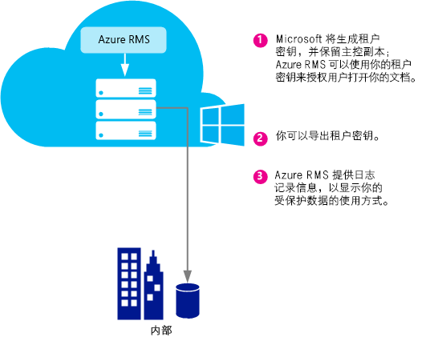
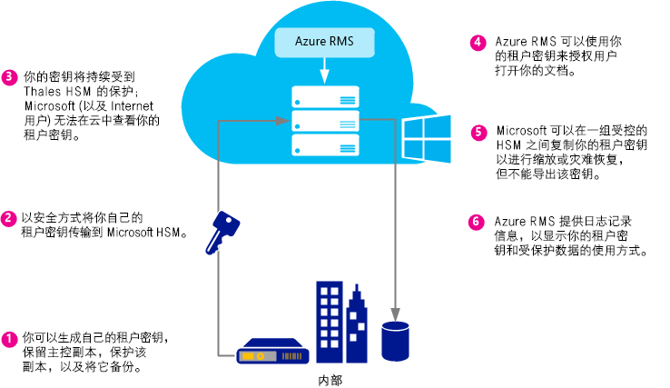
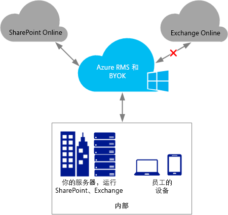
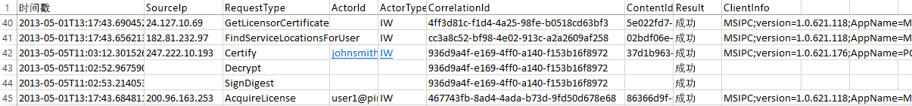

# 计划和实现你的 Azure 权限管理租户密钥
使用本主题中的信息可帮助你计划和管理 Azure RMS 的权限管理服务 (RMS) 租户密钥。 例如，为了遵守组织的具体规定，你不能让 Microsoft 管理你的租户密钥（默认设置），而想要自行管理租户密钥。  自行管理租户密钥也称为自带密钥 (BYOK)。

> [!NOTE]
> RMS 租户密钥也称为服务器许可方证书 (SLC) 密钥。 Azure RMS 为订阅 Azure RMS 的每个组织维护一个或多个密钥。 只要将密钥用于组织内部的 RMS（例如用户密钥、计算机密钥、文档加密密钥），它们将通过加密方式链接到你的 RMS 租户密钥。

**概览：**参考下表来快速了解建议的租户密钥拓扑。 然后，参考其他部分来了解详细信息。

如果你使用 Microsoft 管理的租户密钥部署 Azure RMS，则你以后可以改为使用 BYOK。 但是，目前你无法将 Azure RMS 租户密钥从 BYOK 改为由 Microsoft 管理。

|业务要求|建议的租户密钥拓扑|
|--------|-------------|
|快速部署 Azure RMS，而无需特殊硬件|由 Microsoft 管理|
|需要装有 Azure RMS 的 Exchange Online 中的完整 IRM 功能|由 Microsoft 管理|
|你的密钥由你自己创建，并在硬件安全模块 (HSM) 中受保护|BYOK<br /><br />目前，此配置将导致 Exchange Online 中的 IRM 功能降低。 有关详细信息，请参阅[BYOK 定价和限制](../Topic/Planning_and_Implementing_Your_Azure_Rights_Management_Tenant_Key.md#BKMK_Pricing)部分。|
使用以下部分可帮助你选择要使用的租户密钥拓扑，了解租户密钥生命周期和实现自带密钥 (BYOK) 的方式，以及要采取的后续步骤：

-   [选择你的租户密钥拓扑：由 Microsoft 管理（默认设置）或由你管理 (BYOK)](../Topic/Planning_and_Implementing_Your_Azure_Rights_Management_Tenant_Key.md#BKMK_ChooseTenantKey)

-   [BYOK 定价和限制](../Topic/Planning_and_Implementing_Your_Azure_Rights_Management_Tenant_Key.md#BKMK_Pricing)

-   [实现“自带密钥”(BYOK)](../Topic/Planning_and_Implementing_Your_Azure_Rights_Management_Tenant_Key.md#BKMK_ImplementBYOK)

-   [后续步骤](../Topic/Planning_and_Implementing_Your_Azure_Rights_Management_Tenant_Key.md#BKMK_NextSteps)

## <a name="BKMK_ChooseTenantKey"></a>选择你的租户密钥拓扑：由 Microsoft 管理（默认设置）或由你管理 (BYOK)
确定哪种租户密钥拓扑最适合你的组织。 默认情况下，Azure RMS 生成你的租户密钥，并管理租户密钥生命周期的大多数方面。 这是最简单的选项，管理开销最低。 大多数情况下，你甚至不需要知道自己有租户密钥。 你只需注册 Azure RMS，密钥管理过程的剩余部分将由 Microsoft 处理。

或者，你可能希望完全控制自己的租户密钥，这就需要创建你的租户密钥，并将主副本保存在本地。 这种方案通常称为自带密钥 (BYOK)。 使用这种选项的过程如下：

1.  你根据 IT 策略在本地生成租户密钥。

2.  你将租户密钥从自己掌握的硬件安全模块 (HSM) 安全传送到由 Microsoft 拥有和管理的 HSM。 整个过程中，你的租户密钥从未离开硬件保护范围。

3.  当你将租户密钥传送到 Microsoft 时，它始终处于 Thales HSM 保护下。 Microsoft 与 Thales 进行了合作，确保你的租户密钥无法从 Microsoft 的 HSM 提取。

虽然这是可选的，但你可能希望使用 Azure RMS 提供的接近实时的使用日志，以便准确了解你的租户密钥的使用时间和方式。

> [!NOTE]
> 作为一种附加保护措施，Azure RMS 在位于北美、EMEA 地区（欧洲、中东和非州）和亚洲的数据中心使用单独的安全体系。 当你管理自己的租户密钥时，它将关联到你的 RMS 租户注册所在地区的安全体系。 例如，欧洲客户的租户密钥无法在北美或亚洲的数据中心使用。

## <a name="BKMK_OverviewLifecycle"></a>租户密钥生命周期
如果你决定由 Microsoft 管理你的租户密钥，Microsoft 将处理大多数密钥生命周期操作。 但是，如果你决定自行管理租户密钥，则要负责很多密钥生命周期操作，以及其他一些过程。

下图显示和比较了这两个选项。 第一张图显示在由 Microsoft 管理租户密钥的默认配置中，管理员开销非常低。



第二张图显示当你自行管理租户密钥时需要的其他步骤。



如果你决定让 Microsoft 管理你的租户密钥，则除了生成密钥之外，再无需任何额外操作，你可以跳过以下部分，直接执行[后续步骤](../Topic/Planning_and_Implementing_Your_Azure_Rights_Management_Tenant_Key.md#BKMK_NextSteps)。

如果你决定自行管理租户密钥，请阅读以下部分以获取更多信息。

### 有关 Thales HSM 和 Microsoft 添加件的详细信息
Azure RMS 使用 Thales HSM 来保护你的密钥。

Thales e-Security 是一家全球领先的数据加密和网络安全解决方案提供商，面向金融服务、高科技、制造、政府机构和技术行业。 Thales 解决方案在保护企业和政府信息方面拥有 40 年的悠久历史，在五分之四的大型能源和航天公司以及 22 个 NATO 国家/地区得以使用，为全球 80% 以上的支付交易提供安全保护。

Microsoft 与 Thales 联手协作，不断增强这些 HSM 的功能。 通过这些增强功能，你可以享受托管服务的典型优势，而无需放弃对密钥的控制。 具体来说，这些增强功能让 Microsoft 管理 HSM，因此你无需进行管理。 作为一种云服务，Azure RMS 可在短时间内扩展，以满足你组织的使用高峰需求。 同时，你的密钥在 Microsoft 的 HSM 内部得到保护：你可以保持对密钥生命周期的控制，因为你将生成密钥并将其传送到 Microsoft 的 HSM。

有关详细信息，请参阅 Thales 网站上的 [Thales HSM 和 Azure RMS](http://www.thales-esecurity.com/msrms/cloud)。

## <a name="BKMK_Pricing"></a>BYOK 定价和限制
具有 IT 托管的 Azure 订阅的组织可以使用 BYOK 并记录其使用情况，而无需额外付费。 使用个人 RMS 的组织无法使用 BYOK 和日志记录，因为他们没有租户管理员来配置这些功能。

> [!NOTE]
> 有关个人 RMS 的详细信息，请参阅[个人 RMS 和 Azure 权限管理](../Topic/RMS_for_Individuals_and_Azure_Rights_Management.md)。



BYOK 和日志记录可以无缝应用程序于任何与 Azure RMS 集成的应用程序。 其中包括 SharePoint Online 等云服务、运行 Exchange 和 SharePoint 的本地服务器（它们通过使用 RMS 连接器来运行 Azure RMS）、Office 2013 等客户端应用程序。 无论哪个应用程序请求 Azure RMS，你都将获得密钥使用日志。

但有一个例外：目前，**Azure RMS BYOK 不兼容 Exchange Online**。  如果你使用 Exchange Online，我们建议你暂时以默认密钥管理模式部署 Azure RMS，由 Microsoft 生成和管理你的密钥。 例如，以后你可以在 Exchange Online 不支持 Azure RMS BYOK 时，选择改用 BYOK。 但是，如果你不能等待，则目前可以采用另一种做法，那就是使用 BYOK 部署 Azure RMS，在这种情况下，Exchange 的 RMS 功能将会下降（未受保护的电子邮件和未受保护的附件将保持完全正常运行）：

-   无法显示 Outlook Web Access 中受保护的电子邮件或受保护的附件。

-   无法显示使用 Exchange ActiveSync IRM 的移动设备上的受保护电子邮件。

-   无法进行传输解密（例如，扫描恶意软件）和日记解密，因此将跳过受保护的电子邮件和受保护的附件。

-   无法执行会强制 IRM 策略的传输保护规则和数据丢失预防 (DLP)，因此，无法使用这些方法应用 RMS 保护。

-   基于服务器的受保护的电子邮件，因此将跳过受保护的电子邮件搜索。

当你对 Exchange Online 使用 RMS 功能缩减的 Azure RMS BYOK 时，RMS 将适用于 Windows 和 Mac 上 Outlook 中的电子邮件客户端，以及在不使用 Exchange ActiveSync IRM 的其他电子邮件客户端。

如果你正在从 AD RMS 迁移到 Azure RMS，你可能已导入你的密钥作为可信发布域 (TPD) 到 Exchange Online（在 Exchange 术语中也称为 BYOK，这不同于 Azure RMS BYOK）。 在此情况下，你必须从 Exchange Online 中删除 TPD，以避免模板和策略冲突。 有关详细信息，请参阅 Exchange Online cmdlet 库中的 [Remove-RMSTrustedPublishingDomain](https://technet.microsoft.com/library/jj200720%28v=exchg.150%29.aspx)。

有时，Exchange Online 的 Azure RMS BYOK 异常实际上并不是问题。 例如，需要 BYOK 和日志记录功能的组织在本地运行他们的数据应用程序（Exchange、SharePoint、Office），并使用 Azure RMS 提供使用本地 AD RMS 不易实现的功能（例如，与其他公司协作，从移动客户端进行访问）。 BYOK 和日志记录功能在这种方案中使用效果非常好，让组织能够完全控制他们的 Azure RMS 订阅。

## <a name="BKMK_ImplementBYOK"></a>实现“自带密钥”(BYOK)
如果你决定自行生成和管理租户密钥，请使用本部分中的信息和过程；“自带密钥”(BYOK) 方案：

-   [BYOK 的先决条件](../Topic/Planning_and_Implementing_Your_Azure_Rights_Management_Tenant_Key.md#BKMK_Preqs)

-   [生成和传送租户密钥 – 通过 Internet](../Topic/Planning_and_Implementing_Your_Azure_Rights_Management_Tenant_Key.md#BKMK_BYOK_Internet)

-   [亲自生成和传送你的租户密钥](../Topic/Planning_and_Implementing_Your_Azure_Rights_Management_Tenant_Key.md#BKMK_BYOK_InPerson)

> [!IMPORTANT]
> 如果你已经开始使用 [!INCLUDE[aad_rightsmanagement_1](../Token/aad_rightsmanagement_1_md.md)]（服务已激活），但有些用户在运行 Office 2010，则在运行这些过程之前，请联系 Microsoft 客户支持服务 (CSS)。 根据你的方案和要求，你仍然可以使用 BYOK，但会受到一些限制，或者需要执行一些额外步骤。
> 
> 如果你的组织制定了关于密钥处理的特定政策，也请联系 CSS。

### <a name="BKMK_Preqs"></a>BYOK 的先决条件
有关自带密钥 (BYOK) 的先决条件列表，请参阅以下表格。

|要求|更多信息|
|------|--------|
|支持 Azure RMS 的订阅|有关可用订阅的详细信息，请参阅 [Azure 权限管理要求](../Topic/Requirements_for_Azure_Rights_Management.md)主题中的[支持 Azure RMS 的云订阅](../Topic/Requirements_for_Azure_Rights_Management.md#BKMK_SupportedSubscriptions)部分。|
|请不要使用个人 RMS 或 Exchange Online。 或者，如果你使用 Exchange Online，应了解并接受对此配置使用 BYOK 的限制。|有关 BYOK 当前限制的详细信息，请参阅本主题中的 [BYOK 定价和限制](../Topic/Planning_and_Implementing_Your_Azure_Rights_Management_Tenant_Key.md#BKMK_Pricing)部分。 **Important:** 目前，BYOK 不兼容 Exchange Online。|
|Thales HSM、智能卡和支持软件<br /><br />如果要使用软件密钥到硬件密钥从 AD RMS 迁移到 Azure RMS，必须拥有 Thales 驱动程序的最低版本 11.62。|你必须能够使用 Thales 硬件安全模块，并且掌握有关 Thales HSM 的基本操作知识。 有关兼容型号的列表，请参阅 [Thales 硬件安全模块](http://www.thales-esecurity.com/msrms/buy)，如果你还没有 HSM，请及时购买。|
|如果你希望通过 Internet 传送租户密钥，而不是亲自前往美国 Redmond 传送租户密钥：<br /><br />1.  脱机 x64 工作站，Windows 操作系统版本最低为 Windows 7，Thales nShield 软件至少为版本 11.62。<br />    如果此工作站运行 Windows 7，则必须安装 [Microsoft .NET Framework 4.5](http://go.microsoft.com/fwlink/?LinkId=225702)。<br />2.  连接到 Internet 的工作站，Windows 操作系统版本最低为 Windows 7。<br />3.  USB 驱动器或其他便携式存储设备，至少 16 MB 可用空间。|如果你亲自将租户密钥送到 Redmond，则不需要这些先决条件。<br /><br />出于安全原因，我们建议第一个工作站不要连接到网络。 但是，程序对此没有强制要求。 **Note:** 在接下来的说明中，此工作站称为未连接工作站。<br />此外，如果你的租户密钥用于生产网络，我们建议你使用第二个独立工作站来下载工具集和上载租户密钥。 但如果用于测试目的，你可以使用同一个工作站。 **Note:** 在接下来的说明中，这第二个工作站称为连接 Internet 的工作站。|
|可选：Azure 订阅|如果你希望记录租户密钥使用情况（以及权限管理使用情况 ），则必须具有 Azure 订阅，而且在 Azure 上有足够的存储空间来存储你的日志。|
生成和使用自己的租户密钥的过程，具体取决于你是要通过 Internet 传送租户密钥还是亲自传送租户密钥：

-   **通过 Internet：**这种方式需要一些额外配置步骤，例如下载并使用工具集和 Windows PowerShell cmdlet。 但是，你无需亲自前往 Microsoft 设施传送你的租户密钥。 通过以下方法维护安全性：

    -   你从脱机工作站生成租户密钥，这样可以减小攻击面。

    -   租户密钥使用“密钥交换密钥”(KEK) 进行了加密，这样在传送到 Azure RMS HSM 之前可以一直保持加密状态。 只有已加密版本的租户密钥才能离开原始工作站。

    -   你的租户密钥的一个工具集属性，该属性将你的租户密钥绑定到 Azure RMS 安全体系。 因此，在 Azure RMS HSM 收到和解密你的租户密钥之后，只有这些 HSM 能够使用该密钥。 你的租户密钥无法导出。 绑定由 Thales HSM 实施。

    -   用于加密你的租户密钥的“密钥交换密钥”(KEK) 在 Azure RMS HSM 内部生成，而且无法导出。 HSM 强制要求在 HSM 外部不能有 KEK 的明文版本。 此外，工具集包括来自 Thales 的证明，它证实 KEK 是无法导出的，在 Thales 制造的真品 HSM 内部生成。

    -   工具集还包括来自 Thales 的证明，它证实 Azure RMS 安全体系也在 Thales 制造的真品 HSM 上生成。 这样可向你证明 Microsoft 使用了真品硬件。

    -   Microsoft 使用单独的 KEK，而且在每个地理区域中使用独立的安全体系，这样可以确保你的租户密钥只能在对其进行加密的区域内的数据中心使用。 例如，欧洲客户的租户密钥无法在北美或亚洲的数据中心使用。

    > [!NOTE]
    > 你的租户密钥可在不受信任的计算机和网络之间安全传送，因为它进行了加密，并且通过访问控制级别权限得到保护，只能在你的 HSM 和 Microsoft 的用于 Azure RMS 的 HSM 内部使用。 你可以使用工具集中提供的脚本来验证安全措施，并且阅读 Thales 提供的此方面内容的详细信息：[RMS 云中的硬件密钥管理](https://www.thales-esecurity.com/knowledge-base/white-papers/hardware-key-management-in-the-rms-cloud)。

-   **亲自传送密钥：**这种方式要求你联系 Microsoft 客户支持服务 (CSS) 来安排 Azure RMS 的密钥传送预约。 你必须亲自前往位于美国华盛顿州 Redmond 市的 Microsoft 办事处，将你的租户密钥传送到 Azure RMS 安全体系。

### <a name="BKMK_BYOK_Internet"></a>生成和传送租户密钥 – 通过 Internet
如果你希望通过 Internet 传送租户密钥，而不是亲自前往 Microsoft 设施来传送密钥，请使用以下过程：

-   [准备你的连接 Internet 的工作站](../Topic/Planning_and_Implementing_Your_Azure_Rights_Management_Tenant_Key.md#BKMK_InternetPrepareWorkstation)

-   [准备你的未连接工作站](../Topic/Planning_and_Implementing_Your_Azure_Rights_Management_Tenant_Key.md#BKMK_DisconnectedPrepareWorkstation)

-   [生成你的租户密钥](../Topic/Planning_and_Implementing_Your_Azure_Rights_Management_Tenant_Key.md#BKMK_InternetGenerate)

-   [准备要传送的租户密钥](../Topic/Planning_and_Implementing_Your_Azure_Rights_Management_Tenant_Key.md#BKMK_InternetPrepareTransfer)

-   [将你的租户密钥传送到 Azure RMS](../Topic/Planning_and_Implementing_Your_Azure_Rights_Management_Tenant_Key.md#BKMK_InternetTransfer)

#### <a name="BKMK_InternetPrepareWorkstation"></a>准备你的连接 Internet 的工作站
为了准备连接 Internet 的工作站，请按照以下 3 个步骤操作：

-   [步骤 1：安装适用于 Azure 权限管理的 Windows PowerShell](../Topic/Planning_and_Implementing_Your_Azure_Rights_Management_Tenant_Key.md#BKMK_PrepareInternetConnectedWorkstation1)

-   [步骤 2：获取你的 Azure Active Directory 租户 ID](../Topic/Planning_and_Implementing_Your_Azure_Rights_Management_Tenant_Key.md#BKMK_PrepareInternetConnectedWorkstation2)

-   [步骤 3：下载 BYOK 工具集](../Topic/Planning_and_Implementing_Your_Azure_Rights_Management_Tenant_Key.md#BKMK_PrepareInternetConnectedWorkstation3)

##### <a name="BKMK_PrepareInternetConnectedWorkstation1"></a>步骤 1：安装适用于 Azure 权限管理的 Windows PowerShell
在连接 Internet 的工作站上下载和安装适用于 Azure 权限管理的 Windows PowerShell 模块。

> [!NOTE]
> 如果你之前已下载了此 Windows PowerShell 模块，请运行以下命令来检查你的版本号是否至少为 2.1.0.0：`(Get-Module aadrm -ListAvailable).Version`

有关安装说明，请参阅[安装适用于 Azure 权限管理的 Windows PowerShell](../Topic/Installing_Windows_PowerShell_for_Azure_Rights_Management.md)。

##### <a name="BKMK_PrepareInternetConnectedWorkstation2"></a>步骤 2：获取你的 Azure Active Directory 租户 ID
使用“以管理员身份运行”选项启动 Windows PowerShell，然后运行以下命令：

-   使用 [Connect-AadrmService](http://msdn.microsoft.com/library/windowsazure/dn629415.aspx) cmdlet 连接到 Azure RMS 服务：

    ```
    Connect-AadrmService
    ```
    出现提示时，输入 [!INCLUDE[aad_rightsmanagement_1](../Token/aad_rightsmanagement_1_md.md)] 租户管理员凭据（通常，将使用作为 Azure Active Directory 或 Office 365 的全局管理员的帐户）。

-   使用 [Get-AadrmConfiguration](http://msdn.microsoft.com/library/windowsazure/dn629410.aspx) cmdlet 显示租户的配置：

    ```
    Get-AadrmConfiguration
    ```
    保存输出的第一行中的 GUID (BPOSId)。 这是你的 Azure Active Directory 租户 ID，以后你在准备要上载的租户密钥时需要使用它。

-   使用 [Disconnect-AadrmService](http://msdn.microsoft.com/library/windowsazure/dn629416.aspx) cmdlet 断开与 Azure RMS 服务的连接，直至你为上载密钥做好准备：

    ```
    Disconnect-AadrmService
    ```

不要关闭 Windows PowerShell 窗口。

##### <a name="BKMK_PrepareInternetConnectedWorkstation3"></a>步骤 3：下载 BYOK 工具集
转到 Microsoft 下载中心并[下载适用于你所在区域的 BYOK 工具集](http://go.microsoft.com/fwlink/?LinkId=335781)：

|区域|包名称|
|------|-------|
|北美|AzureRMS-BYOK-tools-UnitedStates.zip|
|欧洲|AzureRMS-BYOK-tools-Europe.zip|
|亚洲|AzureRMS-BYOK-tools-AsiaPacific.zip|
工具集包括以下部分：

-   “密钥交换密钥”(KEK) 软件包，名称以 **BYOK-KEK-pkg-** 开头。

-   安全体系包，名称以 **BYOK-SecurityWorld-pkg-** 开头。

-   名为 **verifykeypackage.py** 的 Python 脚本。

-   一个名为 **KeyTransferRemote.exe** 的命令行可执行文件、一个名为 **KeyTransferRemote.exe.config** 的元数据文件以及关联的 DLL。

-   名为 **vcredist_x64.exe** 的 Visual C++ 可再分发包。

将包复制到 USB 驱动器或其他便携式存储设备。

#### <a name="BKMK_DisconnectedPrepareWorkstation"></a>准备你的未连接工作站
为了准备未连接到网络（Internet 或内部网络）的工作站，请按照以下 2 个步骤操作：

-   [步骤 1：准备要运行 Thales HSM 的未连接工作站](../Topic/Planning_and_Implementing_Your_Azure_Rights_Management_Tenant_Key.md#BKMK_PrepareDisconnectedWorkstation1)

-   [步骤 2：在未连接工作站上安装 BYOK 工具集](../Topic/Planning_and_Implementing_Your_Azure_Rights_Management_Tenant_Key.md#BKMK_PrepareDisconnectedWorkstation2)

##### <a name="BKMK_PrepareDisconnectedWorkstation1"></a>步骤 1：准备要运行 Thales HSM 的未连接工作站
在未连接工作站的 Windows 计算机上安装 nCipher (Thales) 支持软件，然后将 Thales HSM 连接到该计算机。

确保 Thales 工具在你的路径（**(%nfast_home%\bin** 和 **%nfast_home%\python\bin**）中。 例如，键入以下命令：

```
set PATH=%PATH%;”%nfast_home%\bin”;”%nfast_home%\python\bin”
```
有关详细信息，请参阅 Thales HSM 附带的用户指南，或者访问 Thales 的 Azure RMS 网站，地址为 [http://www.thales-esecurity.com/msrms/cloud](http://www.thales-esecurity.com/msrms/cloud)。

##### <a name="BKMK_PrepareDisconnectedWorkstation2"></a>步骤 2：在未连接工作站上安装 BYOK 工具集
从 USB 驱动器或其他便携式存储设备复制 BYOK 工具集包，然后执行以下操作：

1.  将文件从下载包解压到任意文件夹。

2.  在该文件夹下运行 vcredist_x64.exe。

3.  按照以下说明安装 Visual Studio 2012 的 Visual C++ 运行时组件。

#### <a name="BKMK_InternetGenerate"></a>生成你的租户密钥
在未连接工作站上，按照以下 3 个步骤，生成你自己的租户密钥：

-   [步骤 1：创建安全体系](../Topic/Planning_and_Implementing_Your_Azure_Rights_Management_Tenant_Key.md#BKMK_InternetGenerate1)

-   [步骤 2：验证下载的包](../Topic/Planning_and_Implementing_Your_Azure_Rights_Management_Tenant_Key.md#BKMK_InternetGenerate2)

-   [步骤 3：创建新密钥](../Topic/Planning_and_Implementing_Your_Azure_Rights_Management_Tenant_Key.md#BKMK_InternetGenerate3)

##### <a name="BKMK_InternetGenerate1"></a>步骤 1：创建安全体系
启动命令提示符，并运行 Thales new-world 程序。

```
new-world.exe --initialize --cipher-suite=DLf1024s160mRijndael --module=1 --acs-quorum=2/3
```
此程序可在 %NFAST_KMDATA%\local\world（与 C:\ProgramData\nCipher\Key Management Data\local 文件夹对应）下创建一个**安全体系**文件。 你可以使用不同值进行仲裁，但在我们的示例中，系统提示你输入三个空白卡，以及每个卡的 Pin。 然后，将要求任意两个卡对安全体系（你的指定仲裁）具有管理访问权限。  这些卡变成新安全体系的**管理员卡集**。 在此阶段，你可以为每个 ACS 卡指定密码或 PIN，也可以在以后使用命令添加它。

> [!TIP]
> 你可以使用 `nkminfo` 命令验证 HSM 的当前配置状态。

然后执行下列操作：

1.  按照 Thales 文档中的说明，安装 Thales CNG 提供程序，并将其配置为使用新安全体系。

2.  备份 **%nfast_kmdata%\local** 中的体系文件。 保护体系文件、管理员卡及其 PIN，确保没有任何用户能够访问多个卡。

##### <a name="BKMK_InternetGenerate2"></a>步骤 2：验证下载的包
此步骤是可选的，但我们建议执行此步骤，以便能够进行以下验证：

-   工具集包括的“密钥交换密钥”是从真品 Thales HSM 生成的。

-   工具集包括的 Azure RMS 安全体系的哈希是在真品 Thales HSM 中生成的。

-   “密钥交换密钥”是无法导出的。

> [!NOTE]
> 若要验证下载的包，HSM 必须处于连接状态且接通电源，其上必须有安全体系（例如你刚才创建的那一个）。

###### 验证下载的包

1.  根据你所在的地区，键入以下命令之一，以运行 verifykeypackage.py 脚本：

    -   适用于北美：

        ```
        python verifykeypackage.py -k BYOK-KEK-pkg-NA-1 -w BYOK-SecurityWorld-pkg-NA-1
        ```

    -   适用于欧洲：

        ```
        python verifykeypackage.py -k BYOK-KEK-pkg-EU-1 -w BYOK-SecurityWorld-pkg-EU-1
        ```

    -   适用于亚洲：

        ```
        python verifykeypackage.py -k BYOK-KEK-pkg-AP-1 -w BYOK-SecurityWorld-pkg-AP-1
        ```

    > [!TIP]
    > Thales 软件包括了一个 Python 解释器（位于 %NFAST_HOME%\python\bin 中）

2.  确认你看到以下结果，它表示验证成功：**结果：SUCCESS**

此脚本验证签名人链，一直到 Thales 根密钥。 此根密钥的哈希嵌入到脚本中，其值应为 **59178a47 de508c3f 291277ee 184f46c4 f1d9c639**。 你也可以通过访问 [Thales 网站](http://www.thalesesec.com/)，单独确认该值。

你现在可以创建一个新密钥，作为你的 RMS 租户密钥。

##### <a name="BKMK_InternetGenerate3"></a>步骤 3：创建新密钥
使用 Thales **generatekey** 和**cngimport** 程序创建一个 CNG 密钥。

运行以下命令以生成密钥：

```
generatekey --generate simple type=RSA size=2048 protect=module ident=contosokey plainname=contosokey nvram=no pubexp=
```
当你运行此命令时，请使用以下说明：

-   对于密钥大小，我们建议为 2048 位，但也支持现有 AD RMS 客户拥有 1024 位 RSA 密钥，这些客户使用此类密钥向 Azure RMS 迁移。

-   将 **ident** 和 **plainname** 的 *contosokey* 值替换为任何字符串值。 为了最大程度地减少管理开销和降低错误风险，我们建议两者使用相同的值，并且全部使用小写字符。

-   在本例中，pubexp 保留空白（默认值），但你可以指定特定值。 有关详细信息，请参阅 Thales 文档。

然后运行以下命令，将密钥导入 CNG：

```
cngimport --import -M --key=contosokey --appname=simple contosokey
```
当你运行此命令时，请使用以下说明：

-   将 *contosokey* 替换为*在生成你的租户密钥*部分的[步骤 1：创建安全体系](../Topic/Planning_and_Implementing_Your_Azure_Rights_Management_Tenant_Key.md#BKMK_InternetGenerate1)中指定的同一值。

-   请使用 **-M** 选项，使得密钥适合此方案。 在不使用此选项的情况下，生成的密钥将是当前用户的用户特定密钥。

此命令可在你的 %NFAST_KMDATA%\local 文件夹中创建一个标记化密钥文件，其名称以 **key_caping_** 开头，后跟 SID。 例如：**key_caping_machine--801c1a878c925fd9df4d62ba001b94701c039e2fb**。 此文件包含加密密钥。

> [!TIP]
> 你可以使用 `nkminfo –k` 命令查看密钥的当前配置状态。

在安全位置备份这个标记化密钥文件。

> [!IMPORTANT]
> 当你以后将密钥传送到 Azure RMS 时，Microsoft 无法再将此密钥导出给你，因此你必须安全地备份密钥和安全体系，这一点极为重要。 请联系 Thales 以获得备份密钥的指导和最佳实践。

你现在可将租户密钥传送到 Azure RMS。

#### <a name="BKMK_InternetPrepareTransfer"></a>准备要传送的租户密钥
在未连接工作站上，按照以下 4 个步骤，准备你自己的租户密钥：

-   [步骤 1：创建你的密钥副本，该副本具有降低的权限](../Topic/Planning_and_Implementing_Your_Azure_Rights_Management_Tenant_Key.md#BKMK_InternetPrepareTransfer1)

-   [步骤 2：检测新的密钥副本](../Topic/Planning_and_Implementing_Your_Azure_Rights_Management_Tenant_Key.md#BKMK_InternetPrepareTransfer2)

-   [步骤 3：使用 Microsoft 的“密钥交换密钥”加密你的密钥](../Topic/Planning_and_Implementing_Your_Azure_Rights_Management_Tenant_Key.md#BKMK_InternetPrepareTransfer3)

-   [步骤 4：将你的密钥传送包复制到连接 Internet 的工作站](../Topic/Planning_and_Implementing_Your_Azure_Rights_Management_Tenant_Key.md#BKMK_InternetPrepareTransfer4)

##### <a name="BKMK_InternetPrepareTransfer1"></a>步骤 1：创建你的密钥副本，该副本具有降低的权限
若要降低你的租户密钥的权限，请执行以下操作：

-   根据你所在的地区，从命令提示符处运行以下命令之一：

    -   适用于北美：

        ```
        KeyTransferRemote.exe -ModifyAcls -KeyAppName simple -KeyIdentifier contosokey -ExchangeKeyPackage BYOK-KEK-pkg-NA-1 -NewSecurityWorldPackage BYOK-SecurityWorld-pkg-NA-1
        ```

    -   适用于欧洲：

        ```
        KeyTransferRemote.exe -ModifyAcls -KeyAppName simple -KeyIdentifier contosokey -ExchangeKeyPackage BYOK-KEK-pkg-EU-1 -NewSecurityWorldPackage BYOK-SecurityWorld-pkg-EU-1
        ```

    -   适用于亚洲：

        ```
        KeyTransferRemote.exe -ModifyAcls -KeyAppName simple -KeyIdentifier contosokey -ExchangeKeyPackage BYOK-KEK-pkg-AP-1 -NewSecurityWorldPackage BYOK-SecurityWorld-pkg-AP-1
        ```

运行此命令时，请将 *contosokey* 替换为*在生成你的租户密钥*部分的[步骤 1：创建安全体系](../Topic/Planning_and_Implementing_Your_Azure_Rights_Management_Tenant_Key.md#BKMK_InternetGenerate1)中指定的同一值。

可能会要求你插入安全体系 ACS 卡，并且如果指定了其密码或 PIN，还会要求提供它们。

命令完成时，你将看到 **Result:SUCCESS**，具有降低的权限的租户密钥副本将位于名为 key_xferacId_*&lt;contosokey&gt;* 的文件中。

##### <a name="BKMK_InternetPrepareTransfer2"></a>步骤 2：检测新的密钥副本
或者，运行 Thales 实用工具以确认新租户密钥的最低权限：

-   aclprint.py：

    ```
    "%nfast_home%\bin\preload.exe" -m 1 -A xferacld -K contosokey "%nfast_home%\python\bin\python" "%nfast_home%\python\examples\aclprint.py"
    ```

-   kmfile-dump.exe：

    ```
    "%nfast_home%\bin\kmfile-dump.exe" "%NFAST_KMDATA%\local\key_xferacld_contosokey"
    ```

运行这些命令时，请将 *contosokey* 替换为*在生成你的租户密钥*部分的[步骤 1：创建安全体系](../Topic/Planning_and_Implementing_Your_Azure_Rights_Management_Tenant_Key.md#BKMK_InternetGenerate1)中指定的同一值。

##### <a name="BKMK_InternetPrepareTransfer3"></a>步骤 3：使用 Microsoft 的“密钥交换密钥”加密你的密钥
根据你所在的地区，运行以下命令之一：

-   适用于北美：

    ```
    KeyTransferRemote.exe -Package -KeyIdentifier contosokey -ExchangeKeyPackage BYOK-KEK-pkg-NA-1 -NewSecurityWorldPackage BYOK-SecurityWorld-pkg-NA-1 -TenantBposId GUID -KeyFriendlyName ContosoFirstkey
    ```

-   适用于欧洲：

    ```
    KeyTransferRemote.exe -Package -KeyIdentifier contosokey -ExchangeKeyPackage BYOK-KEK-pkg-EU-1 -NewSecurityWorldPackage BYOK-SecurityWorld-pkg-EU-1 -TenantBposId GUID -KeyFriendlyName ContosoFirstkey
    ```

-   适用于亚洲：

    ```
    KeyTransferRemote.exe -Package -KeyIdentifier contosokey -ExchangeKeyPackage BYOK-KEK-pkg-AP-1 -NewSecurityWorldPackage BYOK-SecurityWorld-pkg-AP-1 -TenantBposId GUID -KeyFriendlyName ContosoFirstkey
    ```

当你运行此命令时，请使用以下说明：

-   将 *contosokey* 替换为你在*生成你的租户密钥*部分的[步骤 1：创建安全体系](../Topic/Planning_and_Implementing_Your_Azure_Rights_Management_Tenant_Key.md#BKMK_InternetGenerate1)中用于生成密钥的标识符。

-   将 *GUID* 替换为你在*准备你的连接 Internet 的工作站*部分的[步骤 2：获取你的 Azure Active Directory 租户 ID](../Topic/Planning_and_Implementing_Your_Azure_Rights_Management_Tenant_Key.md#BKMK_PrepareInternetConnectedWorkstation2)中检索的 Azure Active Directory 租户 ID。

-   将 *ContosoFirstKey* 替换为将用作输出文件名称的标签。

成功完成后，它将显示 **Result:SUCCESS**，当前文件夹中将有一个新文件，名称如下：TransferPackage-*ContosoFirstkey*.byok

##### <a name="BKMK_InternetPrepareTransfer4"></a>步骤 4：将你的密钥传送包复制到连接 Internet 的工作站
使用 USB 驱动器或其他便携式存储设备，将前一步骤中的输出文件 (KeyTransferPackage-*ContosoFirstkey*.byok) 复制到连接 Internet 的工作站。

> [!NOTE]
> 运用安全实践来保护该文件，因为其中包含你的私钥。

#### <a name="BKMK_InternetTransfer"></a>将你的租户密钥传送到 Azure RMS
在连接 Internet 的工作站上，按照以下 3 个步骤，将你的新租户密钥传送到 Azure RMS：

-   [步骤 1：连接到 Azure RMS](../Topic/Planning_and_Implementing_Your_Azure_Rights_Management_Tenant_Key.md#BKMK_InternetTransfer1)

-   [步骤 2：上载密钥包](../Topic/Planning_and_Implementing_Your_Azure_Rights_Management_Tenant_Key.md#BKMK_InternetTransfer2)

-   [步骤 3：根据需要枚举你的租户密钥](../Topic/Planning_and_Implementing_Your_Azure_Rights_Management_Tenant_Key.md#BKMK_InternetTransfer3)

##### <a name="BKMK_InternetTransfer1"></a>步骤 1：连接到 Azure RMS
返回到 Windows PowerShell 窗口并键入以下命令：

1.  重新连接到 [!INCLUDE[aad_rightsmanagement_1](../Token/aad_rightsmanagement_1_md.md)] 服务：

    ```
    Connect-AadrmService
    ```

2.  使用 [Get-AadrmKeys](http://msdn.microsoft.com/library/windowsazure/dn629420.aspx) cmdlet 查看你的当前租户密钥配置：

    ```
    Get-AadrmKeys
    ```

##### <a name="BKMK_InternetTransfer2"></a>步骤 2：上载密钥包
使用 [Add-AadrmKey](http://msdn.microsoft.com/library/windowsazure/dn629418.aspx) cmdlet 上载你从未连接工作站复制的密钥传送包：

```
Add-AadrmKey –KeyFile <PathToPackageFile> -Verbose
```
> [!WARNING]
> 系统将提示你确认此操作。 必须知道此操作是无法撤销的，这一点非常重要。 当你上载租户文件时，它自动成为你组织的首选租户密钥，用户将在保护文档和文件时开始使用此租户密钥。

如果上载成功，你将看到以下消息：**Rights Management 服务已成功添加密钥。**

当更改传播到所有 [!INCLUDE[aad_rightsmanagement_1](../Token/aad_rightsmanagement_1_md.md)] 数据中心时，将会出现复制延迟。

##### <a name="BKMK_InternetTransfer3"></a>步骤 3：根据需要枚举你的租户密钥
每当你希望查看租户密钥列表以及查看租户密钥的更改时，可再次使用 Get-AadrmKeys cmdlet。 显示的租户密钥包括 Microsoft 为你生成的初始租户密钥，以及你添加的任何租户密钥：

```
Get-AadrmKeys
```
标记为“活动”的租户密钥是你的组织当前用于保护文档和文件的密钥。

你现在已经完成了通过 Internet 自带密钥所需的全部步骤，接下来可以执行[后续步骤](../Topic/Planning_and_Implementing_Your_Azure_Rights_Management_Tenant_Key.md#BKMK_NextSteps)。

### <a name="BKMK_BYOK_InPerson"></a>亲自生成和传送你的租户密钥
如果你不希望通过 Internet 传送你的租户密钥，请使用以下过程亲自传送你的租户密钥。

-   [生成你的租户密钥](../Topic/Planning_and_Implementing_Your_Azure_Rights_Management_Tenant_Key.md#BKMK_GenerateKey)

-   [将你的租户密钥传送到 Azure RMS](../Topic/Planning_and_Implementing_Your_Azure_Rights_Management_Tenant_Key.md#BKMK_Transfer)

#### <a name="BKMK_GenerateKey"></a>生成你的租户密钥
若要生成你自己的租户密钥，请执行以下 3 个步骤：

-   [步骤 1：准备运行 Thales HSM 的工作站](../Topic/Planning_and_Implementing_Your_Azure_Rights_Management_Tenant_Key.md#BKMK_GenerateYourKey1)

-   [步骤 2：创建安全体系](../Topic/Planning_and_Implementing_Your_Azure_Rights_Management_Tenant_Key.md#BKMK_GenerateYourKey2)

-   [步骤 3：创建新密钥](../Topic/Planning_and_Implementing_Your_Azure_Rights_Management_Tenant_Key.md#BKMK_GenerateYourKey3)

##### <a name="BKMK_GenerateYourKey1"></a>步骤 1：准备运行 Thales HSM 的工作站
在 Windows 计算机上安装 nCipher (Thales) 支持软件。 将 Thales HSM 连接到该计算机。 确保 Thales 工具在你的路径中。 有关详细信息，请参阅 Thales HSM 附带的用户指南，或者访问 Thales 的 Azure RMS 网站，地址为 [http://www.thales-esecurity.com/msrms/cloud](http://www.thales-esecurity.com/msrms/cloud)。

##### <a name="BKMK_GenerateYourKey2"></a>步骤 2：创建安全体系
启动命令提示符，并运行 Thales new-world 程序。

```
new-world.exe --initialize --cipher-suite=DLf1024s160mRijndael --module=1 --acs-quorum=2/3
```
此程序可在 %NFAST_KMDATA%\local\world（与 C:\ProgramData\nCipher\Key Management Data\local 文件夹对应）下创建一个**安全体系**文件。 你可以使用不同值进行仲裁，但在我们的示例中，系统提示你输入三个空白卡，以及每个卡的 Pin。 因此，其中任意二个卡将提供对安全体系的完全访问权限。  这些卡变成新安全体系的**管理员卡集**。

然后执行下列操作：

1.  按照 Thales 文档中的说明，安装 Thales CNG 提供程序，并将其配置为使用新安全体系。

2.  备份体系文件。 保护体系文件、管理员卡及其 PIN，确保没有任何用户能够访问多个卡。

你现在可以创建一个新密钥，作为你的 RMS 租户密钥。

##### <a name="BKMK_GenerateYourKey3"></a>步骤 3：创建新密钥
使用 Thales **generatekey** 和**cngimport** 程序创建一个 CNG 密钥。

运行以下命令以生成密钥：

```
generatekey --generate simple type=RSA size=2048 protect=module ident=contosokey plainname=contosokey nvram=no pubexp=
```
当你运行此命令时，请使用以下说明：

-   对于密钥大小，我们建议为 2048 位，但也支持现有 AD RMS 客户拥有 1024 位 RSA 密钥，这些客户使用此类密钥向 Azure RMS 迁移。

-   将 **ident** 和 **plainname** 的 *contosokey* 值替换为任何字符串值。 为了最大程度地减少管理开销和降低错误风险，我们建议两者使用相同的值，并且全部使用小写字符。

-   在本例中，pubexp 保留空白（默认值），但你可以指定特定值。 有关详细信息，请参阅 Thales 文档。

然后运行以下命令，将密钥导入 CNG：

```
cngimport --import –M --key=contosokey --appname=simple contosokey
```
当你运行此命令时，请使用以下说明：

-   将 *contosokey* 替换为你在步骤 1 中指定的同一值。

-   请使用 **-M** 选项，使得密钥适合此方案。 在不使用此选项的情况下，生成的密钥将是当前用户的用户特定密钥。

此命令可在你的 %NFAST_KMDATA%\local 文件夹中创建一个标记化密钥文件，其名称以 **key_caping_** 开头，后跟 SID。 例如：**key_caping_machine--801c1a878c925fd9df4d62ba001b94701c039e2fb**。 此文件包含加密密钥。

在安全位置备份这个标记化密钥文件。

> [!IMPORTANT]
> 当你以后将密钥传送到 Azure RMS 时，Microsoft 将拥有你的密钥的不可恢复副本。 这意味着 Microsoft 的任何人都无法从 HSM 检索你的密钥。 这使你能够保持对租户密钥的独有控制。 因此，你必须安全地备份密钥和安全体系，这一点极为重要。 请联系 Thales 以获得备份密钥的指导和最佳实践。

你现在可将租户密钥传送到 Azure RMS。

#### <a name="BKMK_Transfer"></a>将你的租户密钥传送到 Azure RMS
在你生成自己的密钥之后，在使用之前，必须将其传送到 Azure RMS。 为了达到最高级别的安全性，这种传送采用人工过程，要求你亲自前往位于美国华盛顿州 Redmond 市的 Microsoft 办事处。 若要完成此过程，请执行以下 3 个步骤：

-   [步骤 1：将你的密钥提供给 Microsoft](../Topic/Planning_and_Implementing_Your_Azure_Rights_Management_Tenant_Key.md#BKMK_TransferYourKey1)

-   [步骤 2：将你的密钥传送到 Window Azure RMS 安全体系](../Topic/Planning_and_Implementing_Your_Azure_Rights_Management_Tenant_Key.md#BKMK_TransferYourKey2)

-   [步骤 3：完成过程](../Topic/Planning_and_Implementing_Your_Azure_Rights_Management_Tenant_Key.md#BKMK_TransferYourKey3)

###### 步骤 1：将你的密钥提供给 Microsoft

-   联系 Microsoft 客户支持服务 (CSS)，安排 Azure RMS 的密钥传送预约。 向位于 Redmond 市的 Microsoft 设施提交以下项目：

    -   管理卡的仲裁。 如果你遵循了前面[步骤 2：创建安全体系](../Topic/Planning_and_Implementing_Your_Azure_Rights_Management_Tenant_Key.md#BKMK_GenerateYourKey2)中的说明，则它们是三个卡中的任意两个卡。

    -   被授权携带你的管理卡和 PIN 的员工，通常有两位（一人一卡）。

    -   你的安全体系文件 (%NFAST_KMDATA%\local\world)，保存在 USB 驱动器上。

    -   你的标记化密钥文件，保存在 USB 驱动器上。

###### 步骤 2：将你的密钥传送到 Window Azure RMS 安全体系

1.  当你亲自前往 Microsoft 传送你的密钥时，会发生以下情况：

    -   Microsoft 为你提供连接 Thales HSM 的脱机工作站，它安装了 Thales 软件，并将 Azure RMS 安全体系文件预先加载到文件夹 C:\Temp\Destination。

    -   在此工作站上，你将 USB 驱动器上的安全体系文件和标记化密钥文件加载到 C:\Temp\Source 文件夹中。

    -   Azure RMS 操作人员使用 Thales 实用工具，将你的密钥安全传送到 Azure RMS 安全体系。

    这个过程与以下过程类似，本例中的最后一个参数 key-xfer-im 替换为你的标记化密钥文件名称：

    **C:\&gt; mk-reprogram.exe --owner c:\Temp\Destination add c:\Temp\Source**

    **C:\&gt; key-xfer-im.exe c:\Temp\Source c:\Temp\Destination --module c:\Temp\Source\key_caping_machine--801c1a878c925fd9df4d62ba001b94701c039e2fb**

2.  Mk-reprogram 将请求你和 Azure RMS 操作人员插入相应的管理员卡和 PIN。 这些命令在包含受 Azure RMS 安全体系保护的密钥的 C:\Temp\Destination 目录中输出一个标记化密钥文件。

###### 步骤 3：完成过程

-   当你在场的情况下，Azure RMS 操作人员执行以下操作：

    -   运行 Microsoft 和 Thales 协作开发的一种工具，用于删除两种权限：恢复密钥的权限、更改权限的权限。 完成此操作后，你的这个密钥副本将会锁定到 Azure RMS 安全体系。 Thales HSM 将不允许拥有管理员卡的 Azure RM 操作人员恢复密钥明文副本。

    -   将生成的密钥文件复制到 USB 驱动器，以便以后上载到 Azure RMS 服务。

    -   对 HSM 进行出厂重置，将工作站擦除干净。

你现在已经完成了自带密钥所需的全部步骤，可以返回到组织执行后续步骤。

## <a name="BKMK_NextSteps"></a>后续步骤

1.  开始使用你的租户密钥：

    -   如果尚未开始使用，你必须立即启用权限管理，以便你的组织能够开始使用 RMS。 用户立即开始使用你的租户密钥（由 Microsoft 管理或由你管理）。

        有关激活的详细信息，请参阅[激活 Azure 权限管理](../Topic/Activating_Azure_Rights_Management.md)。

    -   如果你已经激活了权限管理，然后决定自行管理租户密钥，用户将逐渐从旧租户密钥迁移到新租户密钥，这种交错式迁移可能需要花费几周才能完成。 受旧租户密钥保护的文档和文件仍然可供授权用户访问。

2.  请考虑启用使用日志记录，该功能可记录 RMS 执行的每一个事务。

    如果你决定自行管理租户密钥，则日志记录包括租户密钥的使用信息。 请参阅在 Excel 中显示的以下日志文件示例，其中的 **Decrypt** 和 **SignDigest** 请求类型显示该租户密钥正在使用中。

    

    有关使用日志记录的详细信息，请参阅[记录和分析 Azure 权限管理使用情况](../Topic/Logging_and_Analyzing_Azure_Rights_Management_Usage.md)。

3.  维护你的租户密钥。

    有关详细信息，请参阅[你的 Azure 权限管理租户密钥的操作](../Topic/Operations_for_Your_Azure_Rights_Management_Tenant_Key.md)。

## 请参阅
[配置 Azure 权限管理](../Topic/Configuring_Azure_Rights_Management.md)

