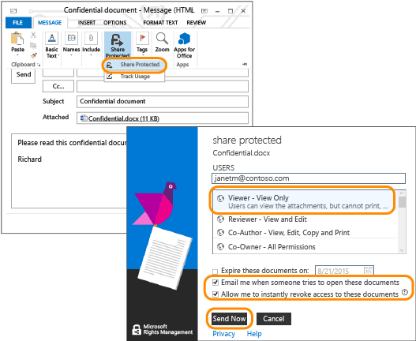

# Azure Rights Management 快速入门教程
使用本教程，你可以快速试用适合你组织的 Microsoft Azure 权限管理（也称 Azure RMS），只需执行 5 个步骤，所需时间不到 15 分钟。 你需要激活服务，然后即可通过电子邮件将机密文档安全地发送给其他组织的人员，并可跟踪该文档何时被打开。 通过电子邮件发送机密文档时，该文档在传输过程中会进行加密，只能由收件人使用发件人设置的权限来打开。

本教程针对的是 IT 管理员和顾问，目的是帮助他们评估 Azure 权限管理的作用，看其是否适合用作组织的信息保护解决方案。 在生产环境中，应该由管理员按说明来激活服务，由最终用户按说明来发送文档。 这两套说明都包括在本教程中，其所展示的端到端方案说明了如何将机密文档安全地发送到其他组织的人员手中。 如果你在完成本教程的过程中遇到问题，请发送电子邮件至 [AskIPTeam](mailto:askipteam@microsoft.com?subject=Having%20problems%20with%20the%20Quick%20Start%20tutorial)，我们会帮助你解决问题。

若要完成本教程，你需要满足以下先决条件：

-   支持 Azure Rights Management 的订阅。 该订阅可以是付费订阅，也可以是试用订阅。 如果你想要使用文档跟踪（本教程中的步骤 5需要使用此功能），你的订阅必须支持文档跟踪。 有关订阅选项以及免费试用版链接的详细信息，请参阅 [Azure 权限管理要求](../Topic/Requirements_for_Azure_Rights_Management.md)主题中的[支持 Azure RMS 的云订阅](../Topic/Requirements_for_Azure_Rights_Management.md#BKMK_SupportedSubscriptions)部分。

    提示：如果你需要获取某个订阅，请提前进行，因为该过程有时需要一定的时间才能完成。

-   用于登录到 Office 365 管理中心或 Azure 经典门户的管理员帐户，你可以使用该帐户来激活 Rights Management 服务。 此帐户还必须有电子邮件地址和可用的电子邮件服务（例如，Exchange Online 或 Exchange Server）。

-   运行 Windows（最低配置为 Windows 7 SP1）并已安装 Office 2016、Office 2013 或 Office 2010 的计算机。

让我们开始吧。

## 步骤 1：激活权限管理服务

即使你的订阅支持 Azure 权限管理，该服务在默认情况下也是禁用的。 你可以使用 Office 365 管理中心或 Azure 经典门户来激活它：

-   如果你有一个包含 Azure Rights Management 的 Office 365 订阅，或者虽然你的 Office 365 订阅不包含 Azure Rights Management，但你有一个包含 Azure RMS Premium 的订阅，则可执行以下操作：**使用 Office 365 管理中心**。

-   如果你没有 Office 365 订阅，则可执行以下操作：**使用 Azure 经典门户**。

#### 从 Office 365 管理中心激活权限管理

1.  转到 [Office 365 门户](https://portal.office.com/)，使用你的工作或学校帐户登录。

2.  如果未自动显示 Office 365 管理中心，请选择左上方的应用程序启动程序图标，然后选择**“管理”**。 “管理”磁贴只会向 Office 365 管理员显示。

    > [!TIP]
    > 有关管理中心的帮助，请参阅[关于 Office 365 管理中心 - 管理员帮助](https://support.office.com/article/About-the-Office-365-admin-center-Admin-Help-58537702-d421-4d02-8141-e128e3703547)。

3.  在左窗格中，单击“服务设置”。

4.  单击“权限管理”。

5.  在“权限管理”页上，单击“管理”。

6.  在“权限管理”页上，单击“激活”。

7.  当提示“是否要激活权限管理?”时，请单击“激活”。

你现在应该看到**“权限管理已激活”**以及停用选项（可能需要手动刷新该页）。

此时请勿单击**“高级功能”**。 单击该选项会将你转到可在其中配置模板的 Azure 经典门户，这些模板不是本教程所必需的。 与之相反，你可以关闭 Office 365 管理中心。

#### 从 Azure 门户激活权限管理

1.  转到 [Azure 经典门户](http://go.microsoft.com/fwlink/p/?LinkID=275081)并登录。

2.  在左窗格中，单击“ACTIVE DIRECTORY”。

3.  在“Active Directory”页中，单击“Rights Management”。

4.  为[!INCLUDE[aad_rightsmanagement_2](../Token/aad_rightsmanagement_2_md.md)]选择要管理的目录，单击“激活”，然后确认你的操作。

**“权限管理状态”**现在应该显示**“活动”**，而**“激活”**选项将替换为**“停用”**。

虽然你可以在门户中配置 Rights Management 的其他选项，但这些选项不是本教程所必需的，因此可关闭 Azure 经典门户。

此第一步只需执行这些操作。 激活此服务后，你组织中的所有用户就可以对重要的和敏感的文档进行保护。 在生产环境中，你可能需要对谁能在开始的时候执行此操作进行限制，以方便分阶段部署。 不过，本教程不需要这样。

进行生产部署时，你可能还需要配置自定义模板，当然本教程不包含此部分内容。 在需要对文件进行保护时，用户可以使用模板更快速、轻松地应用正确的设置。 激活权限管理时，你将自动获得 2 个默认的模板，而在生产环境中，你可能需要使用自己的自定义模板对这些模板进行补充。 但本教程不需要模板，因此你可以转到下一步。

|如果你想了解更多信息|其他信息|
|--------------|--------|
|关于如何激活权限管理以后如何在激活该服务后控制谁能对文件和电子邮件进行保护   →|[激活 Azure 权限管理](../Topic/Activating_Azure_Rights_Management.md)|
|关于默认模板以及如何创建新的自定义模板   →|[为 Azure 权限管理配置自定义模板](../Topic/Configuring_Custom_Templates_for_Azure_Rights_Management.md)|

## 步骤 2：安装权限管理共享应用程序

权限管理共享应用程序（也称"RMS 共享应用程序"）不是 Azure 权限管理所必需的，但我们建议将其用于支持 Azure 权限管理的所有计算机和移动设备。 通过安装 Office 加载项，RMS 共享应用程序可与 Office 应用程序集成在一起，使得用户能够轻松地从功能区直接保护文件。 此外，它还可以向本来不受 Azure 权限管理支持的文件应用常规保护，从而保护所有文件类型，并可为用户设置一个文档跟踪站点，方便其跟踪和撤销受保护的文件。 我们将在本教程的后面部分用到文档跟踪站点。

此应用程序可免费下载，并可针对生产环境进行脚本化安装。 不过就本教程来说，我们将在本地安装它。

#### 下载并安装权限管理共享应用程序

1.  转到 Microsoft 网站上的 [Microsoft 权限管理](http://go.microsoft.com/fwlink/?LinkId=303970)页。

2.  在**“计算机”**部分，单击**“适用于 Windows 的 RMS 应用程序”**图标，然后保存用于安装 Microsoft 权限管理共享应用程序的 **Setup.exe** 文件。

3.  若要进行本地安装，你必须使用管理员帐户运行已下载的 Setup.exe 文件。 如果系统提示你继续，请单击**“是”**。

4.  在**“安装 Microsoft RMS”**页上，单击**“下一步”**，然后等待安装完成。

5.  安装完成后，请单击**“重新启动”**（如果系统提示你重新启动计算机），或单击**“关闭”**完成安装。

现在，你可以开始对那些你希望只与指定人员共享其中所含信息的文件进行保护。

|如果你想了解更多信息|其他信息|
|--------------|--------|
|关于适用于 Windows 的权限管理共享应用程序的本地安装以及用户说明   →|[权限管理共享应用程序用户指南](http://technet.microsoft.com/library/dn339006.aspx)|
|关于适用于 Windows 的权限管理共享应用程序的脚本化安装以及更多技术信息   →|[权限管理共享应用程序管理员指南](http://technet.microsoft.com/library/dn339003.aspx)|
|了解本机保护和常规保护的区别   →|[常规保护和内置（本机）保护的区别是什么？](https://technet.microsoft.com/library/dn574738.aspx)|

## 步骤 3：通过电子邮件发送要保护的文档

就这一步来说，首先请使用 Word 创建并保存一个文档，该文档就是你需要保护的文档，你可以将其命名为 **Confidential.docx**。 就本教程来说，该文档实际包含什么文本并不重要，而之所以需要让其包含一些文本，是为了方便你确认所授权的收件人能够阅读它。 例如，你可以键入：**如果你可以阅读电子邮件附件中的此内容，则说明发件人已通过 Azure RMS 成功共享了受保护的文件。**

然后你就可以安全地通过电子邮件共享此文档。

#### 通过电子邮件安全地共享你的文档

1.  使用 Outlook 创建一封新邮件，然后将你刚创建的文件添加到附件中。

2.  在**“收件人”**框中，键入一个或多个业务电子邮件地址。 请务必指定业务电子邮件地址，例如 **janetm@contoso.com** 或 **p.dover@fabrikam.com**，因为 Azure Rights Management 目前不支持 Internet 提供商提供的可在家里使用的个人电子邮件地址。 请不要担心你向其发送电子邮件的人是否也有 Azure 权限管理。

3.  键入一个主题，例如**“机密文档”**，然后键入简短的电子邮件内容，例如**“请阅读此机密文档，不要与其他人共享。”**

4.  然后，在**“RMS”**组的**“消息”**选项卡中，单击**“共享保护项”**，然后再次单击**“共享保护项”**：

5.  在**“共享保护项”**对话框中，执行以下操作：

    1.  选择**“查看者 – 仅查看”**。

        这意味着收件人能够查看该文档，但不能进行编辑或打印。

    2.  选择**“当有人尝试打开这些文档时，给我发电子邮件”**。

        每次收件人尝试打开该附件时，你都会收到电子邮件通知。另外，如果其他人尝试打开该附件（例如，收件人将电子邮件转发给同事），你也会收到电子邮件通知。 在最后这种情况中，你会看到访问被拒绝，你可以根据用户详细信息来决定是否向该人发送一份允许其打开的文档。

    3.  选择**“允许我立即撤消对这些文档的访问权限”**。

        此选项要求收件人每次打开该附件时都要有 Internet 连接，但好处是，如果你在以后撤销该文档，则收件人下次将无法打开它。 如果你不选择此选项，则收件人在没有 Internet 连接的情况下也可以打开该文档，但坏处是，如果你在以后撤销该文档，则可能需要延迟一段时间才能生效。

    4.  单击**“立即发送”**。

        将向你所指定的电子邮件地址发送带附件的电子邮件。 除了你的电子邮件，他们还会看到有关如何阅读受 Azure 权限管理保护的附加文档的说明。

现在，你已发送受保护文档，你可以要求收件人等待该文档，在其到达后打开它。 但请勿关闭 Outlook，因为我们需要在最后一步再次使用它来跟踪该附件。

|如果你想了解更多信息|其他信息|
|--------------|--------|
|有关保护通过电子邮件进行共享的文件的完整说明和替代方法   →|[使用权限管理共享应用程序保护通过电子邮件进行共享的文件](https://technet.microsoft.com/library/dn574735.aspx)|
|关于**“共享保护项”**对话框中的选项   →|[权限管理共享应用程序的的对话框选项](https://technet.microsoft.com/library/dn574738.aspx)|

## 步骤 4：要求收件人打开通过电子邮件发送的文档

收件人可以使用很多设备来阅读你以电子邮件附件形式发送的受保护文档。 这些设备包括 iPad、iPhone、Android 平板电脑和手机、Mac 计算机，以及 Windows 计算机。

要求他们阅读你发送的电子邮件。 他们会看到你的电子邮件，而在此之前，他们会看到以下文本：

**发件人已使用 Microsoft RMS 保护了附件。你必须** [登录](http://aka.ms/rms)
      **才能打开它们。**

当他们单击此链接时，会显示相关说明，告知他们如何安装 RMS 共享应用程序，以及如何在必要时注册免费的帐户。 该免费帐户提供个人 RMS 订阅，因此可确保被授权的用户始终能够阅读受保护的文档，即使其组织没有 Azure RMS。 然后，他们就可以根据以下说明阅读受保护的附件。

#### 查看受保护的文档附件

1.  由于 Azure 权限管理对 Word 文档进行了保护，因此该电子邮件有两个附件。 这实际上是同一文件的两个版本，仅文件扩展名不同。 打开文件扩展名为 **.ppdf** 的版本 (**Confidential.ppdf**)。

    如果你设备上的 [Office 版本支持权限管理](https://technet.microsoft.com/library/dn655136.aspx)，你可以打开该文件的其他版本 (**Confidential.docx**)，让其在 Word 中打开。

2.  如果系统提示你输入用户名和密码，请在输入用户名时采用与发送电子邮件和附件时所用电子邮件地址相同的格式。 例如，**janetm@contoso.com** 或 **p.dover@fabrikam.com**。 至于密码，请键入注册个人 RMS 时提供的密码。 如果你的组织有 Azure RMS，则也可输入通常的工作密码。

此时该文档会打开，你可以阅读其内容。 例如，文档内容可能是：**如果你可以阅读电子邮件附件中的此内容，则说明发件人已通过 Azure RMS 成功共享了受保护的文件。**由于该文档为只读文档，因此无法更改其内容。

你也可以要求收件人将电子邮件转发给没有包括在你的原始电子邮件中的其他人，此为可选步骤。 即使这些其他人所工作的组织有 Azure 权限管理，或者这些人申请了自己的个人 RMS 订阅，他们也无法打开该附件。 当系统要求他们提供用户名时，将会拒绝其对文档的访问。

现在，收件人已打开该附件并选择性地将其转发给他人，因此正常情况下你会获得电子邮件通知，该通知会报告此活动。 不过，时间越长，电子邮件越不容易查找，因此若要跟踪谁访问了你的文档，更好的方法是使用文档跟踪站点，这会在最后一步进行介绍。

|如果你想了解更多信息|其他信息|
|--------------|--------|
|关于如何查看受 Azure 权限管理保护的文件的完整说明   →|[查看和使用受权限管理保护的文件](https://technet.microsoft.com/library/dn574741.aspx)|
|关于免费订阅：个人 RMS   →|[个人 RMS 和 Azure 权限管理](../Topic/RMS_for_Individuals_and_Azure_Rights_Management.md)|
|关于你所看到的两个版本的电子邮件附件文件   →|[自动创建的 .ppdf 文件是什么文件？](https://technet.microsoft.com/library/dn574738.aspx)|

## 步骤 5：跟踪受保护文档

> [!NOTE]
> 就此步骤来说，你必须有一个支持文档跟踪的订阅。 若要查看你的订阅是否包括文档跟踪，请参阅[权限管理服务 (RMS) 各项功能的比较](https://technet.microsoft.com/dn858608.aspx)。

虽然此步骤为可选步骤，但大多数人都想知道其所发送的附件是否被打开、何时被打开甚至从何处打开。 例如：

-   你希望某人能在指定的时间内进行回应，但你从文档跟踪站点了解到，虽然截止时间快到了，但她并没有打开该文档。 你给她发送跟进电子邮件或打电话提醒她。

-   在看到有人打开了该文档后，你继续跟进，询问她是否有任何问题，或者是否需要其他信息。

#### 跟踪受保护文档

1.  使用 Outlook 时，请在**“RMS”**组的**“主页”**选项卡上，单击**“跟踪使用情况”**。

2.  如果你看到**“按你的方式保护和共享”**页，请单击**“登录”**，然后再次提供用户名和密码。

3.  在**“你的共享文档”**页上，你会看到附加到电子邮件中的文档 **Confidential.docx**。 此时，该文档是唯一显示的文件，但当你共享更多的受保护文档时，此列表会扩大。

    在此页上，你会看到你何时共享了该文档（何时发送了带受保护附件的电子邮件）、上次活动的日期，以及你向其发送电子邮件的收件人的名称。 单击文档名可获取更多详细信息。

4.  在新页（包含你所单击的文件的名称）上，你只会看到该文档的摘要详细信息，以及可供文档使用的其他选项的列表（**“列表”**、**“时间线”**、**“映射”**、**“设置”**）。

    单击每个选项，了解如何使用不同的方式来跟踪受保护文档。 此外，你也可以在**“摘要”**页上单击**“在 Excel 中打开”**以将信息导出到电子表格，或者单击**“撤消访问权限”**以停止共享该文档。

你可以返回此站点来跟踪受保护文档的更多活动，或者根据需要撤消访问权限。 你甚至可以通过移动设备或平板电脑来访问该站点，只需使用浏览器访问以下链接即可：[文档跟踪](http://go.microsoft.com/fwlink/?LinkId=529562)

|如果你想了解更多信息|其他信息|
|--------------|--------|
|关于文档跟踪的完整说明   →|[使用 RMS 共享应用程序跟踪和撤销文档](https://technet.microsoft.com/library/dn986611.aspx)|
|说明并演示文档跟踪的两分钟视频   →|[Azure RMS 文档跟踪和撤销](http://channel9.msdn.com/Series/Information-Protection/Azure-RMS-Document-Tracking-and-Revocation)|
|有关疑难解答和客户方面的问题   →|[文档跟踪常见问题](https://technet.microsoft.com/dn947488)|

## 后续步骤
本教程为你逐步演示了一个方案，即如果通过 Azure RMS 来帮助保护你的数据。 若要查看其他常见用途，请参阅[什么是 Azure 权限管理？](../Topic/What_is_Azure_Rights_Management_.md)这篇文章的[运行中的 Azure RMS](https://technet.microsoft.com/library/jj585026.aspx) 部分。 你可能还会发现这篇文章中的其他部分也很有用，例如 Azure RMS 的工作原理以及它能够解决哪些业务问题。

当你做好开始部署 Azure RMS 的准备时，请通过 [Azure 权限管理部署路线图](../Topic/Azure_Rights_Management_Deployment_Roadmap.md)获取部署步骤和操作说明链接。

## 请参阅
[Azure 权限管理入门](../Topic/Getting_Started_with_Azure_Rights_Management.md)

