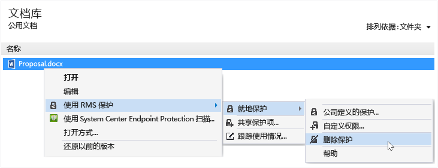

# 使用 Rights Management 共享应用程序移除对文件的保护
若要删除之前使用 RMS 共享应用程序对文件进行的保护（即取消文件保护），请从文件资源管理器中使用“移除保护”选项。

> [!IMPORTANT]
> 必须是文件所有者才能删除保护。

### 删除对文件的保护

1.  在文件资源管理器中，右键单击文件（例如 Sample.ptxt）、选择“使用 RMS 保护”、单击“就地保护”，然后单击“删除保护”：

    

    系统可能会提示你输入凭据。

将会删除原始的受保护文件（例如 Sample.ptxt），并替换为一个同名但文件扩展名不受保护的文件（例如 Sample.txt）。

## 示例和其他说明
有关如何使用 Rights Management 共享应用程序以及操作说明的示例，请参阅以下 Rights Management 共享应用程序用户指南部分：

-   [使用 RMS 共享应用程序的示例](../Topic/Rights_Management_sharing_application_user_guide.md#BKMK_SharingExamples)

-   [要执行什么操作？](../Topic/Rights_Management_sharing_application_user_guide.md#BKMK_SharingInstructions)

## 请参阅
[权限管理共享应用程序用户指南](../Topic/Rights_Management_sharing_application_user_guide.md)

