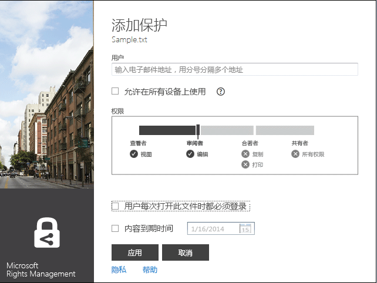
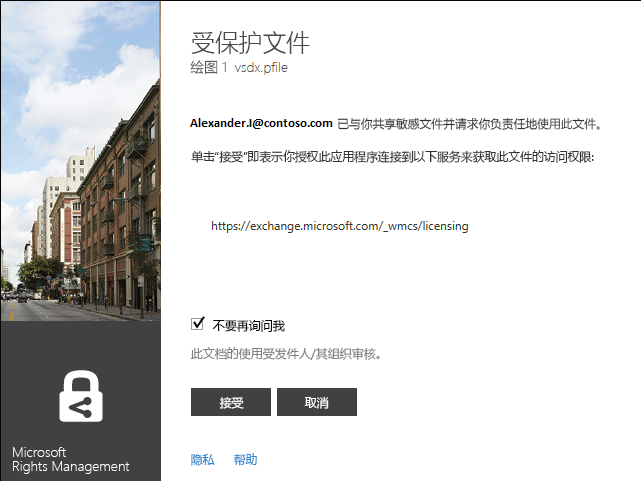
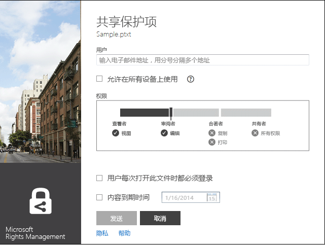
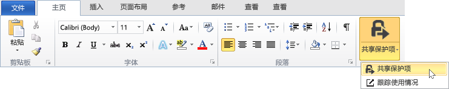
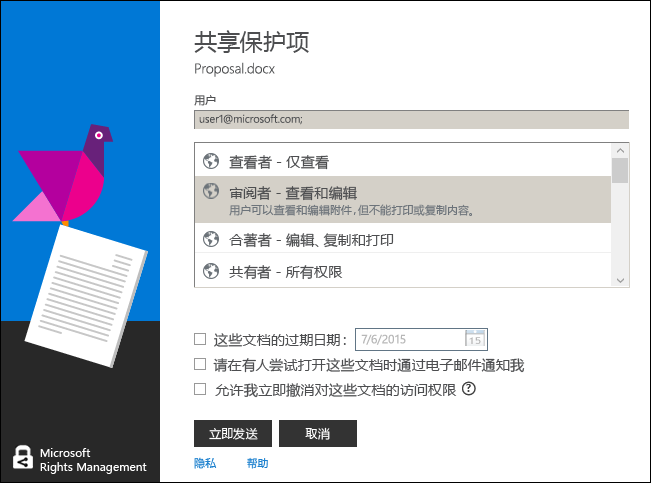

# 修订版本 3：Microsoft Rights Management 共享应用程序指南
使用此适用于 Windows 的 Microsoft Rights Management (RMS) 共享应用程序的指南，帮助你防止外人查看重要文档和图片，以保护文档和图片的安全，即使你通过电子邮件将其发送或保存到另一台设备也是如此。同样，你可以使用此应用程序打开并使用其他用户已通过使用相同的 Rights Management 技术保护的文件。

此共享应用程序通过以下方式为你的文件提供此保护：

-   它向“文件资源管理器”（在 Windows 7 和较早版本中也称为“Windows 资源管理器”）中添加功能，以便你在管理文件夹中的文件时，可以轻松保护单个文件、批量保护多个文件或保护一个文件夹中的所有文件。

-   它为所有文件类型提供保护，并且有一个用于常用文本和图像文件类型的内置查看器。

-   它将“共享受保护”按钮添加到 Word、PowerPoint 和 Excel 的 Microsoft Office 工具栏。

你只需一台运行 Windows 7 或 Windows 8 的计算机和本地管理员帐户就可以安装 RMS 共享应用程序。然后从 Microsoft 下载并安装此免费应用程序。

如果你的疑问在本指南中没有相应解答，请参阅[适用于 Windows 的 Microsoft Rights Management 共享应用程序常见问题](http://go.microsoft.com/fwlink/?LinkId=303971)。

## 使用 RMS 共享应用程序的示例
下面只是一些示例，演示了如何使用 RMS 共享应用程序来帮助你保护文件。

|方案|使用 RMS 共享应用程序解决方案|
|------|---------------------|
|**我想要将公司机密文档安全地复制到另一台设备**<br /><br />你在使用 PC 处理公司机密战略文档，并且你希望将它复制到 U 盘，以便在离开办公室之后继续处理该文档而无需访问公司网络。|你在 PC 和笔记本电脑上都安装了 RMS 共享应用程序。使用 PC 上的“文件资源管理器”通过模板保护该文件，以防止非公司人员访问它。然后将文件复制到 U 盘，再将 U 盘连接到笔记本电脑并继续处理该文档。如果 U 盘丢失或笔记本电脑被盗，任何非公司人员都无法访问该文档。|
|**我想要与我信任的组织之外的人员安全地共享财务信息**<br /><br />你与合作伙伴公司协作，并且想要通过电子邮件向他们发送包含预期销售额的 Excel 电子表格。你希望他们能够查看数字但不能进行更改。|使用 Excel 中功能区上的“共享受保护”按钮、键入合作伙伴公司中与你合作的两位用户的电子邮件地址、选择滑块上的“查看器”，然后单击“发送”。<br /><br />当该电子邮件到达合作伙伴公司时，只有该电子邮件中的收件人才可以查看该电子表格，但是他们无法保存、编辑、打印或转发它。|
|**我想要通过电子邮件将工程图安全地发送给使用 iOS 设备的人员**<br /><br />你的公司使用自定义的工程设计应用程序，你想要通过电子邮件将高度机密的工程图发送给某位同事，你知道该同事会定期在其 iOS 设备上检查电子邮件。|使用文件资源管理器右键单击该文件，然后选择“共享受保护”。RMS 共享应用程序识别出该文件扩展名不是来自本身支持 RMS 的应用程序，因此当它将文件附加到电子邮件时，它会自动将其转换为受常规保护的文件，并自动选择“允许在所有设备上使用”选项。<br /><br />收件人在其 iOS 设备上接收电子邮件、单击电子邮件中的链接（该链接会告知他们如何下载 RMS 共享应用程序）、安装适用于 iOS 设备的版本，然后查看该图。|
|**我的公司不使用 Rights Management，但我收到了一封电子邮件，其中包含一个受 RMS 保护的附件**<br /><br />电子邮件发件人是你信任的人，因为你过去曾与他们有业务往来，你猜想他们可能向你发送了有关潜在新业务机会的信息。|单击电子邮件中的链接（该链接会告知你如何为你的计算机下载 RMS 共享应用程序）、安装应用程序，然后注册个人 RMS。Microsoft 确认你的组织未订阅 Office 365，并向你发送一封电子邮件以完成免费注册过程，然后你便可以使用新帐户登录。随后你可以打开电子邮件附件了解新的业务机会。|

## <a name="BKMK_Install"></a>如何下载和安装 RMS 共享应用程序
> [!IMPORTANT]
> 你必须具有本地管理员帐户才能安装 RMS 共享应用程序。如果你未以本地管理员身份登录，则在第 3 步中运行 Setup.exe 时，可以使用“以管理员身份运行”选项。

若要安装 RMS 共享应用程序，请按照下列步骤操作：

1.  转到 Microsoft 网站上的 [Microsoft Rights Management](http://go.microsoft.com/fwlink/?LinkId=303970) 页面。

2.  在“计算机”部分中，单击“适用于 Windows 的 RMS 应用”图标，然后将 Microsoft Rights Management 共享应用程序安装包保存到你的计算机中。

3.  双击已下载的压缩文件，然后双击“setup.exe”。如果系统提示你继续，请单击“是”。

4.  在“安装 Microsoft RMS”页上，单击“下一步”，然后等待安装完成。

5.  在安装完成后，单击“重新启动”，重新启动计算机并完成安装。或者，单击“关闭”，在稍后重新启动计算机完成安装。

现在，你可以随时开始保护你的文件或读取其他人保护的文件。

## <a name="BKMK_UsingMSRMSApp"></a>你希望做什么？
使用以下说明来帮助你使用受保护的文件。

### <a name="BKMK_CreatePTXT"></a>创建一个受保护的文本文件
你可以将常规文本 (.txt) 文件转换为随后带有 .ptxt 文件扩展名的受保护文件。

##### 创建受保护的文本 (.ptxt) 文件

1.  在文件资源管理器中，右键单击某个文件夹、单击“新建”，然后单击“文本文档”。

2.  重命名该文件（例如 Sample.txt）。

3.  双击该文件，并用记事本打开该文件。

4.  在记事本中，向该文件添加几行文本，然后保存它。可以使用以下内容作为示例文本。

    ```
    This is a sample text file.
    This is a sample text file.
    This is a sample text file.
    This is a sample text file. 
    This is a sample text file.
    This is a sample text file.
    ```

5.  右键单击该文件、单击“就地保护”，然后从列表中选择一个模板。如果这是你首次使用 RMS 共享应用程序，你将首先需要选择“公司保护”，此选项将为你的组织下载模板。

6.  在“Microsoft Rights Management 共享应用程序”屏幕上，确认要应用的策略、单击“应用”，然后在该文件受到保护后单击“关闭”。

### <a name="BKMK_ViewPTXT"></a>查看受保护的文本文件 (.ptxt) 或受保护的图像文件
若要查看受保护的文本 (.ptxt) 文件，请在文件资源管理器中双击该文件（例如 Sample.ptxt)。系统可能会提示你输入凭据。当文件打开时，你会在文件顶部看到文件的保护策略。

以同样的方式查看和打开受保护的图像。

### <a name="BKMK_CreatePFILE"></a>创建受常规保护的文件
使用常规保护 (.pfile) 文件格式为 RMS 共享应用程序或其他提供内置 RMS 类型保护的应用程序不直接支持的文件类型提供常规级别的保护。你可以使用 Microsoft 网站上的 [Microsoft Rights Management](http://go.microsoft.com/fwlink/?LinkId=303970) 页面迅速检查哪些应用程序支持 RMS 内置保护。

例如，因为 Microsoft Visio 当前不支持 RMS 内置保护，因此你可以对通过 Microsoft Visio 创建的 .vsd 文件使用常规保护。

> [!TIP]
> 内置（本机）保护和常规保护之间的区别是什么？
> 
> -   当文件受常规保护时，未经授权的人员无法打开该文件。但在授权人员打开文件后，他们随后可以将未受保护的文件转发给其他人或将它保存在其他人可以访问的位置。不过，他们会在文件顶部看到一条消息，告知他们对该文件具有哪些权限，并且要求他们遵守这些权限，但是此保护无法强制实施。此外，当文件受常规保护时，除了授权以外，你无法再进行进一步权限限制。例如，如果使用自定义权限，则 RMS 共享应用程序中的滑块会自动选择“共有者”，并且无法更改以进行进一步权限限制，例如“查看者”或“合著者”。
> -   相比之下，当你将 RMS 内置保护与支持此保护的应用程序（例如，Office 文件）结合使用时，即使文件随后将发送给其他人或保存在其他位置，该保护也仍将应用于该文件。此外，当你保护这些文件时，你可以使用限制性权限（例如，只读），也可以使用编辑但无法打印或复制的权限。例如，如果使用自定义权限，则 RMS 共享应用程序中的滑块将自动针对相应权限选择“审阅者”，然后你可以增加或减少限制。

##### 例如：从 Visio 绘图 (.vsd) 文件创建受常规保护的文件 (.pfile)

1.  在文件资源管理器中，右键单击某个文件夹、单击“新建”，然后单击“新 Visio 文档”。

2.  重命名该文件（例如 Sample.vsd）。

3.  双击该文件，并用 Visio 打开该文件。

4.  在 Visio 中，向图形添加元素，然后保存并关闭该文件。

5.  右键单击该文件、单击“就地保护”，然后从列表中选择一个策略模板。如果这是你首次使用 RMS 共享应用程序，你将首先需要选择“公司保护”，此选项将为你的组织下载模板。

6.  在“Microsoft Rights Management 共享应用程序”屏幕上，选择要应用的策略，然后单击“应用”。

7.  将出现一条消息，指明受保护文件已另存为 .pfile 文件（例如，Sample.vsd.pfile）。原始文件已删除。

### <a name="BKMK_ViewPFILE"></a>查看受常规保护的 (.pfile) 文件
若要查看受常规保护的 (.pfile) 文件，请在文件资源管理器中，双击受常规保护的 (.pfile) 文件（例如，Sample.vsd.pfile），然后单击“打开”。

### <a name="BKMK_Unprotect"></a>删除文件保护
若要删除对之前受保护文件的保护（即，解除文件保护），请使用“删除保护”选项：

1.  右键单击该文件（例如，Sample.ptxt）、单击“就地保护”，然后单击“删除保护”。系统可能会提示你输入凭据。

2.  原始的受保护的文件（例如 Sample.ptxt）将会删除，并将替换为一个同名但文件扩展名不受保护的文件（例如 Sample.txt）。

### <a name="BKMK_ProtectCustom"></a>使用你自己的自定义权限保护文件
保护文件的最简单方法是使用模板，但还可以指定你自己的权限。这称为用户编写的保护，它在以下情况中将很有用：

-   你想要限制为仅限特定列表，该列表由通过各个用户的电子邮件地址标识的各用户组成。

-   你想要限制为仅限特定权限使用文件，例如对文档的只读权限。

若要保护具有用户授予的权限的文件，请右键单击该文件、单击“就地保护”，然后单击“自定义权限”。你将看到以下屏幕：



键入用户的电子邮件地址、使用滑块为文件选择权限，然后单击“应用”。

### <a name="BKMK_UserDefined"></a>使用具有自定义保护的文件
你打开的大多数受保护文件都是通过应用模板来保护的文件。但是，用户还可以通过使用他们自己的自定义权限保护文件，这称为用户编写的保护。

对于文本和图像文件格式，此级别的保护要求将用于编辑、保存或限制这些文件的所有应用程序都设计为支持 RMS 保护，并且要求它们实现 AD RMS SDK 中所提供的保护 API。

当你查看具有用户编写保护的受保护文本文件时，你将注意到在为文件显示权限时其中会存在细微差异，如以下示例中所示。

对于通过使用常规保护 (.pfile) 文件格式保护的文件，由用户指定的特定权利或权限（而不是用于保护该文件的模板名称）将显示在确认屏幕上，如下图所示。



### <a name="BKMK_ShareProtected"></a>保护要通过电子邮件共享的内容
若要保护你想要使用电子邮件共享的内容，请右键单击该文件，然后单击“共享受保护”。你将看到以下屏幕：



键入列表中用户的电子邮件地址、使用滑块为该文件选择权限，然后单击“发送”。然后，Outlook 会为收件人创建一封电子邮件，其中包含一条内容可更改的简短消息，并随附了附加的受保护文件。原始文件不受保护。

若要让用户在非 Windows 设备上查看受保护的文件，请单击“允许在所有设备上使用”。用户可能需要下载适用于其设备的 RMS 共享应用程序，而电子邮件中包含了用于执行此操作的链接。

### <a name="BKMK_Multiple"></a>将保护应用到多个文件和文件夹
在使用文件资源管理器时，你不必将保护一对一地应用于文件。你反而可以选择多个文件或一个文件夹中的所有文件（如果这些文件尚未受到保护）。

##### 保护多个文件或选定文件夹中的所有文件

1.  在文件资源管理器中，可以选择多个文件，也可以选择一个包含要保护文件的文件夹。

2.  右键单击选定文件夹或文件、单击“就地保护”，然后从列表中选择一个模板。如果这是你首次使用 RMS 共享应用程序，你将首先需要选择“公司保护”，此选项将为你的组织下载模板。

3.  在“Microsoft Rights Management 共享应用程序”屏幕上，确认文件已受保护。

> [!TIP]
> 如果看到任何错误，请参考[适用于 Windows 的 Microsoft Rights Management 共享应用程序常见问题](http://go.microsoft.com/fwlink/?LinkId=303971)。

### <a name="BKMK_OfficeToolbar"></a>使用 Office 工具栏加载项
你可以通过使用适用于 Microsoft Rights Management 共享应用程序的 Office 功能区加载项，直接从 Microsoft Office 中保护和共享 Word、PowerPoint 和 Excel 中的文件。

在“保护”组中，单击“共享受保护”启动 Microsoft Rights Management 共享应用程序。



### <a name="BKMK_AccessKeys"></a>使用键盘快捷方式
按“Alt”键查看可用访问键，然后按“Alt”+ 访问键选择一个选项。

例如，在“共享受保护”对话框中，按“Alt”查看访问键，然后按“Alt + u”选中“用户必须在每次打开此文件时登录”复选框。



## 请参阅
[Microsoft Rights Management 共享应用程序下载](http://go.microsoft.com/fwlink/?LinkId=303970)
 [适用于 Windows 的 Microsoft Rights Management 共享应用程序常见问题](http://go.microsoft.com/fwlink/?LinkId=303971)

