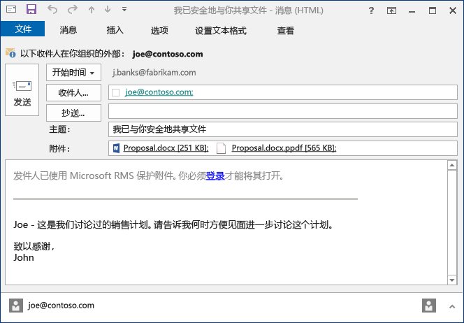
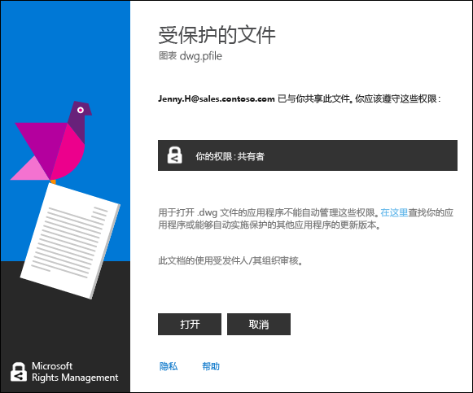

# Rights Management 共享应用程序用户指南 - 单个主题的修订
适用于 Windows 的 Microsoft Rights Management (RMS) 共享应用程序可帮助你防止外人查看重要文档和图片，保护文档和图片的安全，即使你通过电子邮件发送它们或将其保存到另一台设备也是如此。你还可以通过此应用程序，打开并使用其他人已通过使用相同的 Rights Management 技术保护的文件。

你只需一台最低运行 Windows 7 的计算机和一个本地管理员帐户，即可安装 RMS 共享应用程序。 然后从 Microsoft [下载并安装](http://go.microsoft.com/fwlink/?LinkId=303970)此免费应用程序。

如果你的疑问在本指南中没有相应解答，请参阅[适用于 Windows 的 Microsoft Rights Management 共享应用程序常见问题](http://go.microsoft.com/fwlink/?LinkId=303971)。

下面只是一些示例，演示了如何使用共享应用程序帮助你保护文件。

|我希望…|如何实现|
|--------|--------|
|**…与我信任的组织之外的人员安全地共享财务信息**  你与合作伙伴公司协作，并且想要通过电子邮件向他们发送包含预期销售额的 Excel 电子表格。你希望他们能够查看数字但不能进行更改。|使用 Excel 中功能区上的“共享受保护”按钮、键入合作伙伴公司中与你合作的两位用户的电子邮件地址、选择滑块上的“查看器”，然后单击“发送”。  当该电子邮件到达合作伙伴公司时，只有该电子邮件中的收件人才可以查看该电子表格，但是他们无法保存、编辑、打印或转发它。  详细信息： 请参阅本指南的[你希望做什么？](../Topic/Rights_Management_sharing_application_user_guide_-_revision_for_single_topic.md#BKMK_UsingMSRMSApp)部分中的**保护通过电子邮件共享的文件**。|
|**…通过电子邮件将文档安全地发送给使用 iOS 设备的人员**  你想要通过电子邮件将高度机密的 Word 文档发送给某位同事，你知道该同事会定期在其 iOS 设备上检查电子邮件。|使用文件资源管理器右键单击该文件，然后选择“共享受保护”。在 RMS 共享应用程序中，选择“允许在所有设备上使用”选项，然后将该文件作为附件发送给你的同事。  收件人在其 iOS 设备上接收电子邮件、单击电子邮件中的链接（该链接会告知他们如何下载共享应用程序）、安装适用于 iOS 设备的版本，然后查看文档。  详细信息： 请参阅本指南的[你希望做什么？](../Topic/Rights_Management_sharing_application_user_guide_-_revision_for_single_topic.md#BKMK_UsingMSRMSApp)部分中的**保护通过电子邮件共享的文件**。|
|**…阅读在包含安全共享文件附件的电子邮件中收到的附件，但是因为我的公司不使用 Rights Management，所以我无法阅读**  电子邮件发件人是你信任的人，因为你过去曾与他们有业务往来，你猜想他们可能向你发送了有关潜在新业务机会的信息。|按照电子邮件中的说明，单击链接注册 Microsoft Rights Management。Microsoft 确认你的组织未订阅 Office 365，并向你发送一封电子邮件以完成免费注册过程，然后你便可以使用新帐户登录。单击电子邮件中的第二个链接来安装 Rights Management 共享应用，然后可以打开电子邮件附件，阅读有关新业务机会的信息。  详细信息： 请参阅本指南的[你希望做什么？](../Topic/Rights_Management_sharing_application_user_guide_-_revision_for_single_topic.md#BKMK_UsingMSRMSApp)部分中的**查看和使用受 Rights Management 保护的文件**。|
|**...保护我的笔记本电脑上的公司机密文件，以防止非公司人员访问它们**  你经常出差，经常使用笔记本电脑访问和更新文件夹中的文件，必须保护该文件夹以阻止未经授权的访问。|你的笔记本电脑上已安装 RMS 共享应用程序。通过使用可快速保护文件的模板，你可以使用文件资源管理器来保护这些文件。如果你的笔记本电脑被盗，你大可放心，任何非公司人员都无法访问这些文档。  详细信息： 请参阅本指南的[你希望做什么？](../Topic/Rights_Management_sharing_application_user_guide_-_revision_for_single_topic.md#BKMK_UsingMSRMSApp)部分中的**保护设备上的文件（就地保护）**。|

## 你希望做什么？
使用以下说明来帮助你使用受保护的文件。

### 下载并安装 Rights Management 共享应用程序

1.  转到 Microsoft 网站上的 [Microsoft Rights Management](http://go.microsoft.com/fwlink/?LinkId=303970) 页面。

2.  在“计算机”部分中，单击“适用于 Windows 的 RMS 应用”图标，然后将 Microsoft Rights Management 共享应用程序安装包保存到你的计算机中。

3.  双击已下载的压缩文件，然后双击“setup.exe”。 如果系统提示你继续，请单击“是”。

    > [!TIP]
    > 你可能必须滚动到当前文件夹中列表的底部才能看到“setup.exe”。

4.  在“安装 Microsoft RMS”页上，单击“下一步”，然后等待安装完成。

5.  在安装完成后，单击“重新启动”，重新启动计算机并完成安装。 或者，单击“关闭”，在稍后重新启动计算机完成安装。

现在，你可以随时开始保护你的文件或读取其他人保护的文件。

#### 详细信息
你必须具有本地管理员帐户才能安装共享应用程序。 如果你未以本地管理员身份登录，则在第 3 步中运行 Setup.exe 时，可以使用“以管理员身份运行”选项。

### 保护设备上的文件（就地保护）

1.  在“文件资源管理器”中，选择要保护的一个文件、一个文件夹或多个文件。 右键单击，然后选择“就地保护”。例如：

    

    > [!NOTE]
    > 如果你未看到“就地保护”选项，可能是因为你的计算机上未安装共享应用程序，也可能是因为必须重启计算机完成安装才能看见。 有关如何安装共享应用程序的详细信息，请参阅本指南的[你希望做什么？](../Topic/Rights_Management_sharing_application_user_guide_-_revision_for_single_topic.md#BKMK_UsingMSRMSApp)部分中的**下载和安装 Rights Management 共享应用程序**说明。

2.  执行以下操作之一：

    -   选择策略模板：这些是预定义的权限，用于对组织中人员的访问和使用进行限制。 如果这是你第一次保护此计算机上的文件，你首先将需要选择“公司定义的保护”才可下载这些模板。模板名称以你的公司名称开头，后跟权限的描述性名称。例如：**Contoso - 仅限机密视图**

    -   选择“自定义权限”：如果模板未提供所需的保护级别，请选择此选项。例如，你想要将访问权限授予组织之外的人员，或者你想要自行显式设置保护选项。 在“添加保护”对话框中指定你希望用于此文件的选项，然后单击“应用”。

        > [!NOTE]
        > 有关此对话框中选项的详细信息，请参阅本指南的[你希望做什么？](../Topic/Rights_Management_sharing_application_user_guide_-_revision_for_single_topic.md#BKMK_UsingMSRMSApp)部分中的**在“Rights Management”对话框中指定选项**说明。

3.  你可能会快速看到一个对话框，指示你该文件已受到保护，然后重新集中处理文件资源管理器。选定的一个或多个文件现在受保护。在某些情况下（当添加保护更改文件扩展名时），文件资源管理器中的原始文件将替换为具有 Rights Management 保护锁定图标的新文件。例如：

    

如果以后需要删除文件保护，请参阅本指南的[你希望做什么？](../Topic/Rights_Management_sharing_application_user_guide_-_revision_for_single_topic.md#BKMK_UsingMSRMSApp)部分中的**删除文件保护**说明。

#### 详细信息
当你就地保护某个文件时，它将替代原始的未受保护的文件。然后，你可以将该文件留在原地、将其复制到其他文件夹或设备，或者共享该文件所在的文件夹，该文件将仍然受保护。 你也可以将受保护文件附加到电子邮件中，但是若要通过电子邮件共享受保护文件，建议直接从文件资源管理器或 Office 应用程序共享（请参阅本指南的[你希望做什么？](../Topic/Rights_Management_sharing_application_user_guide_-_revision_for_single_topic.md#BKMK_UsingMSRMSApp)部分中的**保护通过电子邮件共享的文件**）。

你可以在同一时间使用同一技术保护多个文件或一个文件夹。当你保护某个文件夹时，该文件夹中的所有文件都将自动选中以进行保护，但你在该文件夹中创建的新文件将不会自动受保护。

如果你在尝试保护文件时看到任何错误，请参阅[适用于 Windows 的 Microsoft Rights Management 共享应用程序常见问题](http://go.microsoft.com/fwlink/?LinkId=303971)。

### 保护你通过电子邮件共享的文件

1.  使用以下选项之一：

    -   对于文件资源管理器： 右键单击该文件，然后选择“共享受保护”：

        

    -   对于 Office 应用程序：确保你已先保存该文件。 然后，在“保护”组中，单击“共享受保护”。

        

    > [!NOTE]
    > 如果你未看到这些共享保护选项，可能是因为你的计算机上未安装共享应用程序，也可能是因为必须重启计算机完成安装才能看见。 有关如何安装共享应用程序的详细信息，请参阅本指南的[你希望做什么？](../Topic/Rights_Management_sharing_application_user_guide_-_revision_for_single_topic.md#BKMK_UsingMSRMSApp)部分中的**下载和安装 Rights Management 共享应用程序**说明。

2.  在“共享受保护”对话框中指定你希望用于此文件的选项，然后单击“发送”。

    

    > [!NOTE]
    > 有关此对话框中选项的详细信息，请参阅本指南的[你希望做什么？](../Topic/Rights_Management_sharing_application_user_guide_-_revision_for_single_topic.md#BKMK_UsingMSRMSApp)部分中的**在“Rights Management”对话框中指定选项**说明。

3.  你可能会快速地看到一个对话框，告诉你该文件已受到保护，然后你会看到一封为你创建的电子邮件，其主题为“我已安全地与你共享文件”。在此封电子邮件中，已附加并保护你所选的文件，并且电子邮件中的文本包含指向以下内容的链接：

    -   个人 RMS

    -   RMS 共享应用程序

    -   本用户指南

    例如：

    

4.  可选：你可以根据需要更改此电子邮件中的任何内容。例如，你可以添加或更改邮件主题或正文。

    > [!WARNING]
    > 尽管你可以从此电子邮件添加或移除人员，但这不会更改你在“共享受保护”对话框中指定的附件的权限。如果你想要更改这些权限（例如，向新的用户授予打开文件的权限），请关闭此封电子邮件，既不保存也不发送，然后返回到步骤 1。

5.  发送电子邮件。

#### 详细信息
在保护你通过电子邮件共享的文件时，它将创建原始文件的新版本。原始文件仍处于未受保护状态，而新版本已受保护并自动附加到你之后要发送的电子邮件中。

该封电子邮件具有默认主题和默认文本，你可以在发送之前对其进行更改。

可以通过两种方法保护你通过电子邮件共享的文件：

-   从文件资源管理器：此方法适用于所有文件。

-   从 Office 应用程序： 此方法适用于 Rights Management 共享应用程序支持的应用程序，通过使用 Office 加载项，你可以在功能区上看到“保护”组。

> [!NOTE]
> 在此版本的 Rights Management 共享应用程序中，不存在允许你直接通过 Outlook 应用程序保护文件和电子邮件的 Outlook 加载项。但是可以使用本部分中的过程。

### 查看和使用受 Rights Management 保护的文件

#### 查看受保护文件
通过使用“文件资源管理器”或包含附件的电子邮件、双击受保护文件，然后输入凭据（如果提示输入）。文件的打开方式取决于它受保护的方式。

-   如果文件受常规保护（文件扩展名为 .pfile）：

    你将从共享应用程序中看到“受保护文件”对话框，该对话框将告知你是哪位用户保护了该文件，以及你应该遵守共同所有者权限。当你打开文件时会收到通知，告知你此操作会受到审核。

    

    单击“打开”读取该文件。

-   如果文件以本机方式受到保护（没有 .pfile 文件扩展名）：

    文件通过使用与原始文件扩展名相关联的应用程序打开，并且文件顶部会显示限制横幅。横幅可能会显示应用于该文件的权限，或者可能会提供用于显示这些权限的链接。 例如，你可能会看到以下内容，你必须从中单击“权限当前受到限制”才能查看应用于该文件的实际权限以及可以访问它的人：

    

    此文件也会受到审核，并且只要处于受保护状态，就仍会受到审核。

##### 详细信息
在查看受保护文件之前，RMS 必须先确认你是否有权查看该文件，将通过检查你的用户名和密码来进行确认。在某些情况下，这些内容可能会被缓存，因而你将看不到要求提供凭据的提示。在其他情况下，系统将会提示你提供凭据。

如果你的组织既不使用 Windows Azure Rights Management (Windows Azure RMS) 也不使用 AD RMS，你可以申请一个用于接受凭据的免费帐户，以便打开通过使用 RMS 保护的文件。 若要申请此帐户，请单击链接申请[个人 RMS](http://go.microsoft.com/fwlink/?LinkId=309469)。

#### 使用受保护的文件（例如，编辑和打印该文件）
如果受保护文件的文件扩展名为 .pfile：

-   保存打开的文件，然后为它指定一个与要使用的应用程序相关联的新文件扩展名。

    例如，如果使用文件名 document.vsdx.pfile 保护文件，则查看该文件，然后在“文件资源管理器”中，将该文件另存为 document.vsdx。

    新的文件将不再受到保护。如果你想要保护它，则必须手动执行此操作。 有关说明，请参阅本指南的[你希望做什么？](../Topic/Rights_Management_sharing_application_user_guide_-_revision_for_single_topic.md#BKMK_UsingMSRMSApp)部分中的**如何通过使用 Rights Management 共享应用程序保护设备上的文件（就地保护）**。

如果最初受保护文件的文件扩展名不是 .pfile：

-   除了查看文件以外，你无法执行任何其他操作，除非你具有支持 Rights Management 的应用程序。这些应用程序称为支持 Rights Management 的应用程序。Office 2013 和 Office 2010 中的应用程序（例如 Word、Excel、PowerPoint 和 Outlook）都是支持 Rights Management 的应用程序示例。但非出自 Microsoft 的应用程序（例如其他软件公司的应用程序和你自己的业务流水线应用程序）也可能支持 Rights Management。

    支持 Rights Management 的应用程序知道如何打开由其他支持 Rights Management 的应用程序所保护的文件。它们还会持续提供已应用于文件的保护，即使你编辑了该文件或将其保存为另一文件名或保存到另一位置也是如此。这些应用程序允许你根据当前应用于文件的权限来使用文件，这样只要你具有使用文件的权限，你就可以使用。例如，如果文件以只读方式进行保护，你将无法更改或打印该文件。

### 删除文件保护
从“文件资源管理器”中，右键单击该文件（例如，Sample.ptxt）、单击“就地保护”，然后单击“删除保护”：

系统可能会提示你输入凭据。

#### 详细信息
原始的受保护的文件（例如 Sample.ptxt）将会删除，并将替换为一个同名但文件扩展名不受保护的文件（例如 Sample.txt）。

若要删除之前使用 RMS 共享应用程序保护的文件保护（即取消文件保护），请从“文件资源管理器”中使用“删除保护”选项。

> [!IMPORTANT]
> 必须成为文件所有者，才能删除保护。

### 使用 Rights Management 共享应用程序中的键盘快捷方式
按“Alt”键查看可用访问键，然后按“Alt”+ 访问键选择一个选项。

#### 详细信息
例如，在“共享受保护”对话框中，按“Alt”查看访问键，然后按“Alt + u”选中“用户必须在每次打开此文件时登录”复选框。

### 在“Rights Management”对话框中指定选项

|选项|描述|
|------|------|
|**用户**|键入你希望能够打开文件的用户的电子邮件地址。使用分号分隔多个地址。这些地址可以是组织内部或外部的电子邮件地址。  例如： janetm@contoso.com; pdover@fabricom.com|
|**允许在所有设备上使用**|选中此选项（用于让用户在 iPad 等移动设备上打开文件）后，权限将自动设置为“共有者”（所有权限），以便使用常规保护来保护文件。|
|**权限**|将滑块移动到要用于此文件的权限。  在某些情况下，权限将自动设置为“共有者”且无法进行更改。 如果你选择“允许在所有设备上使用”，则会发生这种情况。此外，如果你要保护无法受 RMS 本机保护而必须进行常规保护的文件时，也会发生这种情况。共享应用程序会根据文件扩展名来做出此决定。 **Tip:** 你可以使用 Microsoft 网站上的 [Microsoft Rights Management](http://go.microsoft.com/fwlink/?LinkId=303970) 页面迅速检查哪些应用程序支持内置保护。|
|**用户必须在每次打开此文件时登录**|在你需要文件具有更高安全性时选择此选项，因为它要求你指定的用户在每次访问文件时始终都进行身份验证。为此，在未缓存他们的凭据时，系统将提示他们输入其用户名和密码。但是，此设置要求这些用户必须连接 Internet 才能打开文件，而收到提示解锁文件并等待身份验证过程完成的过程可能会令人心烦。|
|**内容到期时间**|仅为对时间敏感的文件选择此选项，以使选定用户无法在指定日期之后打开这些文件。你仍然能够打开原始文件。|

#### 详细信息
使用表来帮助你在共享应用程序的“添加保护”对话框或“共享受保护”对话框中指定选项。当你就地保护文件并选择自定义权限时或者当你保护要共享的文件时，将会看到此对话框。

有关就地保护文件以及保护要共享的文件的详细信息，请参阅本指南的[你希望做什么？](../Topic/Rights_Management_sharing_application_user_guide_-_revision_for_single_topic.md#BKMK_UsingMSRMSApp)部分。

## 请参阅
[权限管理共享应用程序管理员指南](../Topic/Rights_Management_sharing_application_administrator_guide.md)
 [Microsoft Rights Management 共享应用程序下载](http://go.microsoft.com/fwlink/?LinkId=303970)
 [适用于 Windows 的 Microsoft Rights Management 共享应用程序常见问题](http://go.microsoft.com/fwlink/?LinkId=303971)

