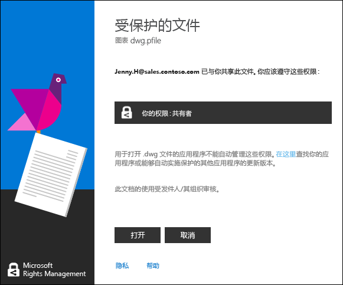

# 查看和使用受权限管理保护的文件
如果[计算机安装了 Rights Management (RMS) 共享应用程序](https://technet.microsoft.com/library/dn574734%28v=ws.10%29.aspx)，你只需双击受保护文件即可查看它。 此文件也许是电子邮件中的附件，或者你可能在使用文件资源管理器时看到它。

> [!NOTE]
> 在你可以查看受保护文件之前，RMS 必须首先确认你有权查看该文件，方法是检查你的用户名和密码。 在某些情况下，此信息会被缓存下来，所以你不会看到要求出示凭据的提示。 在其他情况下，将提示你提供凭据。
> 
> 如果你的组织不使用 Azure Rights Management (Azure RMS) 或 AD RMS，你可以申请会接受你的凭据的免费帐户，以便可以使用 RMS 打开受保护文件：
> 
> -   若要申请此帐户，请单击链接以申请[个人 RMS](http://go.microsoft.com/fwlink/?LinkId=309469)。
> 
>     注册时，使用公司的电子邮件地址，而不是个人电子邮件地址。 如果注册的原因是要使用电子邮件发送受保护附件，请使用与用于发送电子邮件相同的电子邮件地址。
> -   有关详细信息，请参阅[个人 RMS 和 Windows Azure 权限管理](http://technet.microsoft.com/library/dn592127.aspx)。

## 查看受保护文件
通过使用文件资源管理器或包含附件的电子邮件，双击受保护文件，然后在收到提示时输入凭据。

如果你看到两个版本的文件，但具有不同的文件扩展名，仅在不打开另一个文件的情况下打开具有 .ppdf 文件扩展名的文件。 如果 .ppdf 版本也无法打开，请首先安装 [RMS 共享应用程序](http://technet.microsoft.com/library/dn574734.aspx)，因为该程序知道如何打开具有 .ppdf 文件扩展名的文件。

> [!NOTE]
> 有关详细信息，请参阅“[What’s the .ppdf file that’s automatically created?](../Topic/Dialog_box_options_for_the_Rights_Management_sharing_application.md#BKMK_PPDF)”。

文件的打开方式取决于保护方式，此保护方式你可以通过查看文件扩展名得知。 在每种情况下，只要文件受到保护，打开它就需要审核并将处于审核状态。 此外，如果文件以电子邮件附件的形式发送，则每次你打开文件时，发件人都会收到电子邮件通知。

|文件扩展名和保护|更多信息|
|------------|--------|
|文件具有 **.pfile** 文件扩展名。  文件受到一般性保护。|打开文件时，你将看到共享应用程序中的“受保护文件”对话框，告知你此文件由谁保护，并且希望你遵守共同所有者权限。 单击“打开”，读取文件。  |
|该文件具有 **.ppdf** 文件扩展名，或者是受保护的文本或图像文件（如“.ptxt”或“.pjpg”）。  该文件已本机保护为只读副本。|使用 RMS 共享应用程序安装的查看器，打开该文件。 此文件是只读文件，即使你将其保存到其他位置或将其重命名也是如此。|
|其他文件扩展名。  该文件已受到本机保护。|使用与原始文件扩展名关联的应用程序打开文件，并且文件顶部会显示限制横幅。 该横幅可能显示适用于文件的权限，或者提供显示权限的链接。 例如，你可能会看到以下内容，要求你单击“权限当前受限”以查看适用于文件和可以访问文件的用户的实际权限：  |
如需 Rights Management 支持的文件扩展名的完整列表，请参阅 [权限管理共享应用程序管理员指南](../Topic/Rights_Management_sharing_application_administrator_guide.md)中的[Supported file types and file name extensions](../Topic/Rights_Management_sharing_application_administrator_guide.md#BKMK_SupportFileTypes)部分。 如果你的文件扩展名未列出，则可进行 Web 搜索，看它是否是其他应用程序支持的文件扩展名。

> [!NOTE]
> 如果在确认该文件受 Rights Management 保护的情况下无法打开该文件，则可下载并使用 [RMS 分析器工具](https://www.microsoft.com/en-us/download/details.aspx?id=46437)。 按照工具中的说明进行操作，看你的计算机中是否存在妨碍受保护文档打开的问题。

## 使用受保护的文件（例如，编辑和打印文件）
如果在打开受保护文件后，你想要执行除读取之外的其他操作（例如编辑、复制和打印），则可执行以下命令：

|文件扩展名|说明|
|---------|------|
|文件具有 **.pfile** 文件扩展名。|保存已打开文件，并赋予其与所要使用的应用程序关联的新文件扩展名。  例如，如果某个文件使用文件名 document.vsdx.pfile 保护，请查看该文件并在文件资源管理器中将文件作为 document.vsdx 进行保存。  新文件从此不受保护。 如果你想要保护该文件，必须手动执行此操作。 有关说明，请参阅[使用 Rights Management 共享应用程序保护设备上的文件（就地保护）。](../Topic/Protect_a_file_on_a_device__protect_in-place__by_using_the_Rights_Management_sharing_application.md)。|
|该文件具有 **.ppdf** 文件扩展名，或者是受保护的文本或图像文件（如“.ptxt”或“.pjpg”）。|你仅可以查看文件，并且如果重命名或移动文件，保护将保留在文件上。|
|其他文件扩展名。|若要使用这些文件，你的设备必须具有了解 Rights Management 的应用程序。 这些应用程序称为启用 RMS 的应用程序。 Office 2016、Office 2013 和 Office 2010 应用程序（如 Word、Excel、PowerPoint 和 Outlook）即是为 Rights Management 启用的应用程序的示例。 但是非 Microsoft 应用程序（如其他软件公司的应用程序或你自己的业务线应用程序）也要为 Rights Management 而启用。  为 Rights Management 而启用的应用程序知道如何打开由其他权限管理启用的应用程序保护的文件。 它们还保留了应用到它们的保护，即使你编辑该文件、将其按其他文件名保存或将其保存到其他位置。 这些应用程序允许你根据当前应用到文件的权限使用文件，以便在你得到授权的情况下可以使用该文件。 例如，你可能能够编辑文件，但不能打印文件。|

## 示例和其他说明
有关如何使用 Rights Management 共享应用程序以及操作说明的示例，请参阅以下 Rights Management 共享应用程序用户指南部分：

-   [Examples for using the RMS sharing application](../Topic/Rights_Management_sharing_application_user_guide.md#BKMK_SharingExamples)

-   [What do you want to do?](../Topic/Rights_Management_sharing_application_user_guide.md#BKMK_SharingInstructions)

## 请参阅
[权限管理共享应用程序用户指南](../Topic/Rights_Management_sharing_application_user_guide.md)

