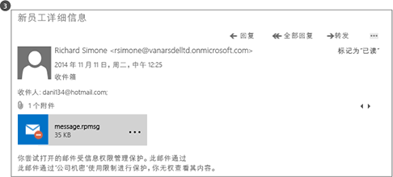
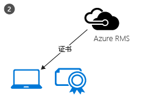

# 什么是 Azure 权限管理？
对于希望在当今充满挑战的工作环境中保护自己数据的组织而言，Azure Rights Management (Azure RMS) 是其信息保护解决方案。

这些挑战包括，对连接到 Internet 的需求，以及用户携带个人设备工作，在路上和家里访问公司数据，与重要的业务合作伙伴共享敏感信息。 在日常工作中，用户使用电子邮件、文件共享站点和云服务来共享信息。 在这种情况下，如果你要保护公司数据，同时仍让用户能够高效工作，则传统安全控制（如访问控制列表和 NTFS 权限）和防火墙的作用有其局限性。

相比之下，不管出现上述哪种情况，Azure RMS 都可以很好地保护贵公司的敏感信息。 它使用加密、标识和授权策略来帮助保护你的文件和电子邮件，并可以在多种设备（手机、平板电脑和电脑）中运行。 可以保护你组织内外的信息，因为该保护保留在数据中，即使数据离开了组织的边界，也是如此。 例如，员工可能会将文档发送给合作伙伴公司，或者将文档保存到云驱动器。 Azure RMS 提供的持续保护不仅有助于保护公司数据，而且从法律上讲还可能是遵循合规性或法律发现要求或单纯遵循良好信息管理实践所必需的。

但非常重要的是，获得授权的人员和服务（如搜索和索引）可以继续读取和检查由 Azure RMS 保护的数据，这是使用对等加密的其他信息保护解决方案所无法轻易实现的。 这种功能有时称为“数据推理”，是保持对组织数据进行控制的关键所在。

下图说明了在使用 Office 365 以及本地服务器和服务的情况下，Azure RMS 是如何发挥权限管理解决方案作用的。 此外，你还会发现该解决方案支持运行 Windows、Mac OS、iOS、Android 和 Windows Phone 的常见最终用户设备。

> [!TIP]
> 此时，你可能发现附加资源非常有用：
> 
> -   两分钟视频：[什么是 Microsoft Azure Rights Management](http://technet.microsoft.com/dn833005.aspx)
> -   五步教程：[Azure Rights Management 快速入门教程](../Topic/Quick_Start_Tutorial_for_Azure_Rights_Management.md)
> -   Azure RMS 要求，包括可购买或评估的订阅选项：[Azure 权限管理要求](../Topic/Requirements_for_Azure_Rights_Management.md)

使用以下部分可以了解有关 Azure RMS 的详细信息：

-   [Azure RMS 解决了哪些问题？](../Topic/What_is_Azure_Rights_Management_.md#BKMK_RMSrequirements)

    -   [安全、合规性和法规要求](../Topic/What_is_Azure_Rights_Management_.md#BKMK_RMScompliance)

-   [运行中的 Azure RMS：管理员和用户看到的内容](../Topic/What_is_Azure_Rights_Management_.md#BKMK_RMSpictures)

    -   [激活和配置权限管理](../Topic/What_is_Azure_Rights_Management_.md#BKMK_Example_ManagementPortal)

    -   [自动在运行 Windows Server 和文件分类基础结构的文件服务器上保护文件](../Topic/What_is_Azure_Rights_Management_.md#BKMK_Example_FCI)

    -   [使用 Exchange Online 和数据丢失防护策略自动保护电子邮件](../Topic/What_is_Azure_Rights_Management_.md#BKMK_Example_DLP)

    -   [使用 SharePoint Online 和受保护的库自动保护文件](../Topic/What_is_Azure_Rights_Management_.md#BKMK_Example_SharePoint)

    -   [用户安全地与移动用户共享附件](../Topic/What_is_Azure_Rights_Management_.md#BKMK_Example_SharingApp)

-   [Azure RMS 的工作原理 揭秘](../Topic/What_is_Azure_Rights_Management_.md#BKMK_HowRMSworks)

    -   [Azure RMS 使用的加密控制：算法和密钥长度](../Topic/What_is_Azure_Rights_Management_.md#BKMK_RMScrytographics)

    -   [Azure RMS 工作原理演练：首次使用、内容保护、内容使用](../Topic/What_is_Azure_Rights_Management_.md#BKMK_Walthrough)

-   [后续步骤](../Topic/What_is_Azure_Rights_Management_.md#BKMK_NextSteps)

## Azure RMS 解决了哪些问题？
使用下表了解组织可能提出的业务要求或遇到的业务问题，以及 Azure RMS 是如何满足这些要求或解决这些问题的。

|要求或问题|Azure RMS 所解决的问题|
|---------|--------------------|
|保护所有文件类型|√ 以前，在实施权限管理的过程中，只有 Office 文件才能使用本机保护功能来保护。 现在，[常规保护](https://technet.microsoft.com/library/dn574738%28v=ws.10%29.aspx)意味着支持对所有文件类型进行保护。|
|随处保护文件|√ 当文件保存到某个位置（[就地保护](https://technet.microsoft.com/library/dn574733%28v=ws.10%29.aspx)）时，该文件一直会受到保护，即使它被复制到不受 IT 部门控制的存储（如云存储服务），也是如此。|
|通过电子邮件安全地共享文件|√ 当文件通过电子邮件共享（[共享保护](https://technet.microsoft.com/library/dn574735%28v=ws.10%29.aspx)）时，该文件会作为电子邮件的附件受到保护，电子邮件中包含如何打开受保护附件的说明。 电子邮件文本没有加密，因此，收件人始终能够阅读这些说明。 但是，由于附加的文档受到保护，因此只有授权用户才能将其打开，即使将该电子邮件或文档转发给其他用户。|
|审核和监视|√ 你可以[审核和监视受保护文件的使用情况](https://technet.microsoft.com/library/dn529121.aspx)，即使这些文件已经离开了组织的边界。  例如，你为 Contoso, Ltd. 工作 你正在与来自 Fabrikam, Inc 的 3 名人员一起致力于一个联合项目你通过电子邮件向这 3 人发送了一个已保护并限制为只读的文档。 Azure RMS 审核功能可以提供以下信息：  -   你指定的来自 Fabrikam 的人是否打开了该文档，以及打开时间（如果已打开过）。 -   你未指定的其他人是否尝试打开该文档却失败了（发生这种情况可能是因为该文档已转发或保存到其他人可以访问的共享位置）。 -   指定的任何人是否尝试打印或更改该文档却失败了。|
|支持所有常用设备，而不仅仅是 Windows 计算机|√ [支持的设备](https://technet.microsoft.com/library/dn655136.aspx)包括：  -   Windows 计算机和手机 -   Mac 计算机 -   iOS 平板电脑和手机 -   Android 平板电脑和手机|
|支持企业与企业之间的协作|√ 由于 Azure RMS 是云服务，因此在与其他组织共享受保护内容前，不需要显式配置与这些组织的信任关系。 如果他们已有 Office 365 或 Azure AD 目录，则会自动支持组织间的协作。 如果他们没有 Office 365 或 Azure AD 目录，则用户可以注册免费的[个人 RMS](https://technet.microsoft.com/library/dn592127.aspx) 订阅。|
|支持本地服务，以及 Office 365|√ 除了[与 Office 365 无缝集成](https://technet.microsoft.com/library/jj585004.aspx)以外，在部署 [RMS 连接器](https://technet.microsoft.com/library/dn375964.aspx)时，你还可以将 Azure RMS 与以下本地服务结合使用：  -   Exchange Server -   SharePoint Server -   运行文件分类基础结构的 Windows Server|
|轻松激活|√ 为用户[激活 Rights Management 服务](https://technet.microsoft.com/library/jj658941.aspx)只需在 Azure 经典门户中单击几下鼠标。|
|可以根据需要在整个组织内扩展|√ 由于 Azure RMS 可作为云服务运行并借助 Azure 灵活地向上和向外扩展，因此，你不需要设置或部署其他本地服务器。|
|可以创建简单灵活的策略|√ [自定义权限策略模板](https://technet.microsoft.com/library/dn642472.aspx)提供了一款便捷的解决方案。通过该解决方案，管理员可以应用策略，用户可以对每个文档应用适当级别的保护，并将访问权限限制给组织内部人员。  例如，为了与所有员工共享公司范围内的策略文档，你可以对所有内部员工应用只读策略。 此外，对于更敏感的文档，如财务报表，你可以将访问权限仅提供给高管。|
|广泛的应用程序支持|√ Azure RMS 可与 Microsoft Office 应用程序和服务紧密集成，并使用 RMS 共享应用程序扩展对其他应用程序的支持。  √ [Microsoft Rights Management SDK](https://msdn.microsoft.com/library/hh552972%28v=vs.85%29.aspx) 为内部开发人员和软件供应商提供了 API，用于编写支持 Azure RMS 的自定义应用程序。  有关详细信息，请参阅[应用程序如何支持 Azure 权限管理](../Topic/How_Applications_Support_Azure_Rights_Management.md)。|
|IT 部门必须保持对数据的控制|√ 组织可以选择管理其自己的租户密钥，使用“[自带密钥](https://technet.microsoft.com/library/dn440580.aspx)”(BYOK) 解决方案，并将其租户密钥存储在硬件安全模块 (HSM) 中。  √ 支持审核和[使用日志记录](https://technet.microsoft.com/library/dn529121.aspx)，因此，你可以通过分析信息来获得业务见解、通过监视信息来了解滥用情况，并可在出现信息泄露的情况下执行取证分析。  √ 使用[超级用户功能](https://technet.microsoft.com/library/mt147272.aspx)委托访问确保 IT 部门始终可以访问受保护的内容，即使文档是由后来从组织离职的员工实施保护的。 相比之下，使用对等加密解决方案会面临丧失公司数据访问权限的风险。  √ 仅同步 [Azure RMS 所需的目录属性](https://azure.microsoft.com/documentation/articles/active-directory-aadconnectsync-attributes-synchronized/)即可对本地 Active Directory 帐户使用通用标识，而且只需使用[目录同步工具](https://azure.microsoft.com/documentation/articles/active-directory-aadconnect-get-started-tools-comparison/)（例如 Azure AD Connect）即可。  √ 使用 AD FS 来启用单一登录，而无需将密码复制到云中。  √ 组织始终可以选择停止使用 Azure RMS，而不会失去对以前受 Azure RMS 保护的内容的访问权限。 有关停止使用选项的信息，请参阅[解除 Azure Rights Management 授权和停用 Azure Rights Management](../Topic/Decommissioning_and_Deactivating_Azure_Rights_Management.md)。 此外，部署了 Active Directory Rights Management Services (AD RMS) 的组织还可以[迁移到 Azure RMS](https://technet.microsoft.com/library/dn858447.aspx)，而不会失去对以前受 AD RMS 保护的数据的访问权限。|
> [!TIP]
> 如果你熟悉本地版的 Rights Management 和 Active Directory Rights Management 服务 (AD RMS)，则可能会对[比较 Azure 权限管理和 AD RMS](../Topic/Comparing_Azure_Rights_Management_and_AD_RMS.md) 中的比较表感兴趣。

### 安全、合规性和法规要求
Azure RMS 支持以下安全、合规性和法规要求：

√ 使用符合业界标准的加密功能，支持 FIPS 140-2。 有关详细信息，请参阅本主题中的[Azure RMS 使用的加密控制：算法和密钥长度](../Topic/What_is_Azure_Rights_Management_.md#BKMK_RMScrytographics)部分。

√ 支持 Thales 硬件安全模块 (HSM)，允许将你的租户密钥存储在 Microsoft Azure 数据中心内。 Azure RMS 对北美、EMEA（欧洲、中东和非洲）和亚洲的数据中心使用单独的安全体系，因此，你的密钥只能在你所在的地区使用。

√ 已针对以下项进行认证：

-   ISO/IEC 27001:2013（包括 [ISO/IEC 27018](http://azure.microsoft.com/blog/2015/02/16/azure-first-cloud-computing-platform-to-conform-to-isoiec-27018-only-international-set-of-privacy-controls-in-the-cloud/)）

-   SOC 2 SSAE 16/ISAE 3402 证明

-   HIPAA BAA

-   欧盟示范条款

-   作为 Office 365 认证中的 Azure Active Directory 的一部分，FedRAMP 已通过 HHS 操作 FedRAMP Agency

-   PCI DSS 级别 1

有关这些外部认证的详细信息，请参阅 [Azure 信任中心](http://azure.microsoft.com/support/trust-center/compliance/)。

## 运行中的 Azure RMS：管理员和用户看到的内容
本节中的图片显示管理员和用户如何查看并使用 Azure RMS 来帮助保护敏感或机密信息的一些典型示例。

> [!NOTE]
> 在 Azure RMS 保护数据的所有这些示例中，内容所有者继续对数据（文件或电子邮件）具有完全访问权限，即使应用的保护向所有者不属于的组授予权限，或者即使应用的保护带有到期日期。
> 
> 同样，IT 部门始终可以通过使用 Rights Management 的超级用户功能（向你指定的授权用户或服务授予委托访问权限）来访问受保护的数据而没有限制。 此外，IT 部门还可以跟踪和监视受保护数据的使用情况（例如，谁正在访问该数据和访问时间）。

有关显示运行中的 Azure RMS 的其他屏幕截图和视频，请查看 [Microsoft Rights Management 服务门户](http://www.microsoft.com/rms)、[Microsoft Rights Management (RMS) 团队博客](http://blogs.technet.com/b/rms)和 [Curah! 站点上 Azure RMS 的特选内容](http://curah.microsoft.com/Search?query="Azure%20RMS")。

### 激活和配置权限管理
尽管可以使用 Windows PowerShell 激活和配置 Azure RMS，但在管理门户中执行这些操作最简单。 激活该服务后，你立即获得两个默认模板，管理员和用户可以选择这两个模板来便捷地对文件应用信息保护。 但你也可以创建自己的自定义模板来提供其他选项和设置。

|||
|-|-|
|  [更大的图](http://technet.microsoft.com/98d53a12-3b19-4622-bb1e-75ef56df5438)（默认情况下，在同一浏览器窗口中）|可以使用 Office 365 管理中心（第一个图）或 Azure 经典门户（第二个图）来激活 RMS。  只需单击一下激活，再单击一下确认，然后即可为你组织中的管理员和用户启用信息保护。|
|  [更大的图](http://technet.microsoft.com/596e4fec-124c-41b1-8efd-63d5179193fb)（默认情况下，在同一浏览器窗口中）|激活后，两个权限策略模板将自动可供你组织使用。 一个模板用于只读访问（名称中包含“机密仅供查阅”），另一个模板用于读取和修改访问（名称中包含“机密”）。  将这两个模板应用于文件或电子邮件时，它们会限制你组织中用户的访问权限。 这是一个非常便捷的方法可帮助防止将你公司的数据泄露给组织外部人员。 **Tip:** 你可以轻松识别这些默认模板，因为它们自动使用组织名称作为前缀。 在我们的示例中为 **VanArsdel, Ltd**。 如果你不希望用户看到这些模板，或者如果你要创建自己的模板，可以在 Azure 经典门户中执行此操作。 如此图所示，向导将指导你完成自定义模板创建过程。|
|  [更大的图](http://technet.microsoft.com/f5df80e5-efc9-4c0f-91be-060225977356)（默认情况下，在同一浏览器窗口中）|如果你决定创建自己的模板，则脱机访问、过期设置以及是否立即发布模板（使其在支持权限管理的应用程序中可见）是可用的一些配置设置。|
|  [更大的图](http://technet.microsoft.com/597a3402-fd5a-4bcf-b5e6-5c983dbde697)（默认情况下，在同一浏览器窗口中）|由于已发布这些模板，用户现在可以在文件资源管理器和 Microsoft Word 等应用程序中选择它们：  -   用户可以选择默认模板 **VanArsdel, Ltd - 机密**。 于是，只有 VanArsdel 组织的员工可以打开并使用该文档，即使后来将该文档通过电子邮件发送给组织外部的人员或保存到公共位置，也是如此。 -   用户可以选择管理员创建的自定义模板“销售和营销 - 仅供阅读和打印”。 于是，不仅保护此文件不让组织外部的人员访问，而且还将此文件限制为只有“销售”和“营销”部门的员工才能访问。 而且，这些员工对该文档不具有完全权限，只能阅读和打印。 例如，他们不能对该文档进行修改，也不能从中复制。|
有关详细信息，请参阅 [激活 Azure 权限管理](../Topic/Activating_Azure_Rights_Management.md)和[为 Azure 权限管理配置自定义模板](../Topic/Configuring_Custom_Templates_for_Azure_Rights_Management.md)。

若要帮助用户保护重要的公司文件，请参阅[帮助用户使用 Azure 权限管理保护文件](../Topic/Helping_Users_to_Protect_Files_by_Using_Azure_Rights_Management.md)。

接下来，请参阅管理员如何应用模板以自动为文件和电子邮件配置信息保护的一些示例。

### 自动在运行 Windows Server 和文件分类基础结构的文件服务器上保护文件
此示例演示如何使用 Azure RMS 自动在至少运行 Windows Server 2012 且配置为使用文件分类基础结构的文件服务器上保护文件。

有多种方法可将分类值应用于文件。 例如，你可以检查文件的内容，并相应地应用内置分类（如机密性和个人身份信息）。 但是，在此示例中，管理员将创建自定义分类“营销”，该分类将自动应用于“市场促销”文件夹中保存的所有用户文档。 尽管此文件夹已使用 NTFS 权限进行保护以限制为只有营销组的成员才能访问，但管理员知道，如果该组中有人移动文件或通过电子邮件发送文件，则这些权限会丢失。 于是，未经授权的用户将可以访问这些文件中的信息。

|||
|-|-|
|  [更大的图](http://technet.microsoft.com/cf18c56b-c301-4640-8d9e-9e677e494091)（默认情况下，在同一浏览器窗口中）|管理员安装并配置权限管理 (RMS) 连接器，该连接器充当本地服务器与 Azure RMS 之间的中继。|
|  [更大的图](http://technet.microsoft.com/ba3e247d-ea5e-4009-8eac-74f70270ece0)（默认情况下，在同一浏览器窗口中）|在文件服务器上，管理员配置分类规则和任务，以使“市场促销”文件夹中的所有用户文件自动归类为“营销”并使用 RMS 加密进行保护。  她选择我们在第一个示例中创建的自定义 RMS 模板（限制为只有“销售”和“营销”部门的成员才能访问）：**销售和营销 - 仅供阅读和打印**。  因此，该文件夹中的所有文档将自动配置有“营销”分类并受“销售和营销”RMS 模板保护。|
|  [更大的图](http://technet.microsoft.com/ad666594-68df-4289-835a-235b2af9bf4b)（默认情况下，在同一浏览器窗口中）|RMS 如何帮助防止将数据泄露给不应有权访问敏感或机密信息的人：  -   营销部的 Janet 通过电子邮件发送了“市场促销”文件夹中的机密报告。 此报告包含新产品功能和广告计划，是出差的同事请求发送的。 但是，Janet 错误地将电子邮件发送给了错误的人 - 她没有注意到她意外地选择了另一家公司中具有类似名称的收件人。     该收件人无法阅读此机密报告，因为他不是“销售”和“营销”组的成员。|
有关详细信息，请参阅[部署 Azure 权限管理连接器](../Topic/Deploying_the_Azure_Rights_Management_Connector.md)。

### 使用 Exchange Online 和数据丢失防护策略自动保护电子邮件
前一示例显示了如何自动保护包含敏感或机密信息的文件，但如果信息不在文件中而在电子邮件中，该怎么办？ 这就是 Exchange Online 数据丢失防护 (DLP) 策略派上用场的地方，它会提示用户（通过使用策略提示）应用信息保护或自动为用户应用信息保护（通过使用传输规则）。

在此示例中，管理员将配置一个策略，以确保组织符合保护个人身份信息数据的美国法规要求，但也可以为其他合规性要求或你定义的自定义规则配置规则。

|||
|-|-|
|  [更大的图](http://technet.microsoft.com/58461319-3981-4b7f-a195-956a1778e907)（默认情况下，在同一浏览器窗口中）|名为“美国”的 Exchange 模板管理员使用**个人身份信息 (PII) 数据**来创建和配置新的 DLP 策略。 此模板在电子邮件中查找身份证号和驾驶证号等信息。  已配置规则，以便对包含这些信息并发送到组织外部的电子邮件自动使用 RMS 模板应用权限保护以限制为只有公司员工才能访问这些邮件。  此处将规则配置为使用其中一个默认模板，即我们的第一个示例中的“VanArsdel, Ltd - 机密”。 但你还可以看到模板选项如何包括你已创建的任何自定义模板以及特定于 Exchange 的“不要转发”选项。|
|  [更大的图](http://technet.microsoft.com/bfb0762d-06fb-42e4-beff-eb391f4bedf0)（默认情况下，在同一浏览器窗口中）|招聘经理撰写的电子邮件包含最近雇用的员工的身份证号。 他将此电子邮件发送给人力资源部的 Sherrie。|
|  [更大的图](http://technet.microsoft.com/59e3b68e-4bed-4962-bb1e-e82d82f8000a)（默认情况下，在同一浏览器窗口中）|如果将此电子邮件发送或转发给组织外部的某人，DLP 规则将自动应用权限保护。  电子邮件离开组织的基础结构时将进行加密，这样，此电子邮件在传输过程中或在收件人的收件箱中时，将无法读取其中的身份证号。 除非收件人是 VanArsdel 员工，否则将无法读取此邮件。|
有关详细信息，请参阅以下各节：

-   [应用程序如何支持 Azure 权限管理](../Topic/How_Applications_Support_Azure_Rights_Management.md) 主题中的 [Exchange Online 和 Exchange Server](../Topic/How_Applications_Support_Azure_Rights_Management.md#BKMK_ExchangeIntro)。

-   [为 Azure 权限管理配置应用程序](../Topic/Configuring_Applications_for_Azure_Rights_Management.md)主题中的 [Exchange Online：IRM 配置](../Topic/Configuring_Applications_for_Azure_Rights_Management.md#BKMK_ExchangeOnline)。

### 使用 SharePoint Online 和受保护的库自动保护文件
这将显示如何使用 SharePoint Online 和受保护的库轻松保护文档。

在此示例中，Contoso 的 SharePoint 管理员为每个部门创建了一个库，各部门的人员可以使用该库集中存储和签出文档进行编辑和版本控制。 例如，有一个库用于销售，一个库用于营销，一个库用于人力资源，等等。 当新文档上载或创建到其中一个受保护的库中时，该文档将继承库的保护（无需选择权限策略模板）并自动进行保护，即使该文档移到了 SharePoint 库外，也仍然受到保护。

|||
|-|-|
|  [更大的图](http://technet.microsoft.com/2fc90989-9289-4431-9e6a-07740b7f6e5a)（默认情况下，在同一浏览器窗口中）|管理员为 SharePoint 站点启用信息权限管理。|
|  [更大的图](http://technet.microsoft.com/a18f2e99-5ac4-4103-a88c-527846374091)（默认情况下，在同一浏览器窗口中）|然后，她将为库启用权限管理。 虽然有其他选项，但这个简单设置通常涵盖了所有所需内容。  现在通过此库下载文档时，这些文档会自动受 Rights Management 的保护，继承针对此库所配置的保护。|
|  [更大的图](http://technet.microsoft.com/0ebd6806-0190-441e-84db-72ac4b97e4a2)（默认情况下，在同一浏览器窗口中）|当销售部的人员从库中签出此销售报表时，他们可以从顶部的信息横幅清楚地看到这是限制访问权限的受保护文档。  即使用户将此文档重命名、保存到其他位置或通过电子邮件共享，此文档也仍然受到保护。 无论将此文件命名为什么名称、存储在什么位置，或是否通过电子邮件共享，都只有销售部的成员才能阅读它。|
有关详细信息，请参阅以下各节：

-   [应用程序如何支持 Azure 权限管理](../Topic/How_Applications_Support_Azure_Rights_Management.md) 主题中的 [SharePoint Online 和 SharePoint Server](../Topic/How_Applications_Support_Azure_Rights_Management.md#BKMK_SharePointIntro)。

-   [为 Azure 权限管理配置应用程序](../Topic/Configuring_Applications_for_Azure_Rights_Management.md)主题中的 [SharePoint Online 和 OneDrive for Business:IRM 配置](../Topic/Configuring_Applications_for_Azure_Rights_Management.md#BKMK_SharePointOnline)。

### 用户安全地与移动用户共享附件
前面的示例显示了管理员如何自动将信息保护应用于敏感数据和机密数据。 但在某些情况下，用户可能需要自己应用此保护。 例如，他们正在与另一组织中的合作伙伴协作，他们或许在前面的示例未涉及的临时情况下，需要自定义模板中未定义的权限或设置。 在这些情况下，用户可以自己应用 RMS 模板，或配置自定义权限。

此示例显示用户如何可以轻松地与另一家公司中的合作人员共享文档，但仍能保护该文档，并确信收件人可以阅读该文档，即使在主流移动设备中阅读也是如此。 此方案使用权限管理共享应用程序，你可以将其自动部署到组织中的 Windows 计算机上。 或者，用户可以自己安装它。

在此示例中，Contoso 的 Alice 通过电子邮件将一个机密的 Word 文档发送给了 Fabrikam 的 Bob。 Bob 在其 iPad 上阅读该文档，但他也能在 iPhone、Android 平板电脑或手机、Mac 计算机、Windows phone 或计算机上轻松地阅读该文档。

|||
|-|-|
|  [更大的图](http://technet.microsoft.com/feeef78d-3c2e-432b-817d-d06f784be226)（默认情况下，在同一浏览器窗口中）|Alice 在其 Windows 电脑上创建了一封标准的电子邮件，并附加了文档。  她在功能区中单击“共享保护”，这将从 RMS 共享应用程序中加载“共享保护”对话框。  Alice 想要将 Bob 限制为只能查看和编辑该文档，而不想让他复制或打印该文档，因此她选择了**“审阅者 - 查看和编辑”**。 她还希望当有人尝试打开该文档时向她发送电子邮件，如有必要，她可以吊销该文档，并且她知道吊销将立即生效。|
|  [更大的图](http://technet.microsoft.com/e748fd78-8bba-4168-96cf-f96def078283)（默认情况下，在同一浏览器窗口中）|Bob 在其 iPad 上查看该电子邮件。  除了 Alice 的邮件和附件外，还有他可以按照其在 iPad 上注册并安装 RMS 共享应用程序的说明。|
|  [更大的图](http://technet.microsoft.com/7dba5ff9-a61d-4a83-8adc-d6ffb0e85df6)（默认情况下，在同一浏览器窗口中）|现在，Bob 可以打开该附件。 首先，要求他登录以确认他是预期的收件人。  当 Bob 查看该文档时，他还看到了受限制的访问权限信息，告诉他可以查看和编辑该文档，但不能复制或打印。|
|  [更大的图](http://technet.microsoft.com/9f642a2e-58ad-44ab-9f81-f890d15380f9)（默认情况下，在同一浏览器窗口中）|Alice 收到了电子邮件，告诉她 Bob 已成功打开她发送的文档以及他访问该文档的时间。  如果 Bob 转发带有该附件的电子邮件，或将其保存到其他人可以访问的位置，或在网络上截获该电子邮件，其他人将无法阅读该文档。|
有关详细信息，请参阅 [Rights Management 共享应用程序用户指南](https://technet.microsoft.com/library/dn339006.aspx)中的[保护通过电子邮件共享的文件](https://technet.microsoft.com/library/dn574735.aspx)和[查看和使用已保护的文件](https://technet.microsoft.com/library/dn574741.aspx)。

此外，[Azure Rights Management 快速入门教程](../Topic/Quick_Start_Tutorial_for_Azure_Rights_Management.md) 还包含对此方案的分步说明。

现在，你已看到 Azure RMS 可以执行哪些操作的一些示例，你可能会对其如何执行这些操作感兴趣。 有关 Azure RMS 的工作原理的技术信息，请参阅下一节。

## Azure RMS 的工作原理 揭秘
了解 Azure RMS 工作原理时，一个要点是权限管理服务，另外，在信息保护过程中，Microsoft 不要查看或存储你的数据。 要保护的信息永远不会发送或存储到 Azure 中，除非你显式将其存储在 Azure 中，或者使用其他可用于在 Azure 中存储数据的云服务。 Azure RMS 只会在文档中保存数据，除已获授权的用户和服务以外，其他任何人都无法读取该文档：

-   数据在应用程序级别进行加密，并包含策略用于定义该文档的授权用法。

-   当合法用户使用受保护的文档，或者已获授权的服务处理文档时，将会解密文档中的数据，并强制实施策略中定义的权限。

下图在较高级别显示了此过程的工作方式。 包含机密公式的文档将受到保护，然后成功地由已获授权的用户或服务成功打开。 文档由内容密钥 （图中的绿色钥匙）保护。 每个文档的内容密钥都是唯一的，它放置在文件标头中，并受 RMS 租户根密钥（图中的红色钥匙）保护。 可以生成并由 Microsoft 管理你的租户密钥，你也可以生成和管理自己的租户密钥。

在整个保护过程中，当 Azure RMS 加密、解密、授权以及强制实施限制时，机密公式永远不会发送到 Azure。

有关所发生情况的详细说明，请参阅本主题中的[Azure RMS 工作原理演练：首次使用、内容保护、内容使用](../Topic/What_is_Azure_Rights_Management_.md#BKMK_Walthrough)部分。

有关 Azure RMS 使用的算法和密钥长度的技术详细信息，请参阅下一部分。

### Azure RMS 使用的加密控制：算法和密钥长度
尽管你不需要知道 RMS 的工作原理，但可能会有人询问你使用的加密控制，以确保安全保护符合行业标准。

|||
|-|-|
|文档保护方法：|算法：AES  密钥长度：128 位和 256 位 1|
|密钥保护方法：|算法：RSA  密钥长度：2048 位|
|证书签名：|算法：SHA-256|
1 当文件具有扩展名 .ppdf 或者是受保护的文本文件或图像文件（例如 .ptxt 或 .pjpg）时，Rights Management 共享应用程序使用 256 位进行常规保护和本机保护。

### Azure RMS 工作原理演练：首次使用、内容保护、内容使用
为了更详细地了解 Azure RMS 的工作原理，让我们通过在[激活 Azure RMS 服务](https://technet.microsoft.com/library/jj658941.aspx)之后，当用户首次在其 Windows 计算机上使用 RMS（有时称为**初始化用户环境**或引导的过程）时，**保护内容**（文档或电子邮件），然后**使用**（打开并使用）其他某人保护的内容，演练一个典型的工作流。

初始化用户环境后，该用户可以保护文档，或使用该计算机上的受保护文档。

> [!NOTE]
> 如果此用户移至另一台 Windows 计算机，或另一个用户使用这同一台 Windows 计算机，请重复该初始化过程。

#### 初始化用户环境
在用户可以保护内容或使用 Windows 计算机上的受保护内容之前，必须在设备上准备用户环境。 这是一次性的过程，当用户尝试保护或使用受保护内容时会自动发生，无需用户干预：

|||
|-|-|
||计算机上的 RMS 客户端首先连接到 Azure RMS，并通过使用其 Azure Active Directory 帐户对用户进行身份验证。  将用户的帐户与 Azure Active Directory 联合时，会自动进行这种身份验证，并且不会提示用户输入凭据。|

|||
|-|-|
||对用户进行身份验证后，连接将自动重定向到组织的 RMS 租户，该租户将颁发证书，让用户在 Azure RMS 上进行身份验证，以便使用受保护内容以及脱机保护内容。  用户证书的副本存储在 Azure RMS 中，因此，如果用户移到另一台设备，将使用相同的密钥创建证书。|

#### 内容保护
当用户保护文档时，RMS 客户端将对未受保护的文档执行以下操作：

|||
|-|-|
||RMS 客户端创建一个随机密钥 （内容密钥），并结合使用此密钥与 AES 对称加密算法来加密该文档。|

|||
|-|-|
||然后，RMS 客户端将会基于模板或者通过指定文档的特定权限为该文档创建包含策略的证书。 此策略包括不同用户或组的权限和其他限制，例如过期日期。  然后，RMS 客户端使用初始化用户环境时获取的组织密钥，并使用此密钥来加密策略和对称内容密钥。 RMS 客户端还使用初始化用户环境时获得的用户证书对策略进行签名。|

|||
|-|-|
||最后，RMS 客户端将该策略嵌入到一个文件中，该文件包含以前已加密的文档的正文，并与该文档共同构成了受保护文档。  可将此文档存储在任意位置，或者使用任何方法将其共享，加密的文档始终附带该策略。|

#### 内容使用
当用户想要使用受保护的文档时，将通过请求对 Azure RMS 服务的访问来启动 RMS 客户端：

|||
|-|-|
||经过身份验证的用户将文档策略和用户的证书发送到 Azure RMS。 服务解密并评估该策略，并生成用户对该文档拥有的权限列表（如果有）。|

|||
|-|-|
||然后，服务将从已解密的策略中提取 AES 内容密钥。 然后，使用通过请求获取的用户公共 RSA 密钥来加密此密钥。  重新加密的内容密钥将连同用户权限列表一起嵌入到加密的使用许可证中，随后使用许可证将返回到 RMS 客户端。|

|||
|-|-|
||最后，RMS 客户端将采用加密的使用许可证，并使用其自身的用户私钥来解密该许可证。 这样，RMS 客户端便可以根据需要解密文档的正文，并在屏幕上呈现其内容。  客户端还将解密权限列表，并将其传递到应用程序，应用程序将在应用程序的用户界面中强制实施这些权限。|

#### 变体
前面的演练包括标准方案，但存在一些变体：

-   **移动设备**：当移动设备通过 Azure RMS 保护或使用文件时，流程要简单得多。 因为每个事务（保护或使用内容）是独立的，移动设备首先不会经历用户初始化过程。 与 Windows 计算机一样，移动设备将连接到 Azure RMS 服务并进行身份验证。 为了保护内容，移动设备将提交一个策略，然后 Azure RMS 将为移动设备发送一个发布许可证和对称密钥用于保护文档。 为了使用内容，当移动设备连接到 Azure RMS 服务并进行身份验证时，它们将文档策略发送到 Azure RMS，并请求一个使用许可证以使用文档。 在响应中，Azure RMS 会将所需的密钥和限制发送到移动设备。 这两个进程使用 TLS 来保护密钥交换和其他通信。

-   **RMS 连接器**：当 Azure RMS 与 RMS 连接器结合使用时，流程保持不变。 唯一的差别在于，连接器充当本地服务（如 Exchange Server 和 SharePoint Server）与 Azure RMS 之间的中继。 连接器本身不执行任何操作，例如用户环境初始化，或者加密或解密。 它只会中继通常要定向到 AD RMS 服务器的通信，处理每一端使用的协议之间的转换。 这种方案允许你将 Azure RMS 与本地服务结合使用。

-   **常规保护 (.pfile)**：当 Azure RMS 对文件提供一般性保护时，流程基本上与内容保护相同，不过，RMS 客户端将创建一个授予所有权限的策略。 使用该文件时，会先将它解密，然后将它传递到目标应用程序。 这种方案允许你保护所有文件，即使它们本机不支持 RMS。

-   **受保护的 PDF (.ppdf)**：Azure RMS 本机保护 Office 文件时, 还会创建该文件的副本，并以相同的方法保护该副本。 唯一的差别在于，文件副本采用 PPDF 文件格式，RMS 共享应用程序只知道如何打开该格式以查看。 这种方案允许你通过电子邮件发送受保护的附件，知道移动设备上的收件人始终能够读取它们，即使移动设备没有相应的应用程序可本机支持受保护的 Office 文件。

## 后续步骤
若要了解 Azure RMS 的详细信息，请参阅 [Azure 权限管理入门](../Topic/Getting_Started_with_Azure_Rights_Management.md)部分中的其他主题（如[应用程序如何支持 Azure 权限管理](../Topic/How_Applications_Support_Azure_Rights_Management.md)），了解你的现有应用程序如何通过与 Azure RMS 集成来提供信息保护解决方案。 请查看 [Azure 权限管理术语](../Topic/Terminology_for_Azure_Rights_Management.md)，以便熟悉在配置和使用 Azure RMS 时可能遇到的术语。此外，还要确保在开始部署前查看 [Azure 权限管理要求](../Topic/Requirements_for_Azure_Rights_Management.md)。 如果你要进一步研究并亲自尝试一下，请使用 [Azure Rights Management 快速入门教程](../Topic/Quick_Start_Tutorial_for_Azure_Rights_Management.md)。

当你做好开始为组织部署 Azure RMS 的准备时，请使用[Azure 权限管理部署路线图](../Topic/Azure_Rights_Management_Deployment_Roadmap.md)获取部署步骤和操作说明链接。

> [!TIP]
> 有关其他信息和帮助，请使用 [Azure 权限管理的信息和支持](../Topic/Information_and_Support_for_Azure_Rights_Management.md)中的资源和链接。

## 请参阅
[Azure 权限管理入门](../Topic/Getting_Started_with_Azure_Rights_Management.md)

