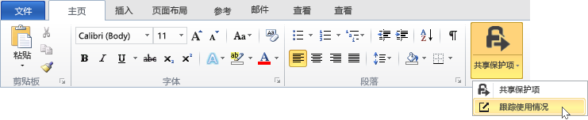
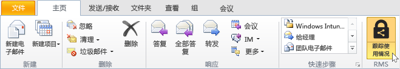
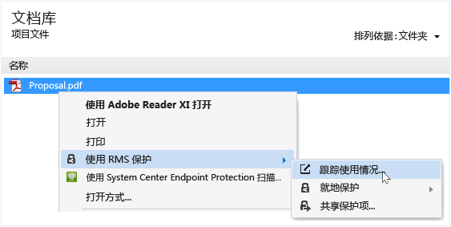
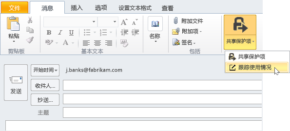

# 使用 RMS 共享应用程序跟踪和撤销文档
通过 RMS 共享应用程序对文档进行保护以后，如果你的组织使用的是 Azure Rights Management 而不是 Active Directory Rights Management Services，则可跟踪人们是如何使用你的受保护文档的。 如有必要（即需要停止对这些文件的共享），你还可以撤消对这些文件的访问权限。 若要进行此类操作，你可以使用**文档跟踪站点**。这些站点可以通过 Windows 计算机、Mac 计算机甚至平板电脑和手机进行访问。

> [!TIP]
> 两分钟视频：[Azure RMS 文档跟踪和撤消](http://channel9.msdn.com/Series/Information-Protection/Azure-RMS-Document-Tracking-and-Revocation)

访问该站点时，登录即可对文档进行跟踪。 如果你的组织有一个[支持文档跟踪和吊销的订阅](https://technet.microsoft.com/dn858608.aspx)，而你已被分配了一个该订阅的许可证，你就可以看到谁曾经尝试打开受保护的文件，以及这些用户是否已成功（即成功完成了身份验证）。 他们尝试访问文档的每个时间，以及访问时所在的位置。 此外：

-   如果你需要停止共享文档：单击“撤消访问”，请注意文档将继续可用的时间段，并确定是否允许用户知道你撤消了对之前共享的文档的访问权限，然后提供一条自定义消息。

-   如果你想要导出到 Excel：单击“在 Excel 中打开”，以便你可以随后修改数据，并创建你自己的视图和图形。

-   如果你想要配置电子邮件通知：单击“设置”并选择在访问该文档时是否通过电子邮件发送通知以及发送方式。

-   如有疑问或想要提供有关文档跟踪站点的反馈：单击“帮助”图标访问[文档跟踪常见问题](http://go.microsoft.com/fwlink/?LinkId=523977)。

## 使用 Office 访问文档跟踪站点

-   对于 Office 应用程序（Word、Excel 和 PowerPoint）：在“主页”选项卡的“RMS”组中，单击“共享保护项”，然后单击“跟踪使用情况”：

    

-   对于 Outlook：使用 Outlook 时，在**“主页”**选项卡的**“RMS”**组中，单击**“跟踪使用情况”**。

    

如果看不到这些用于 RMS 的选项，则很可能你的计算机上未安装 RMS 共享应用程序、未安装最新版本，或必须重启计算机才能完成安装。 有关如何安装共享应用程序的详细信息，请参阅[下载和安装 Rights Management 共享应用程序](../Topic/Download_and_install_the_Rights_Management_sharing_application.md)。

### 跟踪和撤消文档的其他方法
除了使用 Office 应用程序在 Windows 计算机上跟踪文档以外，你还可以使用以下替代方法：

-   **使用 Web 浏览器**：此方法适用于所有受支持的设备。

-   **使用文件资源管理器**：此方法适用于 Windows 计算机。

-   **使用 Outlook 电子邮件**：此方法适用于 Windows 计算机。

##### 使用 Web 浏览器访问文档跟踪站点

-   使用受支持的浏览器转到[文档跟踪站点](http://go.microsoft.com/fwlink/?LinkId=529562)。

    支持的浏览器：建议使用最低版本为 10 的 Internet Explorer，但你可以通过以下任一浏览器使用文档跟踪站点：

    -   Internet Explorer：最低版本 10

    -   至少装有 MS12-037 的 Internet Explorer 9：Internet Explorer 累积安全更新：2012 年 6 月 12 日

    -   Mozilla Firefox：最低版本 12

    -   Apple Safari 5：最低版本 5

    -   Google Chrome：最低版本 18

##### 使用文件资源管理器访问文档跟踪站点

-   右键单击文件，选择“使用 RMS 保护”，然后选择“跟踪使用情况”：

    

##### 使用 Outlook 电子邮件访问此文档跟踪站点

-   在电子邮件中“消息”选项卡上的“RMS”组中，单击“共享保护项”，然后再次单击“跟踪使用情况”：

    

## 示例和其他说明
有关如何使用 Rights Management 共享应用程序以及操作说明的示例，请参阅以下 Rights Management 共享应用程序用户指南部分：

-   [Examples for using the RMS sharing application](../Topic/Rights_Management_sharing_application_user_guide.md#BKMK_SharingExamples)

-   [What do you want to do?](../Topic/Rights_Management_sharing_application_user_guide.md#BKMK_SharingInstructions)

## 请参阅
[权限管理共享应用程序用户指南](../Topic/Rights_Management_sharing_application_user_guide.md)

