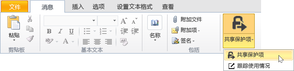
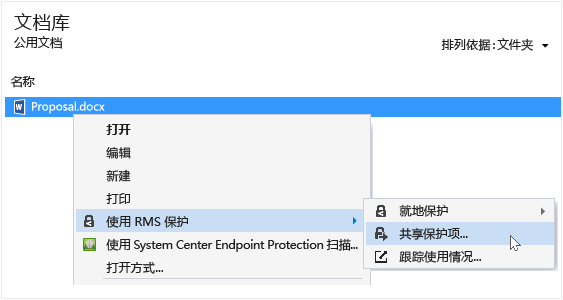
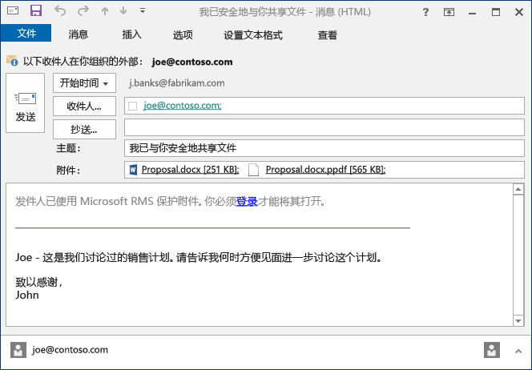

# 使用权限管理共享应用程序保护通过电子邮件进行共享的文件
在保护你通过电子邮件共享的文件时，将会创建原始文件的新版本。 原始文件仍处于未受保护状态，而新版本已受保护并自动附加到你之后要发送的电子邮件中。

在某些情况下（对于由 Microsoft Word、Excel 和 PowerPoint 创建的文件），RMS 共享应用程序将创建附加到电子邮件的文件的两个版本。 文件的第二个版本的文件扩展名为 **.ppdf**，它是该文件的 PDF 影子副本。 此版本的文件可确保收件人始终能够读取该文件，即使他们没有安装你用来创建它的相同应用程序也是如此。 通常人们会在移动设备上阅读电子邮件，并且想要查看其电子邮件附件。 他们只需要 RMS 共享应用程序即可打开该文件。 然后，他们可以读取附加的文件，但只有在他们使用支持 RMS 的应用程序打开该文件的其他版本后，才能更改它。

如果你的组织使用 Azure RMS，则你可以跟踪通过共享保护的文件：

-   选择相应的选项，以便在有人尝试打开这些受保护的附件时接收电子邮件。 每当有人访问该文件时，你都会收到通知，告诉你谁在尝试打开文件、何时尝试打开文件，以及尝试是否成功（他们是否成功通过了身份验证）。

-   使用文档跟踪站点。 你甚至可以通过在文档跟踪站点中撤消对文件的访问权限，来停止共享该文件。 有关详细信息，请参阅[使用 RMS 共享应用程序跟踪和撤销文档](../Topic/Track_and_revoke_your_documents_when_you_use_the_RMS_sharing_application.md)。

## 使用 Outlook：保护通过电子邮件共享的文件

1.  创建你的电子邮件，并附加该文件。 在“消息”选项卡上的“RMS”组中，单击“共享保护内容”，然后再次单击“共享保护内容”：

    

    如果看不到此按钮，则很可能你的计算机上未安装 RMS 共享应用程序、未安装最新版本，或必须重启计算机才能完成此安装。 有关如何安装共享应用程序的详细信息，请参阅[下载和安装 Rights Management 共享应用程序](../Topic/Download_and_install_the_Rights_Management_sharing_application.md)。

2.  在[“共享保护项”对话框](http://technet.microsoft.com/library/dn574738.aspx)中指定你希望用于此文件的选项，然后单击“立即发送”。

### 保护你通过电子邮件共享的文件的其他方法
除了使用 Outlook 共享受保护文件以外，还可以使用以下替代方法：

-   使用从文件资源管理器：此方法适用于所有文件。

-   使用 Office 应用程序：此方法适用于 RMS 共享应用程序支持的应用程序，通过使用 Office 外接程序，功能区上会显示“RMS”组。

##### 使用文件资源管理器或 Office 应用程序：保护通过电子邮件共享的文件

1.  使用以下选项之一：

    -   对于文件资源管理器：右键单击文件，选择“使用 RMS 保护”，然后选择“共享保护项”：

        

    -   对于 Office 应用程序（Word、Excel 和 PowerPoint）：请确保先保存该文件。 然后，在“主页”选项卡的“RMS”组中，单击“共享保护项”，然后再次单击“共享保护项”：

        

    如果看不到这些用于保护的选项，则很可能你的计算机上未安装 RMS 共享应用程序、未安装最新版本，或必须重启计算机才能完成安装。 有关如何安装共享应用程序的详细信息，请参阅[下载和安装 Rights Management 共享应用程序](../Topic/Download_and_install_the_Rights_Management_sharing_application.md)。

2.  在[“共享保护项”对话框](http://technet.microsoft.com/library/dn574738.aspx)中指定你希望用于此文件的选项，然后单击“发送”。

3.  你可能很快会看到告知你该文件受保护的对话框，然后会看到为你创建的电子邮件，该邮件用于通知收件人附件受 Microsoft RMS 保护并且他们必须登录。 当他们单击此链接登录时，他们将会看到说明和链接，以确保他们能够打开你的受保护的附件。

    示例：

    

    你是否想知道：[What’s the .ppdf file that’s automatically created?](../Topic/Dialog_box_options_for_the_Rights_Management_sharing_application.md#BKMK_PPDF)

4.  可选：你可以根据需要更改此电子邮件中的任何内容。 例如，你可以添加或更改邮件主题或正文。

    > [!WARNING]
    > 尽管你可以从此电子邮件添加或删除人员，但这不会更改你在“共享保护项”对话框中指定的附件的权限。 如果你想要更改这些权限（例如，向新的用户授予打开文件的权限），请关闭电子邮件，而不保存也不发送，然后返回到步骤 1。

5.  发送电子邮件。

## 示例和其他说明
有关如何使用 Rights Management 共享应用程序以及操作说明的示例，请参阅以下 Rights Management 共享应用程序用户指南部分：

-   [Examples for using the RMS sharing application](../Topic/Rights_Management_sharing_application_user_guide.md#BKMK_SharingExamples)

-   [What do you want to do?](../Topic/Rights_Management_sharing_application_user_guide.md#BKMK_SharingInstructions)

## 请参阅
[权限管理共享应用程序用户指南](../Topic/Rights_Management_sharing_application_user_guide.md)

