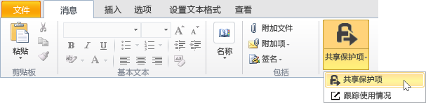

# 如何通过电子邮件安全共享文档

## &lt;管理员指令 - 在向用户提供之前删除此部分&gt;
使用本文档作为创建自己的最终用户指令的起点，以帮助用户通过电子邮件安全共享文档。在下一部分对指令做出任何所需的更改，然后删除这第一个部分，并向用户提供本文档。

此处的指令针对虚构公司 **VanArsdel, Ltd**。在向用户提供这些指令之前，请替换屏幕截图和指令以使其显示你自己的组织名称，或者修改指令，以让用户知道每当指令提到 VanArsdel, Ltd 时，他们都会看到自己的公司名称。你可能想要做出的其他自定义：

-   在步骤 2 中，如果要发送到组织外部的人员，则我们建议只使用两个可用选项。你可能需要更改这些建议。

-   在步骤 2 中，我们建议输入说明来帮助用户识别要选择的模板。你可能需要根据自己的业务和用户更改这些说明，使其更具体或更有意义。

-   在步骤 3 中，我们建议为“查看者 - 仅查看”选项选择“允许我立即撤消对这些文档的访问权限”，例如，当你想要为用户包括此配置选项时。但是，你可以决定每当用户将文档发送到组织外部的某人时都必须选择此选项，或者永远不选择此选项。

-   在步骤 4 中，我们建议使用选项“当有人尝试打开此文档时，给我发电子邮件”。如果用户使用文档跟踪门户跟踪其文档，则可以确定，电子邮件通知是不必要的，因此可以删除此步骤。

> [!NOTE]
> 有关用户可以选择的每个选项的详细信息，请参阅 [Rights Management 共享应用程序的对话框选项](https://technet.microsoft.com/library/dn574738.aspx)

要使用户指令发生作用，必须做好以下准备：

|Check|要求|需要更多信息|
|---------|------|----------|
||已准备好 Azure Active Directory 的帐户和组|[准备 Azure 权限管理](https://technet.microsoft.com/library/jj585029.aspx)|
||已激活 Azure Rights Management|[激活 Azure 权限管理](https://technet.microsoft.com/library/jj658941.aspx)|
||已将 Rights Management 共享应用程序部署到运行 Windows 的用户计算机|[自动部署 Microsoft Rights Management 共享应用程序](https://technet.microsoft.com/library/dn339003%28v=ws.10%29.aspx)|
||如果使用 Exchange Server 而不是 Exchange Online：  -   部署 RMS 连接器，并将 Exchange Server 角色配置为使用该连接器|[部署 Azure 权限管理连接器](https://technet.microsoft.com/library/dn375964.aspx)|
||用户使用 Office 2010 中的 Outlook。|如果用户使用 Office 2013，请将屏幕截图替换为相应的版本，使其与用户看到的内容相符。|
||已按下文所述配置了自定义模板|[为 Azure 权限管理配置自定义模板](https://technet.microsoft.com/library/dn642472.aspx)|

#### 配置自定义模板：

1.  存档 2 个默认模板。

2.  通过复制默认模板并进行以下更改，创建 3 个新模板：

    |要复制的模板|新名称|新的说明|授予这些自定义权限|其他设置|
    |----------|-------|--------|-------------|--------|
    |**&lt;组织名称&gt; - 机密，仅供查阅**|**高度机密 - &lt;组织名称&gt;**|&lt;组织名称&gt; 的所有用户都有查看和编辑权限。不允许脱机访问。|**查看内容**  **保存文件**  **编辑内容**|更新用户使用的语言的名称和说明。  对于“内容过期时间”：保留默认设置“内容永不过期”  对于“脱机访问”：选择“仅在建立 Internet 连接的情况下内容才可用”|
    |**&lt;组织名称&gt; - 机密，仅供查阅**|**机密 - &lt;组织名称&gt;**|&lt;组织名称&gt; 的所有用户都有查看和编辑权限。|**查看内容**  **保存文件**  **编辑内容**|更新用户使用的语言的名称和说明。  对于“内容过期时间”：保留默认设置“内容永不过期”  对于“脱机访问”：选择“在没有 Internet 连接的情况下内容可用的天数”并键入 **1**|
    |**&lt;组织名称&gt; - 机密**|**内部使用 - &lt;组织名称&gt;**|&lt;组织名称&gt; 的所有用户具有完全权限，但无法取消保护内容。|**查看内容**  **保存文件**  **编辑内容**  **复制和提取内容**  **打印**|更新用户使用的语言的名称和说明。  对于“内容过期时间”：保留默认设置“内容永不过期”  对于“脱机访问”：保留“在没有 Internet 连接的情况下内容可用的天数”的默认值，并保留默认值 **7**|

3.  发布 3 个新模板。

## &lt;用户指令从此处开始，删除此标题&gt;
从现在起，每当你通过电子邮件向某人发送重要文档时，都应使用这些指令来帮助防止不应当查看文档的人阅读该文档。

1.  创建电子邮件：指定一个或多个电子邮件地址，键入消息，然后附加你要安全共享的文件。在“消息”选项卡上的“RMS”组中，单击“共享保护内容”，然后再次单击“共享保护内容”：

    

2.  在“共享保护内容”对话框中指定以下信息：

    如果要将文档发送给另一家组织的至少一个人：

    |如果情况是这样...|采取的措施：|
    |--------------|----------|
    |自动为你选择**常规保护** →|保留此项选择：  |
    |文档中的信息不应更改    →|选择“查看者 – 仅查看”：  |
    |文档中的信息可以更改    →|选择“合著者 – 查看、编辑、复制和打印”：  |
    如果要将文档发送给组织内部的人员：

    |如果情况是这样...|采取的措施：|
    |--------------|----------|
    |自动为你选择**常规保护** →|保留此项选择：  |
    |文档中的信息极其机密，如果公开，会给组织或其员工造成极大的损害    →|选择“高度机密 - VanArsdel, Ltd”：  |
    |文档中的信息较为机密，如果公开，会给组织或其员工造成损害    →|选择“机密 - VanArsdel, Ltd”：  |
    |文档中的信息不应与组织外部的人员共享，但不包含有关组织或其员工的机密信息    →|选择“内部使用 - VanArsdel, Ltd”：  |

3.  如果选择了“查看者 - 仅查看”：选择“允许我立即撤消对这些文档的访问权限”：

    

4.  选择“当有人尝试打开此文档时，给我发电子邮件”：

    

5.  单击“立即发送”：

    

当受保护文档的收件人收到该电子邮件时，他们将看到一条消息，其中说明了如何阅读该文档。他们可以在多种设备上阅读该文档。这些设备包括 ipad、iphone、Android 平板电脑和手机、Mac 计算机以及 Windows 计算机。

若要受保护文档的收件人是否访问了这些文档，请使用[文档跟踪站点](https://track.azurerms.com/)。

**需要帮助吗?**

-   其他信息：

    -   [保护通过电子邮件共享的文件](https://technet.microsoft.com/library/dn574735%28v=ws.10%29.aspx)

    -   [跟踪和撤消文档](https://technet.microsoft.com/library/dn986611.aspx)

-   与技术支持联系：

    -   &lt;联系详细信息&gt;

