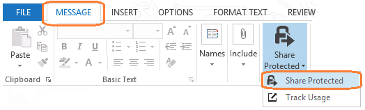
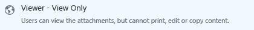

# 方案 - 与另一组织中的用户共享 Office 文件
本部分包含管理员指令、用户指令的模板，以及一个演示最终用户指令的示例。只有在完成管理员的指令后，你才可以将最终用户文档发送给你的用户。

## 管理员的指令

使用这些指令和以下模板创建你自己的最终用户指令，以帮助用户安全地通过电子邮件向另一组织中的人员发送 Office 文件。例如，Office 文件可能是 Word 文档、Excel 电子表格或 PowerPoint 演示文稿，其中包含合作伙伴的价目表信息、分销商的产品列表，或潜在客户的交货时间行列表。如果用户遵照了指令，电子邮件中附加的文件将受 Azure Rights Management 保护。

这些指令适用于下面一组情况：

-   员工必须在组织外部发送 Office 文档形式的信息。

-   该文档包含非公开、但又不是专门供内部使用的信息。

-   收件人用户不需要进一步与其他人共享、打印此信息，也不需要将其用作自己文档的一部分。如果不是这样，你可以将用户指令从选择仅查看权限更改为允许收件人更改附件的另一个选项。

-   员工想要了解外部用户打开此文档的时间。

在下面的用户指令中，将 *&lt;Office 文档类型的名称&gt;* 替换为用户将要发送的文档类型。使用他们的工作流常用的具体词语，例如“价目表”、“交货时间”和“竞标提案”，而不要使用“Word 文档”和“Excel 电子表格”。此外，将 *&lt;联系详细信息&gt;* 替换为有关用户如何与技术支持联系的指令，例如网站链接、电子邮件地址或电话号码。

接下来，对指令做出其他任何必要的修改，然后将这些指令提供给用户。例如，将文档添加到 SharePoint 站点，或通过电子邮件发出。

可能需要对指令做出的修改：

-   在步骤 2 中，我们建议为权限选择“查看者 - 仅查看”，以便收件人只能阅读附加的文档（但不是原始文档）。如果此限制不适用于你的业务要求，请为另一组权限更改此选项，例如“审阅者 - 查看和编辑”。

-   在步骤 3 中，我们建议选择“允许我立即撤消对这些文档的访问权限”，这样，如果用户以后撤消了文档，则不会出现延迟，但设置此选项要求收件人始终连接到 Internet 来打开附件。此步骤还要求你具有支持文档跟踪和撤消的订阅。如果此步骤不适用于你的用户，请删除此步骤。

-   在步骤 4 中，我们建议使用选项“当有人尝试打开此文档时，给我发电子邮件”。如果用户使用文档跟踪门户跟踪其文档，则可以确定，电子邮件通知是不必要的，因此可以删除此步骤。

-   这些步骤不包括设置过期日期。如果附件是时间敏感的，请添加另一个步骤来设置相应的过期时间，例如从发送电子邮件算起的 90 天。

> [!NOTE]
> 有关用户可以选择的每个选项的详细信息，请参阅 [Rights Management 共享应用程序的对话框选项](https://technet.microsoft.com/library/dn574738.aspx)

## 本方案的要求
要使此方案的用户指令发生作用，必须做好以下准备：

|Check|要求|需要更多信息|
|---------|------|----------|
||已准备好 Office 365 或 Azure Active Directory 的帐户和组|[准备 Azure 权限管理](https://technet.microsoft.com/library/jj585029.aspx)|
||已激活 Azure Rights Management|[激活 Azure 权限管理](https://technet.microsoft.com/library/jj658941.aspx)|
||已将 Rights Management 共享应用程序部署到运行 Windows 的用户计算机|[自动部署 Microsoft Rights Management 共享应用程序](https://technet.microsoft.com/library/dn339003%28v=ws.10%29.aspx)|
||用户具有 Office 2013 中的 Outlook|如果用户使用的是 Office 2010，请将屏幕截图替换为相应的版本，使图片与用户看到的内容相符。|
||Azure RMS 订阅包括文档跟踪|如果你的 Azure RMS 订阅不包括文档跟踪和撤消功能，则用户无法完成用户指令中的所有步骤。在这种情况下，请购买支持这些功能的订阅，或修改用户指令以删除使用这些功能的步骤。  检查订阅支持：[Rights Management 服务 (RMS) 产品比较](https://technet.microsoft.com/dn858608)|

## 用户指令
复制并粘贴以下面向最终用户的指令，然后根据本方案的管理员指令对其进行修改。示例文档演示了在你自定义后，用户看到的这组指令的可能形式。

#### 如何共享 &lt;Office 文档类型的名称&gt;

1.  创建电子邮件：指定一个或多个电子邮件地址，键入消息，然后将 *&lt;Office 文档类型的名称&gt;* 附加到电子邮件。在“消息”选项卡上的“RMS”组中，单击“共享保护内容”，然后再次单击“共享保护内容”：

    

2.  在“共享保护内容”对话框中，选择“查看者 - 仅查看”：

    

3.  选择“允许我立即撤消对这些文档的访问权限”：

    

4.  选择“当有人尝试打开此文档时，给我发电子邮件”：

    

5.  单击“立即发送”：

    

当“收件人”、“抄送”或“密件抄送”行中的某人收到这封电子邮件时，他们将看到一条消息，其中说明了如何阅读附加的 *&lt;Office 文档类型的名称&gt;*。他们可以在多种设备上阅读该文档。这些设备包括 ipad、iphone、Android 平板电脑和手机、Mac 计算机以及 Windows 计算机。

使用[文档跟踪门户](https://track.azurerms.com/)跟踪他们是否打开以及何时打开了附加的 &lt;Office 文档类型的名称&gt;。在看到他们打开 &lt;Office 文档类型的名称&gt; 后，建议立即向他们拨打跟进电话。

**需要帮助吗?**

-   其他信息：

    -   [保护通过电子邮件共享的文件](https://technet.microsoft.com/library/dn574735%28v=ws.10%29.aspx)

    -   [跟踪和撤消文档](https://technet.microsoft.com/library/dn986611.aspx)

-   与技术支持联系：

    -   *&lt;联系详细信息&gt;*

### 示例用户文档

##### 如何与客户共享价目表

1.  创建电子邮件：指定客户的一个或多个电子邮件地址，键入消息，然后将价目表附加到电子邮件。在“消息”选项卡上的“RMS”组中，单击“共享保护内容”，然后再次单击“共享保护内容”：

    

2.  在“共享保护内容”对话框中，选择“查看者 - 仅查看”：

    

3.  选择“允许我立即撤消对这些文档的访问权限”：

    

4.  选择“当有人尝试打开此文档时，给我发电子邮件”：

    

5.  单击“立即发送”：

    

当“收件人”、“抄送”或“密件抄送”行中的某人收到这封电子邮件时，他们将看到一条消息，其中说明了如何阅读附加的价目表。他们可以在多种设备上阅读该文档。这些设备包括 ipad、iphone、Android 平板电脑和手机、Mac 计算机以及 Windows 计算机。

使用[文档跟踪门户](https://track.azurerms.com/)跟踪他们是否打开以及何时打开了附加的价目表。在看到他们打开价目表后，建议立即向他们拨打跟进电话。

**需要帮助吗?**

-   其他信息：

    -   [保护通过电子邮件共享的文件](https://technet.microsoft.com/library/dn574735%28v=ws.10%29.aspx)

    -   [跟踪和撤消文档](https://technet.microsoft.com/library/dn986611.aspx)

-   与技术支持联系：

    -   电子邮件：helpdesk@vanarsdelltd.com

